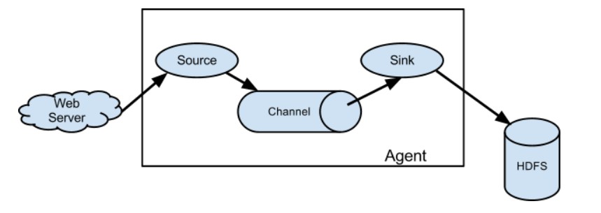

#### 架构

* 组成部分
    1. 输入: 如web server, avro cli, 上一个flume agent的sink
    2. 代理(agent)
        1. 源(source): 将输入交给管道channel
            * avro source
        2. 管道(channel): 存储source发送下来数据，直到sink消费掉数据，才删除该数据，采用本地存储。
        3. 池(sink): 用于将数据发送给其他处理，像是下一个代理的source，亦或是HDFS
            * Flume HDFS sink
    3. 数据(事件)
* 日志
    * 默认等级为在logs/flume.log记录日志
* 启动agent
    * 命令
        * $FLUME_HOME/bin/flume-ng agent -n agent-name [-c configs_dir] -f agent_conf_file 
            * -c 指定公共的配置文件的目录
    * 在agent的source, channel, sink之间的关系
        1. agent中可有多个source
        2. 一个source下游可以有多个channel
        3. 一个channel只能绑定下游一个sink
    * agent_conf_file文件的配置
        * 文件整体架构
        ```
        # Java property file format
        # my_agent.conf defining the flow within a single agent
        # sources, channels, sinks
      
      
        # 定义sources, sinks and channels for the agent
        <Agent>.sources = <Source>
        <Agent>.sinks = <Sink>
        <Agent>.channels = <Channel1> <Channel2>
        
        # 为单个source绑定下游channels
        <Agent>.sources.<Source>.channels = <Channel1> <Channel2> ...
        
        # 为单个sink绑定上游单个channel
        <Agent>.sinks.<Sink>.channel = <Channel1>
        ```
        * 文件中为每个组件设置属性
        ```
        # 基本格式
        # properties for sources
        <Agent>.sources.<Source>.<someProperty> = <someValue>
        
        # properties for channels
        <Agent>.channel.<Channel>.<someProperty> = <someValue>
        
        # properties for sinks
        <Agent>.sources.<Sink>.<someProperty> = <someValue>
        
        ###### E.G ###############
        # 注意每个组件都需要指定其类型，比如在一条流中，avro source -> mem channel -> hdfs sink
        
        agent_foo.sources = avro-AppSrv-source
        agent_foo.sinks = hdfs-Cluster1-sink
        agent_foo.channels = mem-channel-1
        
        # set channel for sources, sinks
        
        # properties of avro-AppSrv-source
        agent_foo.sources.avro-AppSrv-source.type = avro
        agent_foo.sources.avro-AppSrv-source.bind = localhost
        agent_foo.sources.avro-AppSrv-source.port = 10000
        
        # properties of mem-channel-1
        agent_foo.channels.mem-channel-1.type = memory
        agent_foo.channels.mem-channel-1.capacity = 1000
        agent_foo.channels.mem-channel-1.transactionCapacity = 100
        
        # properties of hdfs-Cluster1-sink
        agent_foo.sinks.hdfs-Cluster1-sink.type = hdfs
        agent_foo.sinks.hdfs-Cluster1-sink.hdfs.path = hdfs://namenode/flume/webdata
        ```
    * 详细参见
        * http://flume.apache.org/releases/content/1.9.0/FlumeUserGuide.html#defining-the-flow
       
* 文档
    * http://flume.apache.org/documentation.html