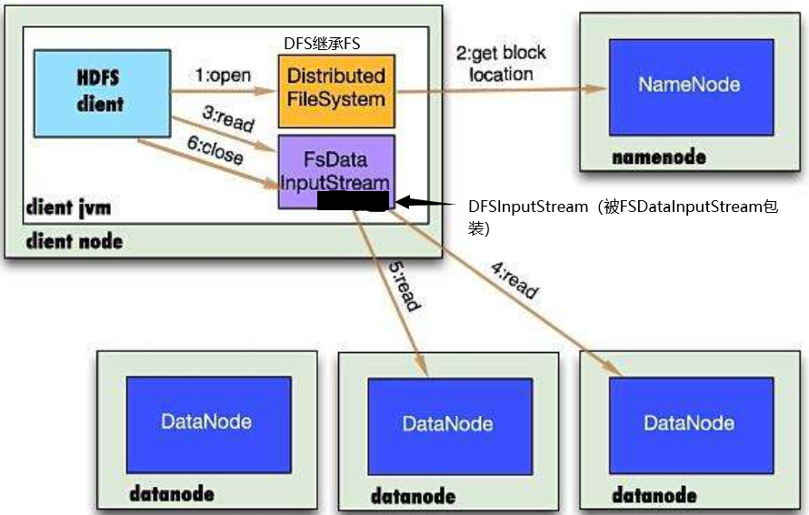
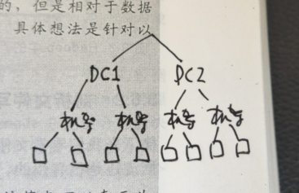
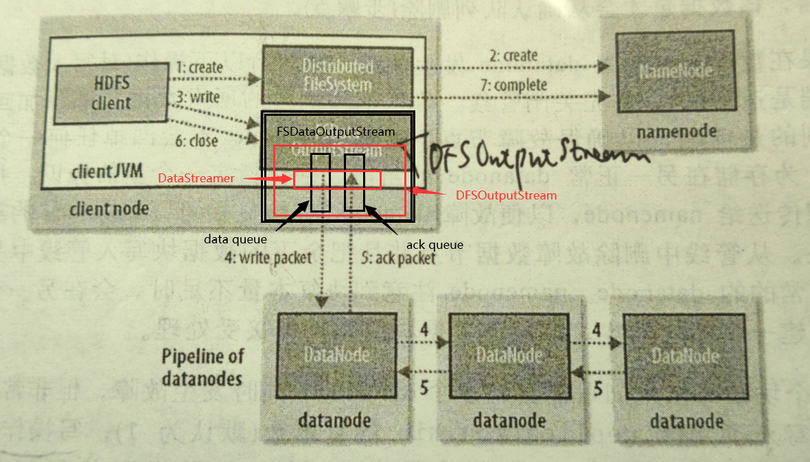

#### HDFS的设计
* 特征
    1. 存储超大文件
    2. 流式数据访问
        * hdfs的构建思路：一次写入，多次读取是最高效的访问模式
    3. 商用硬件（运行在普通硬件上）
* 不适用的场景
    1. 低时间延迟的数据访问
    2. 大量的小文件
        * namenode存储文件的元数据于内存中，故总文件的数量受限于namenode的可使用内存的大小
    3. 多用户写入，任意修改文件
        * 支持hdfs文件的单写，和写操作的文件内容追加。
        * 不支持多个写入者的操作，也不支持在文件的任意位置进行修改。（若支持也是效率低下）
* HDFS的数据块
    * 磁盘块的大小为512字节，OS的基本操作单位为4K字节。而在HADOOP2.x版本中的HDFS数据块默认大小为128MB
    * HDFS数据块尺寸选择的原因
        1. 数据块较大从而最小化寻址开销，数据块大则块数据传输时间远大于块的寻址时间
        2. 数据块也不能设计的太大，有通常一个数据块对应于一个map的分片，若块过大，则影响处理时长
    * HDFS存储数据抽象出数据块的概念的好处
        1. 由于HDFS是分布式集群存储方式，故可以使得存储一个大于任意注意磁盘大小的文件
        2. 设计存储单元为一个数据块，而不是单个文件为存储单元，这样大大简化存储子系统的设计。
            由于块的存储大小是固定的，故计算磁盘能存放多少块就相对容易
        3. 消除了对元数据存储的顾虑，比如传统的本地文件存储，需要将文件元数据同文件内容一同存储在一起。
            而HDFS引入了块的概念就让文件的元数据跟其内容的存储分开进行。若干个数据块专门负责存储文件内容，而
            文件的元数据信息则由namenode的内存存储保证。
        4. 数据块适用于数据备份从而提高了数据的容错能力与提高了可用性。
* HDFS的运行管理模式
    * 运行管理模式
        * 主从架构（namenode，datanode）
    * namenode
        * 内存维护着文件系统树以及整棵树所有文件以及目录
        * 并将**命名空间镜像文件（也存储着文件的元数据，但元数据并不包含文件到数据块的映射关系）与
            编辑日志文件**存放在本地磁盘上
        * 记录的每个文件存储在若干数据块所在的数据节点信息，但**不会永久保留这些
            块的位置信息（块映射），这些块位置信息由HDFS系统重启时先读入命名空间镜像，再读取编辑日志信息
            恢复上一次的文件系统树以及整棵树所有文件以及目录状态，再根据数据节点反馈的块列表信息重建文件的块映射关系**
        * 目录结构
            ```
            ${dfs.name.dir}
            `-- current
                |-- edits_*
                |-- fsimage_*
                |-- fsimage_*.md5
                |-- seen_txid 
                `-- VERSION
            ```
            1. fsimage文件其实是Hadoop文件系统元数据的一个永久性的检查点，其中包含Hadoop文件系统中的所有目录和文件inode的序列化信息
                * 并非hdfs的每个写操作都会更新该文件
                * 每个inode是一个文件/目录的内部描述方式，对于文件包含：副本级别，修改时间，访问时间，访问许可，块大小，
                    组成一个文件的块等。对于目录包含：修改时间，访问许可，配额元信息等内容
            2. edits文件存放的是Hadoop文件系统的所有更新操作记录，文件系统客户端执行的所以写操作首先会被记录到edits文件中。
            3. seen_txid
                * 是存放transactionId的文 件，format之后是0，它代表的是namenode里面的edits_*文件的尾数，namenode重启的时候，
                会按照seen_txid的数字， 循序从头跑edits_0000001~到seen_txid的数字。所以当你的hdfs发生异常重启的时候，
                一定要比对seen_txid内的数字是不是你edits最后的尾数（就是edits_inprogress_000000000* 后边的那串数字，
                inprogress就是正在使用的edits文件），不然会发生建置namenode时metaData的资料有缺少，导致误删Datanode上多余Block的信息。
            * VERSION
                * namespaceId 用来表示当前文件系统的唯一标识，与所有datanode上的VERSION中一致
                * layoutVersion是一个负整数，文件系统的数据结构版本越新，则该值越小。该值主要涉及到hdfs的更新升级
        * 启动过程
            * 安全模式：
                * 除启动一个格式化的namenode外，一起动HDFS就namenode进入安全模式在hdfs中满足最小复本条件
                    （就是hdfs中99.9%的块都有最少复本数量1）时，namenode会在30s后退出安全模式，
                * 在安全模式namenode的文件系统仅仅是只读的
                * 使用hadoop dfsadmin -safemode get查看当前是否处于安全模式
            1. 内存载入fsimage并执行edits日志中的各项操作，一旦内存中建立文件系统元数据的映像，则创建一个新的fsimage文件（不借助辅助namenode）
                与一个空的编辑日志
            2. 当处理完fsimage与编辑日志后，在接收所有datanode发来的块列表信息，并完成文件信息的块映射后。
            3. 满足namenode的最小复本条件的30后退出安全模式，启动完成  
            ```
            // 一些配置
            1. 配置最小复本数目
            dfs.replication.min 默认1
            2. namenode退出安全模式块所要达到的满足最小复本块数目比例
            dfs.safemode.threshold.pct 默认值0.999 设为小于等于0不会启动安全模式，大于1则永远处于安全模式
            3. 满足最小复本条件后退出安全模式之前的驻留时间ms
            dfs.safemode.extension 默认30,000 对于小集群（几十个节点）可以设置为0
            ```      
    * datanode
        * 根据需要存储并索引数据块（受cli或者namenode调度），并定期根据依附心跳向namenode发送其存储的
            块的列表
        * 由于datanode只负责存储数据块，而数据块仅仅用来存储内容并没有文件的元数据。故一旦namenode GG，HDFS上
            的所有文件将会丢失。（namenode内存维护着文件系统树以及整棵树所有文件以及目录）
        * datanode的块扫描器
            * 定期检测节点上的所有块，从而在客户端读到坏块之前及时检测和修复块
    * client
        * cli通过与namenode与datanode交互实现访问整个HDFS文件系统
    * namenode的容错与高可用
        1. 备份命名空间镜像文件
            * 将持久状态写入本地文集磁盘的同时，写入另一个远端的文件系统
        2. 使用second namenode（默认）
            * 作用：定期通过编辑日志合并命名空间镜像，以防止编辑日志过大
            * 流程
                1. 辅助namenode请求注namenode停止使用edits文件，暂时将新的写操作记录到一个新的文件中
                2. 辅助namenode通过HTTP GET的方式从主namenode获取fsimage与edits文件
                3. 辅助namenode将fsimage文件载入内存，逐一执行edits日志文件中操作，创建新的fsimage文件
                4. 辅助namenode将新的fsimage文件通过HTTP GET的方式发回注namenode
                5. 主NameNode从辅助namenode接收fsimage文件替换旧的fsimage；用1.产生的新的edits文件代替旧的edits文件
            * 最终，主namenode拥有一个最新的fsimage文件与一个更小的edits文件
            * 当namenode处于安全模式下时，可以通过hadoop dfsadmin -saveNamespace命令来创建检查点
            * checkpoint的触发：辅助NameNode每个fs.checkpoint.period(默认3600s)创建，当编辑日志
                达到fs.checkpoint.size（默认64M，字节为单位）的属性大小时，即使没有到达一个小时也会触发创建检查点，
                系统每间隔5分钟检查一次编辑日志的大小
            * 当辅助namenode触发检查点后，当namenode gg，可以通过-importCheckpoint选项启动守护进程，将辅助namenode用作新的NameNode
            * 元数据备份
                * 使用脚本定期将辅助namenode上的previous.checkpoint目录存档，同时也需要检查测试副本的一致性
                * 检查一致性的方法
                    1. 本地启动一个NameNode守护进程，看起时候能成功载入备份的fsimage与edits文件，通过读取器产生的日志中由成功信息判断
                    2. 使用hdfs oiv（offline image viewer）与hdfs oev（offline edits viewer）来检测一致性
                        
#### hadoop dfsadmin 工具
1. 查看hdfs集群是否处于安全模式
    * hadoop dfsadmin -safemode get
2. 常用保证执行某个命令之前hdfs已退出安全模式
    ```
    hadoop dfsadmin -safemode wait
    // command to read or write a file
    ``` 
3. 在维护/升级hdfs时，让hdfs进入/退出安全模式（只读）
    * hadoop dfsadmin -safemode enter/leave
4. 将内存中的文件镜像保存为新的fsimage并重置日志文件（仅在安全模式下运行）
    * hadoop dfsadmin -saveNamespace
5. 刷新hdfs中的datanode（通常用于委任/解除节点前）
    * hadoop dfsadmin -refreshNodes
#### hadoop fsck工具
* 用来检查hdfs中hdfs中文件的健康状态
#### 均衡器
* 由于随着时间推移，datanode中的数据越来越不均衡，导致有些datanode过于繁忙。
    均衡器是一个hadoop守护进程，它将块从忙碌的datanode移动到相对空闲的datanode。
#### 委任和解除节点
* 由于种种原因，需要向集群中委任新的节点或者解除旧节点，一般同时处理datanode与tasktracker
* 由于安全性肯定不能任意一个节点都能连接上namenode
* 允许连接到namenode的datanode放在dfs.hosts目录所指定的文件中（该文件在NameNode的本地文件系统中）
    默认为空表示任意都允许连接，注意这个文件与slaves文件的区别，slaves文件的目的主要为了集群的启动
* 新加节点的方式
    1. 将新节点添加到dfs.hosts指定的文件中
    2. hadoop dfsadmin -refreshNodes
    3. 将新节点更新到slaves文件中
    4. 启动新的datanode    
* 解除节点
    1. 将解除节点放入dfs.hosts.exclude指定的文件中，不更新dfs.hosts文件
    2. hadoop dfsadmin -refreshNodes
        * 此时hdfs会完成解除节点上的块复制等待操作
    3. 查看网页界面看到要解除的datanode的管理状态从“正在解除”变为“解除完毕”
    4. 从include文件中移除节点
    5. 从slaves文件中移除节点
#### 升级HDFS版本（一般可以跳过中间版本的升级）
* 若新的HDFS版本的文件系统布局没有发生变化，则只需要安全新的hadoop，用新的hadoop启动即可
* 若新版本的layoutVersion值小于当前版本的layoutVersion值说明，新版本的文件系统存储结构发生的更新
    1. 在升级前保证没有其他的升级
    2. 关闭MR与hdfs
    3. 将新hdfs中的name指向到的老hdfs的name （最好备份一下namenode目录）
    4. $NEW_HADOOP/bin/start-dfs.sh -upgrade
        * 将之前老版本的元数据以及数据块等等均升级（datanode上的也会更新）
        * 同时之前的current目录变成了previous目录，新升级的目录为current
    5. 使用$NEW_HADOOP/bin/hadoop dfsadmin -upgradeProgress status来查看更新的进度
    6. 更新完毕后在新的版本hdfs上启动检验hdfs正常与否，并启动MR验证正常性
    7. 若不正常，则先用新版本的hadoop去stop-dfs.sh，然后执行$OLD_HADOOP/bin/start-dfs.sh -rollback来将元数据于块数据进行回滚老版本
        若正常，则删除previous目录即可
#### hdfs的读操作

1. cli端通过FileSystem对象调用open方法来打开希望读取的文件
2. 对hdfs来说，是通过DistributedFileSystem实例通过RPC来调用namenode，namenode返回文件的所在数据块的datanode信息。
    * 补充：namenode返回每个数据块的所有副本的**网络拓扑排序后的的datanode地址**
3. 在open方法结束后，返回一个FSDataInputStream对象给cli读取数据
4. FSDataInputStream对象封装了DFSInputStream，读取文件数据等同于读取该文件对应块的数据，
    * 补充：由于块可能存在多个副本，故根据块所在的datanode的物理地址选择最拓扑最近的datanode上
5. 从而依次从网络拓扑最近的目标datanode上读取数据块
    * 补充：读取这个数据块的数据。每读完一个块DFSInputStream就关闭与这个DataNode的连接去寻找下一块数据块的datanode连接
    * 补充：若DFSInputStream在**读取块数据失败**时候，会试图读下一块距离cli网络拓扑最近的数据块。
        1. 若是由于**网络通信**原因，会在本地标记这个datanode，以确保后续不在读取这个datanode上的任何块
        2. 若是发现是**块数据错误**，比如对数据块进行校验确认不通过，则先通知NameNode这个数据块有误
6. cli读完所有数据块数据后，FSDataInputStream就调用close方法
* 网络拓扑距离的计算
    
    
    1. 同节点的距离为0
    2. 同机架不同节点的距离为2
    3. 同数据中心不同机架的节点距离为4
    4. 不同数据中心的节点距离为6
#### hdfs的写操作

1. cli调用FileSystem对象的open()方法
2. 实际调用的是DistributedFileSystem对象实例的open方法，对namenod进行一个rpc的远程调用，
    NameNode在检查访问权限与不存在要创建的文件后，为新文件创建一条记录并返回一个FSDataOutputStream对象，
    否则向客户端抛出异常
3. FSDataOutputStream对象封装了一个DFSOutputStream对象，**DFSOutputStream对象负责处理datanode与
    namenode之间的通信**。
4. 当cli通过FSDataOutputStream对象写入数据的时候，DFSOutputStream对象将数据分成一个个数据包，
    并将数据包写入data queue，而DFSOutputStream对象中的DataStreamer对象负责将这些数据包依次
    流式地发送到由一组datanode组成的管线中。
    * 补充：1block=128M,1packet=64K,1chunk=512+4B，其中4B是校验和，就是每发送一个chunk就会附带一个校验和
    * 补充：DataStreamer对象责任是根据datanode列表来要求namenode分配合适的新数据块来存储副本
    * 补充：namenode上有datanode上所有快的元信息
    * 补充：管线中的datanode接收数据包并将数据包发送给下一个datanode，当最后一个datanode接收后，就开始
        原路返回发送ack确认了
5. DFSOutputStream对象也内部维护着一个ack queue，当ack queue收到了发送的数据包的回执确认则把数据包从
    ack queue删除
    * 补充：每当dataQueue往管线中发送一个数据包，就将其从dataQueue队首中追加到ackQueue的队尾
    * 补充：当写入期间，datanode出现问题，首先关闭管线，将ackQueue中的数据包置到dataQueue队首，出现问题的datanode
        从管线中剔除，再次发送，而复本数量由namenode保证
6. cli完成数据流的写入，调用数据流的close方法
7. 向namenode确认完成
* **复本的放置**（反向放置）
    1. 第一个放置在本机架A本节点上（若cli跑在集群上，否则随机一个不忙的节点存放）
    2. 第二个放置在不同的机架B的任意节点上
    3. 第三个放在机架B上的另一个节点上
    
    
    
            