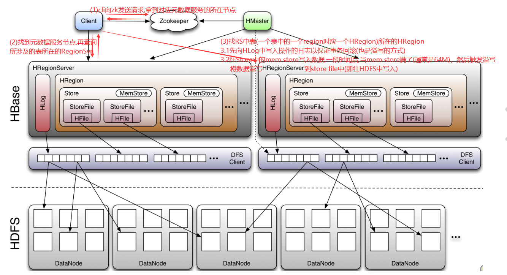

#### HBASE
* 数据库
    * 特点
        1. 面向列
        2. 可伸缩
        3. 实时读写
    * 数据量
        1. 十亿级别的行
        2. 百万级别的列
    * 速度快
        1. 充分利用了内存
        2. 使用了LSM树
        3. 缓存机制
        4. 文件是顺序读
* 数据模型
    * rowkey
        1. 唯一主键
        2. 字典序
        3. 最长64K，推荐10-100B
    * col family 列族
        1. 一组列的集合
        2. 列族作为表的schema定义给出
        3. 列族是权限存储的最小单元
    * qualifier标识
        1. 列
        2. 可以动态的随机插入
        3. 表定义之后没有限制列，随着值得插入也把列插入
        4. 列必须归于某一个列族
    * timestamp时间戳
        1. 64位LONG，精度毫秒
        2. 起版本号的作用，一个cell中存在多个版本的信息
        3. 时间戳可以自己定义，但是不推荐
    * cell
        1. 存储数据中的最小单元（逻辑）
        2. 存储kv格式的数据
            1. key: rowkey+col family+qualifier+timestamp
            2. val: value
        3. 以字节数组存储
 * 架构
    * hbase是主从架构
    * 角色
        1. cli 操作hbase的接口，并维护cli的缓存
        2. zk
            1. 保证任何时刻集群中任何时刻只有一个active的master
            2. 存储所有region的meta数据
            3. 监控所有的rs上下线信息，实时通过matcher事件通知给master
            4. 存储相关的schema数据
        3. master
            1. 分配region
            2. 保证整个集群所有rs的负载均衡
            3. 当发现一个rs宕机后，通过在zk中元数据重新分配region
            4. region过大，region分裂
        4. regionserver
            * 负责接收cli的读写请求，处理对应的region的IO
            * 某个region过大，分裂
            1. region
                * 相当于表的概念
                * 一张表至少对应一个region
                * region过大会分裂
            2. store
                * 相当于列族
                * 使用LSM的数据模型
                1. memstore
                    * 位于内存中
                    * 每一个store中有一个memstore
                2. storefile
                    * 磁盘存储空间，将数据持久化
                    * 每个region有一个或多个storefile
                    * 可合并
    * WAL (write ahead log)
        1. 防止数据丢失
        2. 先写内存，再溢写到hdfs上，异步
    * 读写
* java API
    * Admin 管理表
        1. createTable
        2. disableTable
        3. deleteTable
    * Table 管理数据
        1. put
        2. get
        3. scan
        4. delete
                
#### 基本
* HBase表最初只有一个HRegion保存数据，随着数据写入，HRegion越来越大，达到一定的阈值后会自动分裂为两个HRegion,
    随着这个过程不停的进行，HBase表中的数据会被划分为若干个HRegion进行管理
* Region Server下面有若干个HRegion，每个HRegion下面有若干的列族，每个列族对应着一个HStore
#### 读写操作

* 读操作
    1. cli与zk请求获得元数据服务的那个RS
    2. 访问存储着元数据服务的RS，获得数据表所在的那个RegionServer
    3. 访问存储数据的RS，根据表中的region定位到RS中的特定的HRegion
    4. 先访问HRegion中的mem store看是否能够找到数据
    5. 找不到则去blockcache中查找，查找不到则去hdfs（文件中查找）
        * blockcache：快缓存，用于存储从hdfs中读出数据，由HRegions共享
        * blockcache的种类（cache满后替换的原则）
            1. LruBlockCache
            2. BucketCache
    6. hdfs查找后，将数据缓存在blockcache中。
    * 读操作不涉及HLog
* 写操作见hbase_struct.png

#### Cli与ZK
* Cli
    * 包含访问HBase的接口并维护cache来加快HBase的访问
    * 这个cache是cli中的cache
* ZK
    * 任何时后，集群中只能由一个活跃的HMaster   (HA)
    * 存储所有HRegion的寻址入口
    * 实时监控RS的上线与下限的信息，并及时通知HMaster
        * 正常就通知信息给HMaster
        * 不正常就要通知HMaster，修改原来RS的region访问到新的RS
* HMaster
    * 为RS分配HRegion
    * 负责RS的负载均衡
    * 发现失效的RS，通过Master对其上的Region进行重新分配
    * 管理用户对table的增删改
* RS
    * RS维护HRegion
    * RS负责切分过大的Region
        * 二分Region，新的Region会分布到其他的RS中
* Region
    * HBase会自动将表水平分成多个Region
    * 随着数据的不断插入，Region会越变越大，所以当Region中的数据达到一定阈值的时候，Region就会进行二分分裂
    * 新的列分的Region会保存在不同的RS上
* HStore，MemStore，storefile
    * 一个region由多个hstore组成，一个hstore就对应着一个列族CF
    * store包括位于内存中的memstore与位于磁盘上的storefile，当memstore中的数据达到某个阈值的时候
        RS就会启动flashcache进程写入数据到storefile，每次写入星辰一个单独的storefile
    * 当storefile文件的数量增长到一定阈值后，系统就会进行合并(minor[3-10个文件就合并], major[当前region中所有文件都合并], compaction), 在合并的
        过程中，会进行版本的合并与删除工作(major)你如删除老版本的cell，形成一个更大的storefile
    * 当一个region所有的storefile的大小与数量都打到一个阈值后，就会将当前的region进行分裂
* memstore/hlog的溢写过程与map output阶段的本地会溢写类似
#### Region中涉及到两次排序
* 在mem store中排序，然后flush到单个storefile
* 多个storefile在经过多路归并排序到新的storefile中

#### hbase的region server的数据存储目录下
* oldWALs与WALs目录
    1. WALs目录用于存储现阶段的操作log
    2. 当进行持久化操作之后，WALs的日志将会被挪到oldWALs目录中
* data目录
    ```
    /data
        /default
            /table
                /region
                    /cf
        /hbase
    ```
    * 就是命名空间 namespace
    * data目录下常见的两个命名空间
        1. default
        2. hbase
    * 其实可以理解为数据库
    * 当没有指定的时候，默认的左右数据都是存储到default这个命名空间中的
    * hbase默认就是保存元数据

