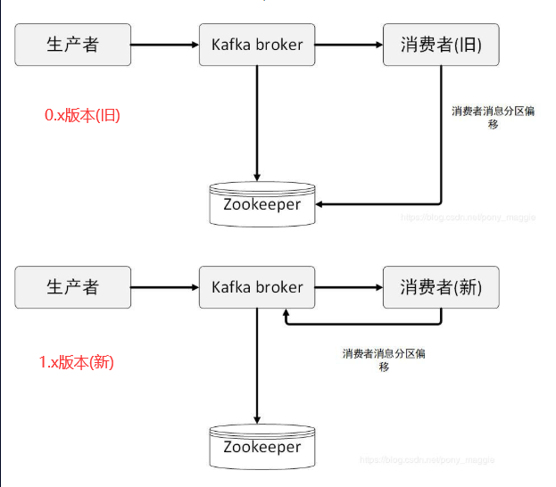

#### 简介
* kafka是一个分布式的消息队列系统(Distributed Message Queue)
#### 安装kafka
1. 下载并解压到目标目录
    * https://mirrors.huaweicloud.com/apache/kafka/1.1.1/kafka_2.12-1.1.1.tgz
2. 配置环境变量
3. 配置$KAFKA_HOME/config/server.properties文件
    1. 将所有作为kafka server的broker.id进行修改
    2. 配置zk选项
3. 启动/停止kafka server
    * sh $KAFKA_HOME/bin/kafka-server-start|stop.sh $KAFKA_HOME/config/server.properties
* 相关操作
    1. 查看topic列表
        * sh $KAFKA_HOME/bin/kafka-topics.sh --zookeeper host1:2181,host2:2181 --list
    2. 创建topic
        * sh $KAFKA_HOME/bin/kafka-topics.sh --zookeeper host1:2181,host2:2181 --create
            --replication-factor 2 --partitions 3 --topic test
        * 选项的含义
            1. --create: 创建topic
            2. --replication-factor: 指定每个分区中的副本数（默认值1）
            3. --partitions: 指定分区数量（默认值1）
            4. --topic 指定创建的topic名字
    3. 创建生产者
        * sh $KAFKA_HOME/bin/kafka-console-producer.sh --broker-list host1:9092,host2:9092 --topic test    
        * 含义
            1. --broker=list: 指定kafka server
            2. --topic: 指定生产的主题
    4. 创建消费者
        * (0.x老版本)sh $KAFKA_HOME/bin/kafka-console-consumer.sh --zookeeper host1:2181,host2:2181 --from-beginning --topic test
        * sh $KAFKA_HOME/bin/kafka-console-consumer.sh --bootstrap-server host1:2181,host2:2181 --from-beginning --topic test
        * 含义
            1. --bootstrap-server: 指定连接的server
     
                  
        