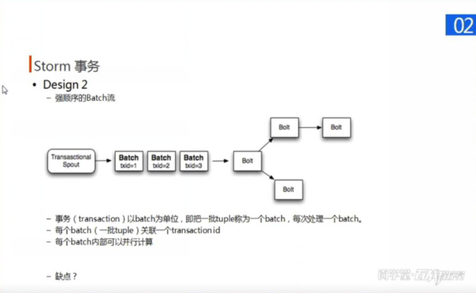

#### 简介
* kafka是一个分布式的消息队列系统(Distributed Message Queue)
#### 安装kafka
1. 下载并解压到目标目录
    * https://mirrors.huaweicloud.com/apache/kafka/1.1.1/kafka_2.12-1.1.1.tgz
2. 配置环境变量
3. 配置$KAFKA_HOME/config/server.properties文件
    1. 将所有作为kafka server的broker.id进行修改
    2. 配置zk选项
3. 启动/停止kafka server
    * sh $KAFKA_HOME/bin/kafka-server-start|stop.sh $KAFKA_HOME/config/server.properties
* 相关操作
    1. topic的相关操作
        * 是否自动创建主题
            * 在server.properties的auto.create.topics.enable=false，默认设置为true。
                如果设置为true，则produce或者fetch不存在的topic也会自动创建这个topic。
              
        * 查看topic
            * sh $KAFKA_HOME/bin/kafka-topics.sh --zookeeper host1:2181,host2:2181 --list
        * 创建topic
            * sh $KAFKA_HOME/bin/kafka-topics.sh --zookeeper host1:2181,host2:2181 --create
                --replication-factor 2 --partitions 3 --topic test
            * 选项的含义
                1. --create: 创建topic
                2. --replication-factor: 指定每个分区中的副本数（默认值1）
                3. --partitions: 指定分区数量（默认值1）
                4. --topic 指定创建的topic名字
        * 删除topic（暂未验证是否删除主题的数据）
            * sh $KAFKA_HOME/bin/kafka-topics.sh --zookeeper host1:2181 --delete --topic topic-name
            * 仅当server.properties下设置了delete.topic.enable=true时，才是真正删除，否则只是标记为删除
        * 删除主题的数据
            1. 删除主题并暴力删除所有broker中的server.properties中的log.dir目录下的数据
            2. （推荐）
            ```
            # 修改保留时间为三秒，但不是修改后三秒就马上删掉，kafka是采用轮训的方式，轮训到这个主题发现三秒前的数据都是删掉。时间由自己在server.properties里面设置
            $KAFKA_HOME/bin/kafka-configs.sh --zookeeper localhost:2181 --entity-type topics --entity-name topic-name --alter --add-config retention.ms=3000
            # 数据删除后，继续使用主题，那主题数据的保留时间就不可能为三秒，所以把上面修改的配置删掉，采用server.properties里面统一的配置。
            $KAFKA_HOME/bin/kafka-configs.sh --zookeeper localhost:2181 --entity-type topics --entity-name test --alter --delete-config retention.ms
            ```            
    3. 创建生产者
        * sh $KAFKA_HOME/bin/kafka-console-producer.sh --broker-list host1:9092,host2:9092 --topic test    
        * 含义
            1. --broker=list: 指定kafka server
            2. --topic: 指定生产的主题
    4. 创建消费者
        * Consumer API允许一个应用订阅一个或多个主题，并处理这些主题所产生的数据
            * http://kafka.apache.org/11/documentation.html#consumerapi
        * (0.x老版本)sh $KAFKA_HOME/bin/kafka-console-consumer.sh --zookeeper host1:9092,host2:9092 --from-beginning --topic test
        * sh $KAFKA_HOME/bin/kafka-console-consumer.sh --bootstrap-server host1:9092,host2:9092 --from-beginning --topic test
        * 含义
            1. --bootstrap-server svr: 指定连接的server，建议给定多个svr
            2. --group group-id: 指定创建的消费者所属的消费组id
     
* 清除kafka
    1. stop
    2. 删除所有kafka brokers主机上的/tmp/kafka-logs下的文件
    3. 删除zk
        ```
        deleteall /controller_epoch 
        deleteall /controller 
        deleteall /brokers 
        deleteall /admin
        deleteall /config
        deleteall /consumers
        deleteall /controller_epoch
        deleteall /latest_producer_id_block
        deleteall /log_dir_event_notification
        deleteall /isr_change_notification    
        ```
* 设置storm的ack机制
    * Storm中有个特殊的task名叫acker，他们负责跟踪spout发出的每一个Tuple的Tuple树（由spout到若干个bolt形成tuple树），同时启动一个计时器。
    ```
    // 注: 设置计时器的时间限制
    config.setMessageTimeoutSecs(secs) // 默认30s
    ```
    * spout的两个方法:
        1. ack：用于处理当本spout产生的tuple树处理完毕后，做的结束操作。（通常是将本spout之前产生的tuple缓存在队列中去掉）
        2. fail: 即当spout启动的计时器超时之前没有用收到acker的ack或者受到acker的fail，就触发spout的fail方法。（通常的做法就是进行重发）
    * 当acker（框架自启动的task）发现一个Tuple树已经处理完成了，它会发送一个消息给产生这个Tuple的那个spout从而从而触发spout的ack方法。
    * acker算法基本思想:
    	1. acker对于每个spout产生的tuple都保存一个ack-val的校验值，它的初始值是0
    	2. 然后每(spout/bolt)发射一个Tuple或Ack一个Tuple时，这个Tuple的msgId就要跟这个校验值异或一下，并且把得到的值更新为ack-val的新值
    	3. 假设每个发射出去的Tuple都被ack了，那么最后ack-val的值就一定是0。Acker就根据ack-val是否为0来判断是否完全处理，如果为0则认为已完全处理。
    * 要实现ack机制：
        1. spout发射tuple的时候指定messageId
        2. spout要重写BaseRichSpout的fail和ack方法
        3. spout对发射的tuple进行缓存(否则spout的fail方法收到acker发来的messsageId，spout也无法获取到发送失败的数据进行重发)，看看系统提供的接口，
            只有msgId这个参数，这里的设计不合理，其实在系统里是有cache整个msg的，只给用户一个messageid，用户如何取得原来的msg貌似需要自己cache，然后用这个msgId去查询，太坑爹了
        3. spout根据messageId对于ack的tuple则从缓存队列中删除，对于fail的tuple可以选择重发。
        4. 设置acker数至少大于0；config.setNumAckers(ackerParal);
    * 编写bolt的注意项
    　　* BasicBolt（无需锚定以及ack）
    		* BasicOutputCollector在emit数据的时候，会自动和输入的tuple相关联(就是锚定)，而在execute方法结束的时候那个输入tuple会被自动ack。
    　　* RichBolt（需锚定以及ack）
    	    * 需要在emit数据的时候，显示指定该数据的源tuple要加上第二个参数anchor tuple，以保持tracker链路，即collector.emit(oldTuple, newTuple);
    	        并且需要在execute执行成功后调用OutputCollector.ack(tuple), 当失败处理时，执行OutputCollector.fail(tuple);
                由一个tuple产生一个新的tuple称为：anchoring，你发射一个tuple的同时也就完成了一次anchoring。	
    
* storm的事务
    * design 1
    
    * design 2
    
        * 缺点：只有处理本轮batch完毕时，其他batch才能开始处理，为了保证一致性（比如先后顺序）
    * design 3
        * 分为processing与committing两个部分
        * processing可以流水处理，committing负责一致性