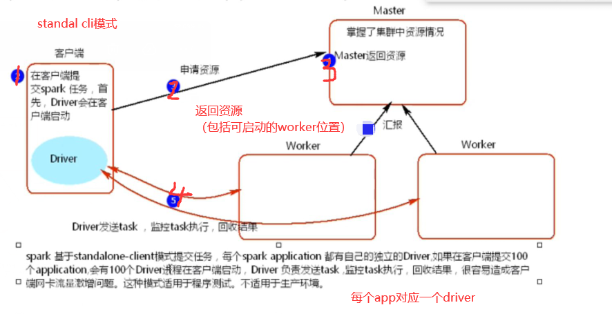
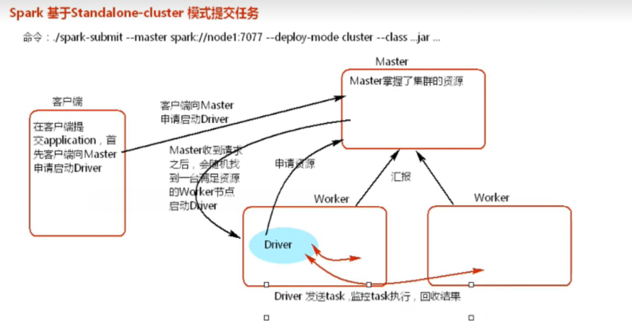
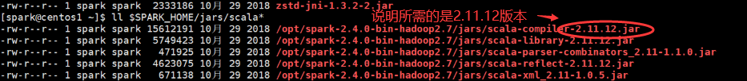

#### spark下载
* https://mirrors.aliyun.com/apache/spark/spark-2.4.4/spark-2.4.4-bin-hadoop2.7.tgz
#### standalone模式
* 就是采用spark自己的资源调度模式
* 文档参见
    * http://spark.apache.org/docs/latest/spark-standalone.html
* standalone client运行模式

    
    * driver位于cli中
* standalone cluster模式
    
    
    * 在cli提交任务
* 注意尽量不要在scala文件中指定master的位置
    * 例如在jar中master中指定local，而在spark-submit中指定master为spark://host:7077
        1. cli模式：实际执行master为local
        2. cluster模式：实际执行master为spark://host:7077    
#### yarn模式
* 注意：
    * 启动spark on YARN必须有hdfs的支持
    * 参见 http://spark.apache.org/docs/latest/running-on-yarn.html
* cli与cluster模式参见
    * https://blog.csdn.net/qq_35688140/article/details/89086557
    * 注意配置的每个executor的mem大小与driver大小与yarn的node manager的大小
        1. 当是cli模式的时候需要
            * mem(NM) > n * mem(executor)
        2. 当是cluster模式时，driver是放在app master中的,最好满足
            * mem(NM) > max{mem(app manager) + mem(executor)}，其中mem(AM) > mem(driver)
        

#### 提交job
1. 在本地打成jar包上传到目标机器上
2. 执行
    * $SPARK_HOME/bin/spark-submit --class <MAIN_CLASS> [--jars <EXTRA_DEP_JARS>] 
        <TARGET_JAR_PATH> [ARGS...]
    * 注意：若是提交后出现了类似scala类/方法未找到的异常很可能是spark的scala版本与本地编译scala的版本不一致的问题
        * 查看spark的所需scala版本
            
        * 出现不一致的问题则修改本地的scala编译版本（建议使用sbt，相关参见scala/sbt.md）