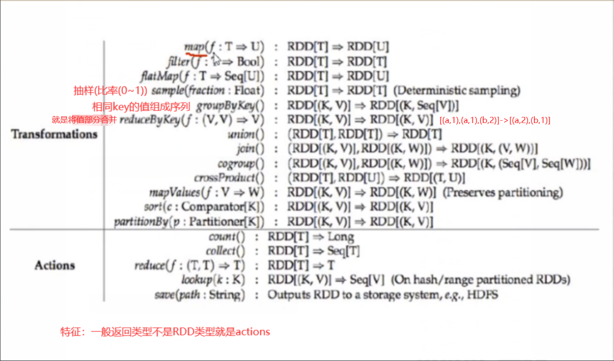
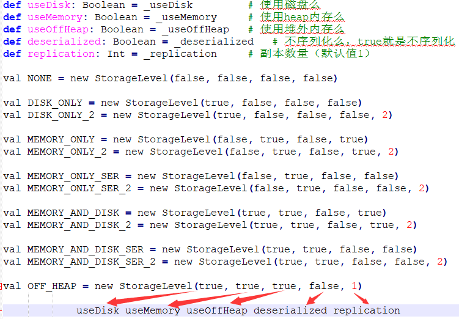

#### 算子
* transformations与action算子

    
    * 所有算子的解释见
        * http://spark.apache.org/docs/latest/rdd-programming-guide.html
    * sample(bool, double, long) 类型：trans
        1. bool：是否又放回的抽样
        2. double：抽取比例
        3. long：种子，对于同一RDD，当提供的种子值相同时，返回的RDD值相同
    * take(num) 类型：ac
        * 用于取出RDD中前num条数据
    * first() 类型：ac
        * 等价于take(1)(0) // 得到大小为1的数组，取第一个元素
    * cache() 类型：trans
#### 算子持久化
* 将rdd的中间trans结果的rdd'持久化，只有当执行action算子的时候，第一次回溯执行到这个持久化的算子时，才会完成持久化
* storage level
        
       
1. cache方式
    * 调用rdd.cache()即可,可以不用写为rdd = rdd.cache()
    * cache() == persist() == persist(StorageLevel.MEMORY_ONLY)
    * 在app结束后会自动释放空间，也可提前使用.unpersist()在其block manager中进行卸载
2. persist方式
    * 更加灵活
    * 在app结束后会自动释放空间，也可提前使用.unpersist()在其block manager中进行卸载
3. checkpoint方式
    * 使用checkpoint首先需要调用sparkContext的setCheckpoint方法，设置一个容错文件系统目录，比如hdfs，然后对RDD调用checkpoint方法
    * 将数据直接持久化到指定目录，当lineage很复杂时，可以尝试使用checkpoint来切断RDD的依赖关系
    * cp的一个重要特性就是将**中间结果在多个driver程序中复用**
* 三者差别
    1. persist或者cache前者持久化只是将数据保存在BlockManager中但是其lineage结构是不变的，但是
        checkpoint执行完后，cp后的rdd就不在依赖cp前的RDD，只有一个checkpointRDD，checkpoint之后，
        RDD的lineage就改变了。
    2. 深入一点讨论，rdd.persist(StorageLevel.DISK_ONLY) 与 checkpoint 也有区别。
        前者虽然可以将 RDD 的 partition 持久化到磁盘，但该 partition 由 blockManager 管理。
        一旦 driver program 执行结束，也就是 executor 所在进程 CoarseGrainedExecutorBackend stop，
        blockManager 也会 stop，被 cache 到磁盘上的 RDD 也会被清空（整个 blockManager 使用的 local 文件夹被删除）。
        而 checkpoint 将 RDD 持久化到 HDFS 或本地文件夹，如果不被手动 remove 掉（ 话说怎么 remove checkpoint 过的 RDD？ ），
        是一直存在的，也就是说可以被下一个 driver program 使用，而 cached RDD 不能被其他 dirver program 使用。
    3. persist或者cache持久化在磁盘或内存，数据丢失的可能性大，但是checkpoint的数据通常保存到hdfs上，放在了高容错文件系统。        
    
    