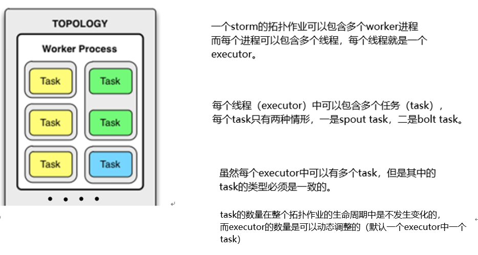
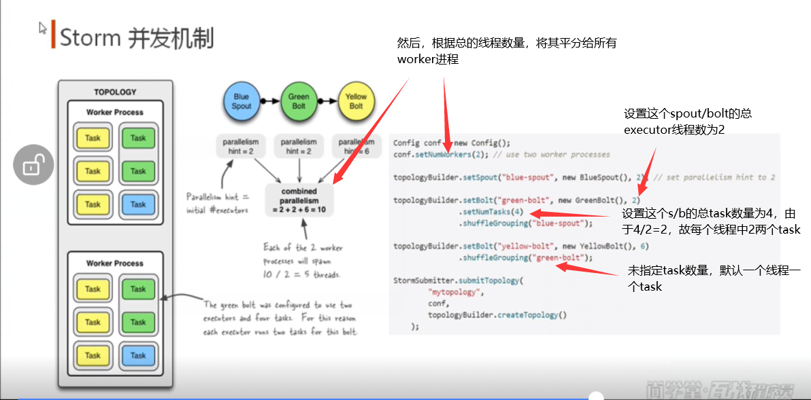
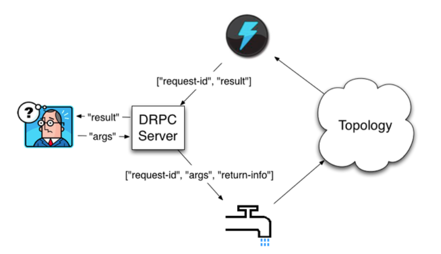

#### 流式与批处理式框架
* 流式处理框架
    * e.g. storm
    * 连续不断的处理，做实时处理，像是扶梯
* 微批处理
    * e.g. spark-streaming
    * 将RDD做得很小
* 批处理式框架
    * e.g. hadoop-mr
    * 分批次处理，做离线处理，像是电梯
#### storm特征
* 实时，分布式，具有高容错
* 进程是常驻内存中的，而hadoop的进程是根据job任务到来而创建的
* storm数据不经过磁盘，在内存中处理
#### storm架构（主从）


* 工作流程

* storm的本地目录树

* storm-zk的目录树

* 组件
    
    * Nimbus （主节点） 类似jobtracker
        1. 资源控制
        2. 任务分配
        3. jar包上传
    * Supervisor（从节点） 
    * Worker （从节点上的工作进程）
    
#### 高可靠
1. 异常处理
2. 消息可靠性保障机制ACK
    
    * storm的ack容错机制，是一般某个bolt处理出现问题，发送给acker一个fail ack后
        acker会通知spout，然后spout会重新发送原来发过的流数据，这就存在一个问题，
        拓扑图中，存在重复的数据处理。
#### Grouping 指定Tuple发往那个bolt进行处理，类似hadoop中的partition操作
1. shuffleGrouping，将Tuple随机发给任意一个下游bolt，保证每个数目大致相同
2. globalGrouping，将Tuple全部发给一个下游task id最低的bolt
3. allGrouping，将Tuple复制n份分发给下游n个bolt
4. fieldsGrouping，将Tuple根据给定的Fields字段来分发给下游bolt
5. noneGrouping，类似shuffle
6. directGrouping，指定特定的bolt来处理。只有声明为DirectStream的流才可以使用这个方法，
    且必须通过directEmit方法来传递给下一个bolt
7. customGrouping，自定义grouping
#### job
1. 提交job
    * 格式: $STORM_HOME/bin/storm jar <jar_path class [args ..]> [--jars dependent_jars] [...]
    ```
    # 示例
    ./bin/storm jar example/storm-starter/storm-starter-topologies-*.jar 
    org.apache.storm.starter.RollingTopWords blobstore-remote2 remote 
    --jars "./external/storm-redis/storm-redis-1.1.0.jar,./external/storm-kafka/storm-kafka-1.1.0.jar" 
    --artifacts "redis.clients:jedis:2.9.0,org.apache.kafka:kafka_2.10:0.8.2.2^org.slf4j:slf4j-log4j12" 
    --artifactRepositories "jboss-repository^http://repository.jboss.com/maven2,HDPRepo^http://repo.hortonworks.com/content/groups/public/"
    ```
2. 删除job（由于是流式处理，所以job一直在运行）
    * 格式: $STORM_HOME/bin/storm kill topology-name [-w wait-time-secs]
#### storm的并发机制

1. 设置一个拓扑作业中的worker进程的数量
    * Config.setNumWorkers(int workers)
2. 设置executor线程的数量
    * TopologyBuilder.setBolt(String id, IRichBolt bolt, Number parallelism_hint)，其中并行度就是线程数量
3. 设置task数量
    * ComponentConfigurationDeclarer.setNumTasks(Number val)
    ```
    // 设置executor的数量为2，task数量为4
    builder.setBolt("2", new LineHandlerBolt(), 2).setNumTasks(4).shuffleGrouping("1"); 
    ```
* 各种数量的分配
    * 着重阅读以下图片
    
* 重新调整（调整负载）
    * 虽然每个spout/bolt的总的task任务数在代码中定义死了无法再动态修改，但是可以通过命令行rebalance来完成
        这个拓扑作业中的worker进程数量，以及每个executor线程数量的动态修改。这样就完成了一个负载均衡。
    * 比如，对于id为xxx的spout/bolt,原先是由1个线程共4个task来工作，虽然4个task的数量无法更改，但是通过
        调整线程的数量为2，这样就会通过rebalance达到每个线程分配两个task的效果，从而达到调整负载的效果。
        再比如，通过调整worker的数量，来完成所有worker中的线程数量的再分配，以及当集群中加入新的supervisor时，
        达到所有worker在所有的supervisor中的一个负载均衡（新的supervisor中分到worker进程）。
    * rebalance命令
        * 格式： $STORM_HOME/bin/[storm rebalance topology-name [-w wait-time-secs] [-n new-num-workers] [-e component=parallelism]* 
#### storm drpc
* DRPC (distributed remote procedure call)   
     
    * DRPC是通过DRPC svr来实现分布式RPC功能的，其中DRPC svr负责接收rpc请求，并将该请求发送到正在storm中
        运行的拓扑作业，并等待作业为其返回处理的结果。
    * 目的：
        * 充分利用storm的计算能力实现高密度的并行实时运算（storm接收若干数据流的输入，数据在拓扑作业中运行完成后
            通过drpc将结果返回）    
    * 参见网址
        * http://storm.apache.org/releases/1.2.3/Distributed-RPC.html 