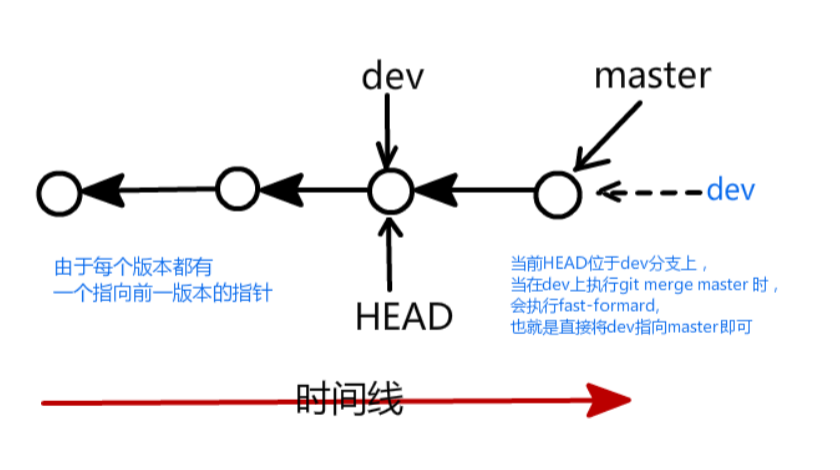
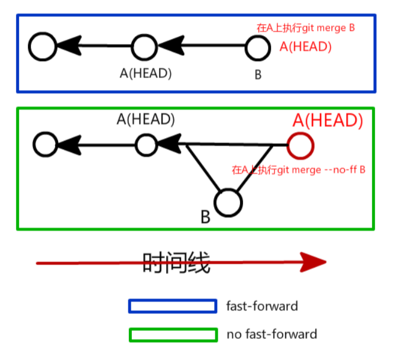

#### Git Branch
* 注意：分支只负责版本库，对于暂存区与工作区都是所有分支的公共区域

* 基本操作
    1. 查看分支 git branch
    2. 创建分支 git branch <new-branch-name>
        * 注意新创建的分支的所有内容与从哪个分支上创建的内容是一致的，比如在dev分支上创建
            test分支，则test分支的**所有初始文件内容**是与dev一致的，则与master不一致。
    3. 切换分支 git checkout <branch-name>，切换上一分支git checkout -
    4. 删除分支
        * 删除分支时注意不可以在即将删除的分支上执行删除操作，故先切换再删除
        1. git branch -d <branch-name>
            * 当要删除的分支做了改动就要求，需删除的分支已经合并过了
        2. git branch -D <branch-name> 强制删除分支
    5. 创建并切换到新分支上
        * git checkout -b <new-branch-name>
    6. 合并分支
        * \[dst-branch-name\] git merge <src-branch-name>
            * 在dst-branch-name分支上执行该命令就会将src-branch-name分支合并到dst-branch-name上。
        * 合并分支的冲突解决
            * 示例
            ```
            # 1.txt in branch A
            hello
            A
          
            # 1.txt in branch B
            hello
            B
          
            # 当执行在分支A上执行git marge B
            hello
            <<<<<<<< HEAD   # 表示在A分支上文件1.txt的起始不同位置
            A
            ========        # 表示两个分支文件的不同分割界限
            B
            >>>>>>>> B      # 表示在B分支上文件1.txt的终止不同位置
          
            # 修改做法：
            # 1. 将自己需要保存的内容保留下来并将<<<<< HEAD ====== >>>>> B等标识冲突的作用域删除
            # 2. 将解决冲突后的文件进行git add和git commit
            ```   
        * 出现在git merge上的fast-forward
        
            
            * 可能原先的dev版本与master版本存在冲突，但是master与dev在同一版本线上，
                但master的版本新于dev，则在当通过吧master合并上dev上时，就会直接将dev的指针移到master上
                （他们的commit ID就是master所指的commit ID）。
            * **注意：**对于处于同一时间线的版本库A与B，但B新于A，为了不使用fast-forward（快进），
                在分支A上执行git merge --no-ff B,此时就不会仅仅将A移到B上,而是会得出一个新的commit ID。
                
        
    7. 查看当前分支的最新一次操作
        * git branch -v
    
    
        
         
