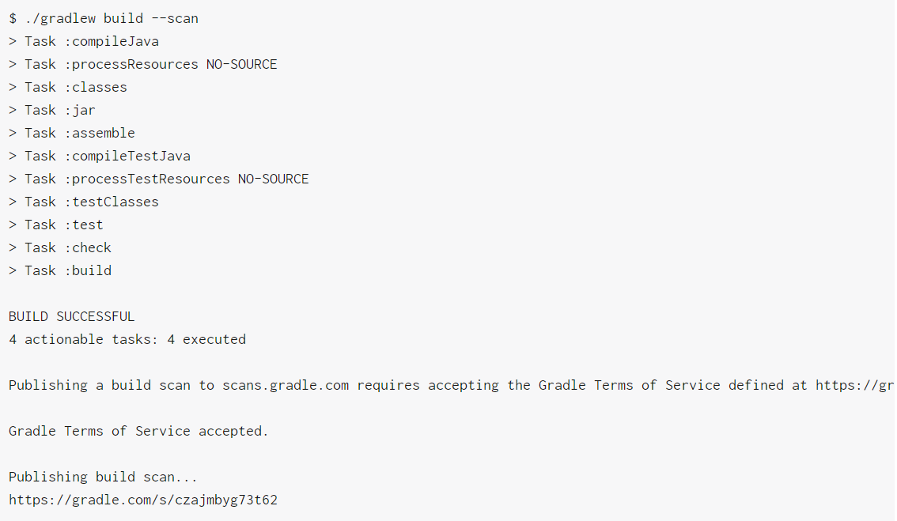
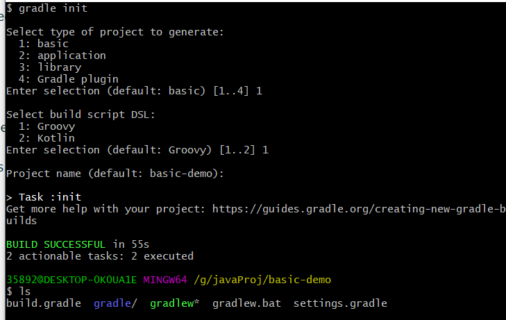
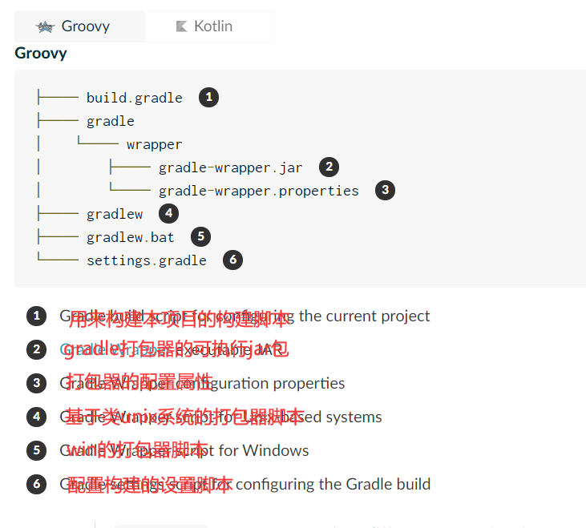
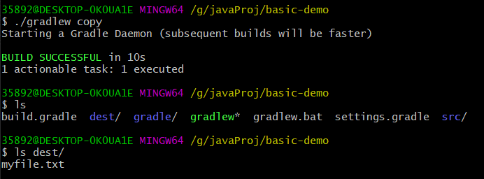
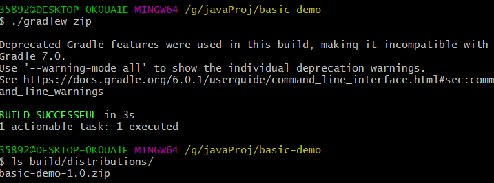
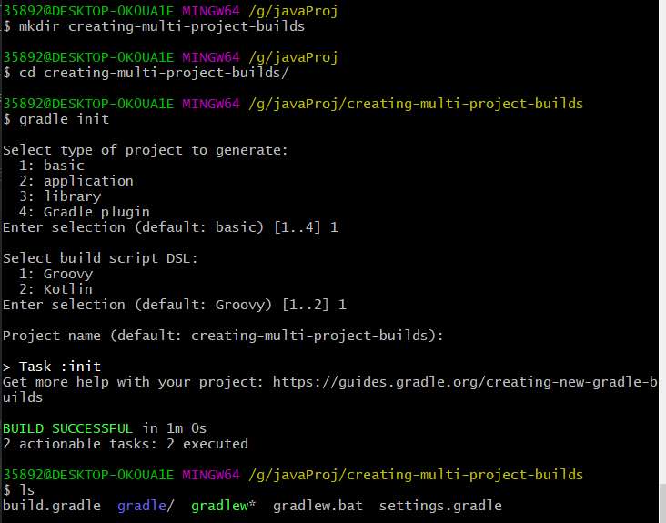
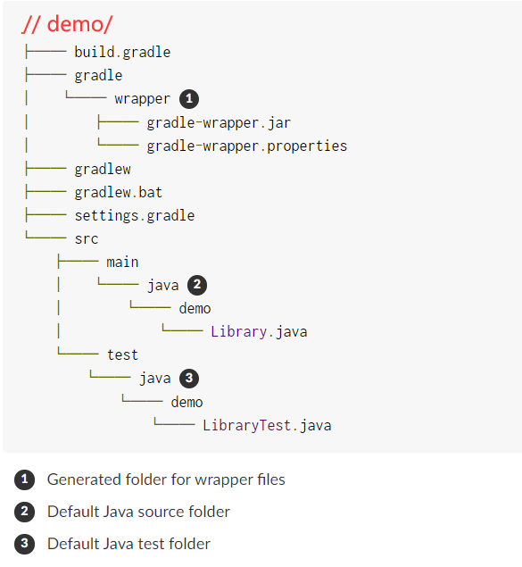

#### Gradle
* learn gradle step by step
    1. 创建构建扫描
        * 基本格式：gradle task-name --scan，为你执行的task进行扫描
        * 学会如何为一个构建创建构建扫描，添加一个插件，一个证书许可，执行一个扫描并观察结果。通过使用
            一个初始化的脚本来为所有的构建添加构建扫描的能力。
        * 一个构建扫描是：一个构建的共享以及集中化的记录，他提供了对构建中发生了什么以及为什么发声的视野。
            通过为你的项目运用一个构建扫描，你能够免费地出版你的构建扫描到https://scans.gradle.com
        * 从4.3版本开始，可以在没有任何额外的脚本配置就能够进行构建扫描，通过执行命令行选项--scan，就会自动
            地进行构件扫描，再给构建结束之前，会要求你同意在命令行上的证书许可。
        
        * 通过这个机制能够不用配置插件在你的build而简单地生成一个临时，一次性的构建扫描。若你想一个更细粒度的
            配置，你可以在一个构建中或者初始脚本中配置一个插件
        * 使得你工程中的构建都能够构建扫描，对于2.x-5.x版本你需要运用com.gradle.build-scan插件在你的根构建脚本中，
            对于gradle6.0，你需要在你的settings脚本中运用com.gradle.enterprise插件,更多参见
            [gradle build scan plugin docs](https://docs.gradle.com/enterprise/gradle-plugin/?_ga=2.114278535.1286504895.1585628010-1274469003.1574326164#applying_the_plugin)
        * 同一构件扫描的证书需许可，第一种方式就是在运行gradle build --scan后在命令行中特定时刻输入yes，另一种方式就是
            在构建文件中写入
            ```groovy
            // settings.gradle
            // 6.0
            gradleEnterprise {
                buildScan {
                    termsOfServiceUrl = 'https://gradle.com/terms-of-service'
                    termsOfServiceAgree = 'yes'
                }
            }
            ```
            * 对于更多关于build scan的配置信息，见[build scans user manual](https://docs.gradle.com/build-scan-plugin/?_ga=2.73786514.1286504895.1585628010-1274469003.1574326164)
            * 对于一次为一个项目中的多个构建都进行构件扫描，一般[使用一个init脚本](https://docs.gradle.com/enterprise/gradle-plugin/?_ga=2.144109365.1286504895.1585628010-1274469003.1574326164#many-projects)来完成，从而避免为每个
                构建都添加插件与证书许可。
            * 额外的还比如在什么条件下进行扫描构建，详见[build scans user manual](https://docs.gradle.com/build-scan-plugin/?_ga=2.73786514.1286504895.1585628010-1274469003.1574326164)
    2. 创建新的gradle构建
        1. 初始化项目（initialize a project）
            1. 创建一个目录
                ```shell script
                mkdir basic-demo
                cd basic-demo
                ```
            2. 使用gradle init命令来生成一个简单的proj
                ```shell script
                # 若想使用基于kotlin管理的gradle项目，则使用gradle init --dsl kotlin
                gradle init
                ```
                * [选择init的类型](https://docs.gradle.org/4.10.3/userguide/build_init_plugin.html#sec:build_init_types)
            3. 完成后
                
                
                
                
        2. 创建一个任务
            * gradle提供了APIs通过groovy/kotlin-based DSL来创建和配置任务，一个proj包括了
                一系列可以执行基本操作的任务。
            * gradle自带了一个任务库，你能够在你自己的proj中配置这些任务。比如，这里有一个叫[Copy](https://docs.gradle.org/4.10.3/dsl/org.gradle.api.tasks.Copy.html)
                的核心类型，它能够实现从一个位置到另一个位置的文件复制。
            1. 创建一个src目录
            2. 在src目录下添加一个名为myfile.txt的文件，内容是任意的。
            3. 在build.gradle文件中定义一个名为copy的Copy任务，它用来复制src到一个名为dest的新目录（这个dest
                目录由task自动为你创建）。
                ```groovy
                // group, description可以省略
                task copy(type: Copy, group: "Custom", description: "Copies sources to the dest directory") {
                    from "src"
                    into "dest"
                }
                ```
            4. 执行task copy
            
                
        3. 应用一个插件
            * gradle包含一系列的插件，更多的插件可以访问[gradle插件门户](https://plugins.gradle.org/).
                随之发行版的一个插件就是base插件，这个插件结合一个Zip的核心类型，用于将你的proj进行zip归档，并归档
                特定的名字以及到特定位置。
            * 添加base插件到你的构建脚本build.gradle中，并添加一个从src中创建zip归档的task zip
                ```groovy
                plugins {
                    id "base"
                } 
              
                task zip(type: Zip, group: "Archive", description: "Archives sources in a zip file") {
                    from "src"
                    // base插件根据设置来创建一个名叫basic-demo-1.0.zip归档到build/distributions目录中
                    setArchiveName "basic-demo-1.0.zip"
                }
                // ... rest of the build file ...
                ```
            * 运行
            
                
        4. 探索以及调试你的构建
            1. 看看你有哪些可用的tasks
                * gradle tasks
            2. 查看你的task执行细节（进行扫描）
                * gradle task-name --scan
            3. 查看你的gradle中可用的properties
                * gradle properties
    3. 创建多项目的构建
        * 多项目构建通过模块化来完成，通过模块化的构建，这样就允许单人在一个庞大的proj中聚焦于
            一个工作区域，然后由gradle去从项目中的其他部分来引入依赖。
        1. 你将构建什么
            * 你将构建一个包含文档的“问候”app，在这个过程中，你将创建一个基于groovy库的proj，一个基于
                asciidoctor的文档工程以及一个可发行的java命令行应用。你会看到如何将这些proj最终连接
                成一个proj
        2. 创建一个root proj
            1. 首先，为proj创建一个目录，并为其添加一个gradle包装器
                
                
            2. 在settings.gradle文件中添加
                ```groovy
                rootProject.name = "creating-multi-project-builds"
                ```
        3. 配置
            * 在一个multi-proj中你可以使用一个顶级构建脚本（也称之为root proj）来尽可能多的配置
                公共属性，让子项目来自定义属于自己特殊的内容。
            * 当使用gradle init不带任何参数命令，在build.gradle文件中，写入
                ```groovy
                allprojects {
                    repositories {
                        jcenter() // Add the JCenter repository to all projects.
                    }
                }
                ```
                * 跟项目配置构建脚本中的allprojects语句块用来将一些公共的配置作用于root-proj以及所有sub-projs，
                    而subprojects语句块添加的配置则仅仅作用于子项目。在跟项目中配置脚本中可以多次使用这两个
                    语句块。
            * 通过在根项目的构建脚本中的subprojects语句块中添加版本号从而来为每个子项目添加版本号
                ```groovy
                subprojects {
                   version = '1.0'
                }
                ```
        4. 在root项目下创建一个基于groovy lib的子项目
            1. 创建子项目的目录（在根目录下，**注意不要为子项目进行gradle init**）
            2. 为子项目添加一个build.gradle文件，并添加如下内容
                * 对于[构建一个基于groovy的库](https://guides.gradle.org/building-groovy-libraries)，更多细节见链接。
                ```groovy
                // creating-multi-project-builds/greeting-library/build.gradle
                plugins {
                    id 'groovy' // 
                }
                
                dependencies {
                    compile 'org.codehaus.groovy:groovy:2.4.10'
                
                    testCompile 'org.spockframework:spock-core:1.0-groovy-2.4', {
                        exclude module: 'groovy-all'
                    }
                }
                ```
            3. 将子项目添加到跟项目中，通过在跟项目的settings.gradle文件中添加
                ```groovy
                // creating-multi-project-builds/settings.gradle
                include "greeting-library"
                ```
            4. 在greeting-library下创建src/main/groovy
                ```shell script
                $ cd greeting-library
                $ mkdir -p src/main/groovy/greeter
                $ mkdir -p src/test/groovy/greeter
                ```
                1. 在src/main/groovy下创建一个包greeter，并添加一个类GreetingFormatter
                ```groovy
                // creating-multi-project-builds/greeting-library/src/main/groovy/greeter/GreetingFormatter.groovy
                package greeter
                
                import groovy.transform.CompileStatic
                
                @CompileStatic
                class GreetingFormatter {
                    static String greeting(final String name) {
                        "Hello, ${name.capitalize()}"
                    }
                }
                ```
                2. 在src/test（需要自己新建）下添加一个基于Spock框架（类似JUnit）的测试
                ```groovy
                // creating-multi-project-builds/greeting-library/src/test/groovy/greeter/GreetingFormatterSpec.groovy
                package greeter
                
                import spock.lang.Specification
                
                class GreetingFormatterSpec extends Specification {
                
                    def 'Creating a greeting'() {
                
                        expect: 'The greeting to be correctly capitalized'
                        GreetingFormatter.greeting('gradlephant') == 'Hello, Gradlephant'
                
                    }
                } 
                ```
            5. 再根项目的目录中执行构建
                ```shell script
                # creating-multi-project-builds/
                ./gradlew build
                ```
                * gradle会自动检测子项目greeting-library下的build任务并执行它，这是gradle多项目
                    构建的有力特征。当子项目中存在相同名称的任务时，在顶级项目中执行某名称的任务时，所有子项目
                    中同名的任务也会得到执行。
                * 单个子项目的构建并不能称为多项目的构建，接下来为顶级项目添加另一个子项目来消费这个greeting-library子项目
        5. 在根项目下添加一个java应用子项目
            1. mkdir creating-multi-project-builds/greeter
            2. vi creating-multi-project-builds/greeter/build.gradle(同样不能为子项目进行gradle init)
                ```groovy
                // creating-multi-project-builds/greeter/build.gradle
                plugins {
                    id 'java'  // 这是一个java项目，故需要java插件     
                    id 'application'   // 为这个java应用添加一个app插件
                }
                ```
            3. 同样将greeter子项目添加到根项目，并把greeter子项目所依赖的greeting-library加入
                ```groovy
                // creating-multi-project-builds/settings.gradle
                // 添加
                include 'greeter'
                ```
                ```groovy
                // creating-multi-project-builds/greeter/build.gradle
                // 添加
                dependencies {
                   // 通过使用project(NAME)的语法来将另一个子项目的lib作为本子项目依赖
                   compile project(":greeting-library")
                }
                ``` 
            4. 为greeter子项目添加一个主类
                ```java
                // 首先mkdir -p greeter/src/main/java/greeter
               
                // creating-multi-project-builds/greeter/src/main/java/greeter/Greeter.java
                package greeter;
                
                public class Greeter {
                    public static void main(String[] args) {
                        final String output = GreetingFormatter.greeting(args[0]);
                        System.out.println(output);
                    }
                }
                ```
                * **由于是java应用，所以需要告诉gradle该应用的主入口（主类）是什么**，通过在该子项目中的
                    build.gradle文件中添加
                    ```groovy
                    // creating-multi-project-builds/greeter/build.gradle
                    mainClassName = 'greeter.Greeter' // 包类的全限定名
                    ```
            5. 编译构建
                ```shell script
                # creating-multi-project-builds/
                ./gradlew build
                ```   
                * **对于添加了主类的java app在构建之后就会生成一个发行版**
            6. 添加一个test
                * 使用spock测试框架（基于groovy）故，在greeter子项目中需要使用groovy插件
                    （groovy插件包含了java插件），股只需要将插件java->groovy即可，并添加
                    spock测试框架的依赖。
                ```groovy
                // creating-multi-project-builds/greeter/build.gradle
                // 设置后变成
                plugins {
                    id 'groovy' // replace groovy to java
                    id 'application'
                }
                
                // point main class for java app
                mainClassName = "greeter.Greeter"
                
                dependencies {
                    compile project(":greeting-library")
                    // 一下为新增
                    testCompile 'org.spockframework:spock-core:1.0-groovy-2.4', {
                        exclude module: 'groovy-all'
                    }
                }
                ``` 
                * 为greeter子项目添加测试类文件
                ```groovy
                // creating-multi-project-builds/greeter/src/test/groovy/greeter/GreeterSpec.groovy
                package greeter
                
                import spock.lang.Specification
                
                class GreeterSpec extends Specification {
                
                    def 'Calling the entry point'() {
                
                        setup: 'Re-route standard out'
                        def buf = new ByteArrayOutputStream(1024)
                        System.out = new PrintStream(buf)
                
                        when: 'The entrypoint is executed'
                        Greeter.main('gradlephant')
                
                        then: 'The correct greeting is output'
                        buf.toString() == "Hello, Gradlephant\n".denormalize()
                    }
                }
                ```
            7. 执行test
                * 回到顶级项目的根目录，执行
                    ```shell script
                    # 表示执行greeter子项目下的test任务，这个任务就是编译构建greeter子项目中的测试代码并执行测试
                    ./gradlew :greeter:test [--tests "测试类的全限定名.方法名"]
                    
                    # 一个替代做法
                    cd greeter
                    ./gradlew test
                    ```
                * **默认情况测试的结果放置在项目的build/reports与results目录下**
                * **可以通过在顶级项目执行./gradlew :sub-proj:task-name \[options ..\]**
                    ```shell script
                    # 查看子项目greeter中的test任务的使用说明
                    ./gradlew :greeter:help --task :greeter:test
                    ```
        6. 在跟项目中添加一个docs的子项目
            * docs子项目用来管理工程的整个文档管理，是基于asciidoctor插件实现的
            1. 在根项目中的build.gradle文件中添加asciidoctor插件
                ```groovy
                // creating-multi-project-builds/build.gradle
                // 添加
                plugins {
                    // 后缀的apply false表明这个插件在根项目中不使用，仅仅在子项目中运用
                    id 'org.asciidoctor.convert' version '1.5.6' apply false 
                }
                ```
            2. 创建docs目录并新建build.gradle文件并写入配置
                ```groovy
                // 1. mkdir docs && vi docs/build.gradle
                // 2. 写入配置
                // creating-multi-project-builds/docs/build.gradle
                plugins {
                    // 由于在root proj中定义了这个插件，故在这里选择使用这个插件
                    id 'org.asciidoctor.convert' 
                }
                
                asciidoctor {
                    sources {
                        // 告知asciidoctor插件在本子项目中的默认的源文件夹(src/docs/asciidoc)中去搜寻名为greeter.adoc为文档文件，
                        // 也就是搜寻creating-multi-project-builds/docs/src/docs/asciidoc/greeter.adoc
                        include 'greeter.adoc'   
                    }
                }
                
                // 将asciidoctor任务添加到本子项目的build生命周期中，即有顶级项目中执行build，
                // 它会先执行本子项目docs的build任务，从而会执行本asciidoctor任务，完成adoc文档的构建
                build.dependsOn 'asciidoctor' 
                ```
            3. 将本子项目添加到顶级项目的settings.gradle中
                ```groovy
                // creating-multi-project-builds/settings.gradle
                // 添加
                include "docs"
                ```
            4. 向docs子项目中添加creating-multi-project-builds/docs/src/docs/asciidoc/greeter.adoc文件
                ```text
                = Greeter Command-line Application
                
                A simple application demonstrating the flexibility of a Gradle multi-project.
                
                == Installation
                
                Unpack the ZIP or TAR file in a suitable location
                
                == Usage
                
                [listing]
                ----
                $ cd greeter-1.0
                $ ./bin/greeter gradlephant
                
                Hello, Gradlephant
                ----
                ```
            5. 在顶级项目中运行asciidoctor任务（在顶级项目运行某任务，但是只在子项目中有，
                则会去所有存在该任务的子项目中执行这个任务）
                ```shell script
                # creating-multi-project-builds/
                ./gradlew asciidoctor
                ```
                * 最终编译的html格式的doc文件会在docs/build/asciidoc/html8/greeter.html
        7. 将文档打包进发行版的归档中（docs子项目生成文档放入java app的子项目greeter的发行版zip/tar中）
            1. 通过向greeter子项目添加任务依赖
                ```groovy
                // creating-multi-project-builds/greeter/build.gradle
                distZip {
                    from project(':docs').asciidoctor, { 
                        into "${project.name}-${version}"
                    }
                }
                distTar {
                    from project(':docs').asciidoctor, {
                        into "${project.name}-${version}"
                    }
                }
                ```
                * **使用project(:NAME)来引用另一项目以及其任务**
            2. 对顶级项目进行构建
                ```shell script
                # creating-multi-project-builds/
                $ ./gradlew build
                ```
        8. 修改公共的构建脚本
            1. 注意到greeting-library与greeter子项目的build.gradle中有公共相同的配置代码，
                gradle提供将这些代码抽出放入到顶级项目的build.gradle配置脚本文件进行管理。
                ```groovy
                // greeting-library与greeter子项目的build.gradle中有公共相同的配置代码
                plugins {
                    id "groovy"
                }
                dependencies {
                    testCompile 'org.spockframework:spock-core:1.0-groovy-2.4', {
                        exclude module: 'groovy-all'
                    }
                }
                ```
                * 将以上greeting-library与greeter子项目的build.gradle中有公共相同的配置代码移除
            2. 进行抽取到顶级项目的build.gradle配置脚本文件进行管理
                ```groovy
                // creating-multi-project-builds/build.gradle
                // 添加
                configure(subprojects.findAll { it.name == 'greeter' || it.name == 'greeting-library' }) { 
                
                    apply plugin: 'groovy'
                
                    dependencies {
                        testCompile 'org.spockframework:spock-core:1.0-groovy-2.4', {
                            exclude module: 'groovy-all'
                        }
                    }
                }
                ```
                * 使用一个带有判断符合条件的configure来让所有满足条件的子项目被配置
            3. 顶级项目执行./gradlew clean build   
    4. 构建一个java库
        1. 创建库项目目录以及初始化它
            ```shell script
            mkdir demo && cd demo
            gradle init # 在选择type of proj选择library，其他默认即可
            ```
            
        2. 进行构建
            * 在执行./gradlew build
        3. 自定义jar
            ```groovy
            // demo/build.gradle
            jar {
                manifest {
                    attributes('Implementation-Title': project.name,
                               'Implementation-Version': project.version)
                }
            }
           
            // 将所有依赖都打入jar
            jar {
                manifest {
                    attributes(
                            "Manifest-Version": 1.0,
                            "Main-Class": "com.baidudu.lbagent.LBAgentServer"   //主函数的名称
                            )  
                }
                from { configurations.compile.collect { it.isDirectory() ? it : zipTree(it) } }
                into('assets') {
                    from 'assets'
                }
            }
            ```
* 五大特征
    1. 通用化的构建工具
        * 仅仅支持以maven-repo，Ivy-compatible-repo以及文件系统作为依赖管理
    2. 基于任务的核心模型
        * 任务以有向无环图的形式组织，通过插件以及自己定的脚本来定义个任务图。而不同的任务之间可以
            通过[任务依赖机制](https://docs.gradle.org/current/userguide/tutorial_using_tasks.html#sec:task_dependencies)
            来完成。
        * 任务由三部分（可选）组成
            1. 动作
            2. 输入
            3. 输出
    3. 由数个固定的构建阶段（来自gradle的[构建周期](https://docs.gradle.org/current/userguide/build_lifecycle.html#build_lifecycle)）
        1. 初始化
            * 设置构建的环境以及决定哪个工程将会参加其中
        2. 配置
            * 构建以及配置图，然后根据用户所需的运行的特定任务来决定哪些依赖任务需要运行（根据任务视图来决定运行顺序）
        3. 执行
            * 运行那些在配置结束阶段被选择的任务
        * [一个良好设计的构建脚本时由声明式的配置组成的而不是复杂的逻辑组成](https://docs.gradle.org/current/userguide/authoring_maintainable_build_scripts.html#sec:avoid_imperative_logic_in_scripts)。
    4. 可拓展
        * 由于业务的不同性，常常需要自己定义构建逻辑，gradle提供了一些机制用于拓展它：
            1. 自定义任务类型
                * 当你希望一个构建能够做一些现存任务实现不了的工作时，你可以简单地实现你自己的
                    任务类型。典型的做法就是：将一个自定义任务类型所需的源文件放到buildSrc目录
                    或者放到一个打包的插件中。然后你就可以像使用自带任务/插件一样使用这个自定义的
                    任务类型了。
            2. 自定义任务动作
                * 你可以通过在Task.doFirst()与doLast()中自定义构建逻辑来完成
            3. 工程以及任务额外的属性
                * 你可以在你自定义的动作以及逻辑中使用你自定义的额外属性，甚至这些属性可以在
                    非你显式创造任务中使用。
            4. 自定义约定
                * 约定是一个强有力的方式来简化构建，这样就使得跟家容易与简单的来使用。
            5. 一个自定义模块
                * gradle允许你再在任务/文件以及依赖管理之外，向一个构建中引入一个新的概念--model。
    5. 通过API来构建脚本操作
        * 良好设计的构建脚本是用来描述在构建软件中所需的步骤是什么，而不是这些步骤如何执行。对于这个问题，
            它是自定义任务类型/插件的工作。
        * **误区：**gradle的强大与灵活之处在于其构建脚本时代码写成的，而其的强大与灵活之处
            其实来自于其底层模型以及API。这也是为什么
            [gradle推荐不要在构建脚本中引入过多的复杂逻辑代码](https://docs.gradle.org/current/userguide/authoring_maintainable_build_scripts.html#sec:avoid_imperative_logic_in_scripts) 
            复杂逻辑值得是比如（大量的条件代码，大量冗长的代码，取而代之的应该是比如将其抽出形成一个自定义插件，再将其引用构建脚本）
            同时不要去使用gradle的内部API，因为gradle随着版本更新内部API可能会发生更改  
* 添加插件的方法
    1. 基于apply方法
        ```groovy
        apply plugin: 'xxx'
        ```
    2. 基于DSL
        ```groovy
        plugins {
            id 'xxx' // version 'xxx'
        }
        ```