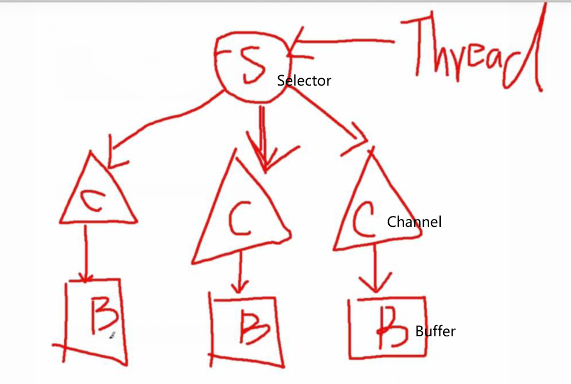

#### NIO 同步非阻塞IO
* io与nio的比较
    * java.io中最为核心的一个概念是流（Stream），面向流的编程。java中一个流要么是输入流要么是输出流，不可能是
        输入又是输出流。
    * java.nio有3个核心概念：Selector，Channel and Buffer。在nio中，我们面向块（block）或是
        缓冲区（buffer）进行编程。Buffer本身就是一块内存，底层实现上就是一个数组。数据的读写就是通过buffer
        （大小通过XXXBuffer.allocate(int)）来实现的
        
