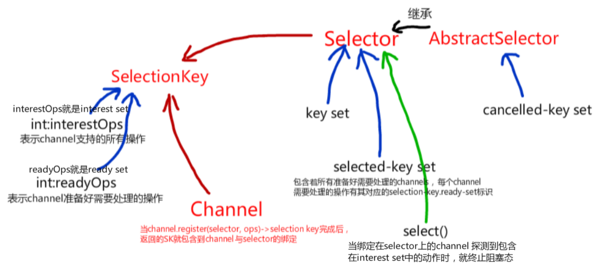

#### abstract class Selector（大概看看，主要看加粗部分与图）

* 使用selector完成同步非阻塞编程，运用场景就是使用一个线程处理所有请求
* **一般当使用一个Selector来实现单线程完成非阻塞任务（比如server socket channel, socket channel都绑定到Selector上）时，
    server socket channel, socket channel才都需要使用SelectableChannel::configureBlocking(false)**
* 获取实例方式
    * Selector.open(),其是使用系统默认的SelectorProvider提供器来新建一个Selector实例，一个Selector
        一致保持open状态直到其被close。
* Selection Operations
    1. 在每一次选择操作中，key可能会被**添加或者从cancelled-key set中删除**。而对key set与selected-key set
        ，key仅仅只可能被从中删除。
    2. 选择操作被执行，通过Selector::select(), Selector::select(long), Selector::selectNow(),其涉及一下三个步骤：
        1. 每一个位于cancelled-key set中的键都会从包含这个键的key set中移除，这个步骤使得cancelled-key set为空。
        2. 要求底层OS做一个更新，以让每一个尚存的通道准备好来执行特定操作，这特定操作由选择操作开始时channel的interest set来特定标识。
            对于准备好做至少一个这样操作的channel，下列二者之一的动作会执行：
            1. 若channel的key没有在Selector的selected-key set中，则会首先将其添加进入sk set中，然后channel的
                准备操作集（ready-operation set）将会修改来标识那些特定的操作，以标识channel已经为那些特定操作准备好了。
                然后任何的存储在准备集合中的信息将会丢弃。
            2. 否则，通道的键已经在所选键集中，因此修改其就绪操作集以识别报告通道已准备就绪的任何新操作。 
                先前记录在就绪集中的任何准备信息都将保留； 换句话说，底层系统返回的就绪集按位分离到key的当前就绪集中。
        * 参见interest set与ready set
        * 若key set中的所有建在这个步骤之前就是空的话，那么sk set与ready-operation set都不会的得到更新
    3. 略 
* 当一个Selector注册到一个可选择的通道（a selectable channel）当中时，会有一个SelectionKey对象来代表。
    一个选择器维持着由选择键组成的三个集合：
    * 一个Selector可以与多个可选通道注册绑定
    1. key set：包含着的keys（每一个key代表这个选择器的一个连接事件特征）代表这个选择器到可选通道的注册的所有特征情形，
        通过Selector::keys获取这个集合(也就是key的所有可能性的集合，就是选择器的所有可能特征集合)
        * 特征比如：已经连接，已断开等等
        * 当通过SelectableChannel::register(Selector, int ops)完成一个选择器到可选通道的注册时，它会附带的完成
            将key添加到选择器的key set中。
    2. selected-key set: **就是需要处理的所有channels的选择键**（等价于所有所有需要处理的channels），
        每个键中包含着这个channel需要处理的动作（这个集合是key set的子集），通过Selector::selectedKeys()
        * **当在后续处理了selected-key set中某个选择键对应channel的操作后，通常需要将这个键从selected-key set中移除，
            表示本轮中，完成了对这个channel的所有处理。**
    3. cancelled-key set: 就是选择器已经取消的keys（事件特征），而其绑定的通道还没有取消注册。这个
        集合是不可以之间访问的，也是key set的子集。
        * 当关闭channel或者调用它的SelectionKey::cancel方法时，一个key就会添加到cancelled-key set中。
            取消一个key就会导致：在下一执行**选择操作**（就是Selector::select()方法的执行）的时候到它的通道的一个注册取消
            以及从key set中移除这个key。
    * 当Selector刚创建的时候，这三个集合都是空集
* 并发
    * 虽然Selector他们自身是并发安全的，但是对于keys来说并不是这样的。
    * 选择操作的同步顺序是：同步选择器自身，同步key set, 同步sk set。他也会在步骤一与步骤3之间同步cancelled-key set
    * 阻塞在一个select()上的线程可能由以下三种情形中断
        1. 调用Selector::wakeup()
        2. 调用Selector::close()
        2. 被阻塞的线程调用Thread::interrupt()，Selector::wakeup()也会得到调用
* 常用方法
    1. static Selector open()
        * 创建一个选择器
    2. SelectorProvider provider()
        * 返回创建这个选择器的选择器提供者
    3. Set<SelectionKey> keys()
        * 返回注册在这个选择器上的所有选择键（话句话说也就是注册在这个选择器上的所有通道）
            当每一次执行选择操作的时候，就会根据cancelled-key set从key set中移除这些键
    4. Set<SelectionKey> selectedKeys()
        * 返回已经准备好处理的所有选择键（也就是待处理的channel）
    5. int select()
        * 选择操作
        * 返回这一轮待处理的选择键数（也就是待处理的通道数）
        * 类似
            1. selectNow
    6. Selector wakeup()
        * 使得尚未返回的选择操作立刻返回，若另一个线程阻塞在选择方法（e.g. select()）上,则在本线程在调用wakeup方法后，那个线程会立即从
            选择方法上返回。若当前没有选择操作处于处理状态，除非此一时刻调用了selectNow(), 否则将在下一次调用选择操作的时候就
            会立即返回。在两次连续成功的选择操作之间调用多次的wakeup方法的效果等同于调用一次。
#### abstract class SelectionKey（着重看）
* 是一个代表着向selector注册的可选通道（SelectableChannel）的标识（Token），
* 每当一个通道注册到selector中就会创建一个选择键(selection key)，即每一个选择键都会绑定一个选择器与一个通道。
* 这个选择键在通过**1. 调用其自身的cancel()方法取消 or 2. 它所依附的selector或者channel被关闭**之后就会变为无效。
    当取消一个选择键，其不会立刻从它绑定过的选择器中移除，代替的是：这个选择键会被加入选择器所持有的取消键集合（cancelled-key set）中,
    位于取消键集合中的所有选择键将会在下一轮的选择操作(selection op, 调用select(..)方法)中移除。
* 可以通过调用其isValid方法来判断这个选择键是否合法。
* 每一个选择键都包含两个操作集合（每个操作集合由一个int值表示，操作基于int值中的位来标识，
    选择键所绑定的channel支持标识的每个操作）
    1. interest set: 这个由int值表示的bit集合保存着若干操作，当选择键创建时，
        interest set由所给的值初始化，通过interestOps(int)方法实现对interest set的值改变。
        * 简言之就是，这个channel所支持的所有操作，同时channel也只会响应这些操作。
    2. ready set: 标识着selector所准备好的所有操作。
        * 当线程阻塞在selector.select()时，注册在selector上的一个channel检测到符合interestOps的一个动作发生（比如触发READ），
            此时selector.select()方法内部恢复执行，1. 若这个channel绑定的选择键不存在于selected-key set中，
            则触发的动作代表的bit覆盖该channel对应的选择键的ready set，并将其加入selected-key set。
            2. 若这个channel绑定的选择键存在于selected-key set中，则触发的动作代表的bit与该channel对应的选择键的ready set
            取或并更新到其ready set中。
        * 然后就是在select()方法中返回
    ```
    // E.G.
    // 其中1 << 0标识OP_READ
    //    1 << 3标识OP_CONNECT  
    int interestOps = 0b1001; // 表示channel支持read与connect操作
    ```
* 常用方法
    1. SelectableChannel channel()
        * 获取与这个selection key绑定的channel
    2. Selector selector()
        * 获取与这个selection key绑定的selector
    3. void cancel()
        * 取消key绑定的channel与selector之间的绑定，并且这个选择键将会被添加到原先绑定的选择器的cancelled-key set中
    4. int interestOps()
        * 返回这个选择键的兴趣操作集（也就是这个选择键绑定的channel所能支持的所有操作）
    5. SelectionKey interestOps(int)
        * 修改这个选择键的兴趣集并返回修改后的自身
    6. int readyOps()
        * 返回这个选择键的准备集（也就是当这个选择键绑定过的选择器在下一次执行选择操作的时候，
            他就会让这个选择键绑定过的channel执行这个准备集中的标识的操作）
    7. Object attach(Object)
        * 将给定的对象绑定到这个选择键上去，返回绑定的对象。当未绑定时调用attachment方法将会返回null
    8. Object attachment()
        * 返回上一次绑定的对象
        * Attaches the given object to this key.
          An attached object may later be retrieved via the attachment method. Only one object may be attached at a time; invoking this method causes any previous attachment to be discarded. The current attachment may be discarded by attaching null.
          
          Params:
          ob – The object to be attached; may be null
          Returns:
          The previously-attached object, if any, otherwise nul
#### abstract class SelectorProvider
* SelectorProvider::provider()方法来获得SelectorProvider的一个实例
    * 返回系统范围内默认的SelectorProvider的一个实例，这个实例的首次顺序获取策略如下
        （使用基于懒汉式的单例模式）：
        1. 通过系统属性：java.nio.channels.spi.SelectorProvider设置具体的java类全限定名，若处理
            失败就抛出未指定的错误
        2. 基于SPI的，通过系统类加载器，去jar中寻找符合如下：
            ```
            // xxx.jar
            /---xxx.jar-----
                /-META-INF/
                    /-services/
                        /-java.nio.channels.spi.SelectorProvider    (a file，SelectorProvider子类的完全限定名就是第一行的内容)
            
            ```
        3. 若以上均为提供，则使用实例化系统默认的SelectorProvider实例
        * 该方法的后续调用返回的均同第一次的结果