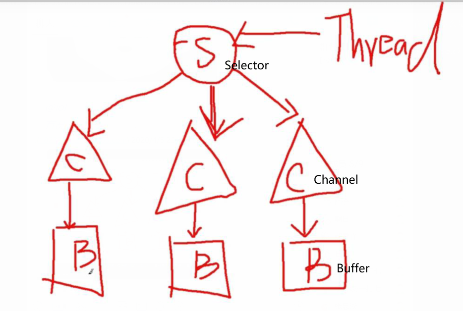

#### NIO 同步非阻塞IO
* io与nio的比较
    * java.io中最为核心的一个概念是流（Stream），面向流的编程。java中一个流要么是输入流要么是输出流，不可能是
        输入又是输出流。
    * java.nio有3个核心概念：Selector，Channel and Buffer。在nio中，我们面向块（block）或是
        缓冲区（buffer）进行编程。Buffer本身就是一块内存，底层实现上就是一个数组。数据的读写就是通过buffer
        （大小通过XXXBuffer.allocate(int)）来实现的
        
        1. Java中的7种原生类型都有其对应的Buffer类型：IntBuffer，ByteBuffer等（没有BooleanBuffer）
        2. Channel可以对其进行读写，但与Stream不同的是就是Channel是双向的，一个流只能是InputStream/OutputStream，
            其次Channel的底层是Buffer，所有的读写都市通过Buffer来执行的。
* java.nio Buffer的三个状态属性
    1. position
        * **下一个**读写的索引，其值小于limit
    2. limit
        * 就是读写操作的索引后边界（exclusive），其值介于\[0, capacity\]
    3. capacity
        * 包含的元素的个数，不能为负数，为固定值。
    ```
    // E.G.
        |------------------------------|
        0   1   2   ...     c-3  c-2  c-1
            ↑                     ↑
            p                     l
            |---可读写的位置---|
    ```
    * 操作的流程
        ```
        while (true) {
            buf.clear();
            // buf写
            // buf读
        }
        ```
    * 补充
        1. mark
            * 用于对buf的mark()与reset()操作
        2. offset
            * 主要用于多个buf共用一个底层数组起始的不同偏移量（比如buf的slice操作）
        3. address
            * 仅仅用于direct buf，用于存放真正的数据的在os中的地址
* 创建buf的三种方式
    1. XXXBuffer.allocate(int)
    2. XXXBuffer.allocateDirect(int)
    3. XXXBuffer.wrap(byte[] \[, int, int\])
        * 直接使用字节数组来封装一个buf，不建议使用
* Buffer的Scattering与Gathering
    * 也就是分散与和聚，比如在channel中奖数据读入到一个buffer数组中，当第一个buf读满的时候，就读第二个buf，
        以此类推。对于Gathering，也是这样的。
    * 使用场景：
        * 当对于一个结构固定过的数据结构，比如分为头，体，尾，三部分，那么就可以通过Scattering将其放到多个buf中，
            而不用像之前将所有数据放到一个buf中，再做解析提取操作。
    
* NIO Buffer类解析
    1. abstract class Buffer
        * 一个buffer是一个线性的，有限原生类型的序列，除了其内容之外，其重要的属性就是：**capacity, limit. position.**
        * 这个类的每个子类都定义了get与put两个范围的操作
            1. 相对操作：读写操作，当每读写一个元素pos就会后移一个位置
            2. 绝对操作：针对于确定索引位置的操作，其不会影响pos的值
        * buffer也会提供mark与reset，当mark值被定义的时候，其值一定非负且小于等于pos，未定义的mark值为-1
        ```0<=mark<=pos<=limit<=capacity```
        * clear, flip, rewind
            1. clear()
                * 设置pos=0,limit=capacity,mark=-1也就是将buf设置为初始状态
            2. flip()
                * 为通道写/buf的相对读做准备（也就是channel-read/put -> channel-write/get），设置limit=pos, pos=0.
            3. rewind()
                * 为重新读取数据做准备，limit保持不变，pos=0
        * 只读buf
            * 每一个buf都是可读的，但是每一个buf并非都是可写的。每一个buf的修改操作都是标识为可选操作。
                对于只读buf当调用这些方法的时候就会抛出只读buf异常。一个只读buf是不允许其内容进行修改的，
                但是他的mark，pos，limit数值是可变的，判断一个buf是否仅仅可读通过调用isReadOnly()方法。
            * 获取只读buf
                * buf.asReadOnlyBuffer() -> XXXBufferR
                    * 返回的XXXBufferR跟原来的buf是共用同一个底层数组的，只是其他参数比如pos,limit,capacity,mark,offset都是独立的
                * 作用：通常用于返回个他人使用而不愿意其修改buf的内容
                * 可读写buf->read only buf, 但是反之不行
                    
        * 线程安全
            * buf并不自动支持线程同步安全，故多线程情况下需要自己手动添加同步语法
        * 调用链
            * 当buf一个方法不需要返回值的时候，就返回其buf，用来形成一个调用链
        * 方法
            1. slice()
                * 返回的就是原来buf的一部分是共享的
                ```java
                buf.position(1);
                buf.limit(9);
                newBuf = buf.slice(); // newBuf == buf[1, 8]
                // 即buf的offset=0，capacity=n，为newBuf的offset==1，c=7
                ```
    2. interface **DirectBuffer**
        * 零拷贝
            * 参见**零拷贝**
        * 接口方法
            1. long address()
            2. Object attachment()
            3. Cleaner cleaner()
    3. abstract class **ByteBuffer** extends Buffer implements Comparable<ByteBuffer>
        * 常见的有从byte buf中get or put常见原生类型值的方法
    3. abstract class **MappedByteBuffer** extends ByteBuffer
        * 是一个**直接**字节buffer(位于堆外内存)，其内容是一个文件的内存映射区域。这个被映射的字节buffer是由FileChannel::map方法来创建的，
            该类包含着对于文件内存映射区域的特定操作。
            * FileChannel::map(FileChannel.MapMode mappingMode, long startMappingPos, long mappingSize)
        * 这个映射字节buffer以及与其代表的文件映射在被GC之前都是有效的。（通过将文件或者文件的一部分映射到内存当中，应用
            程序就只需要通过对映射内存进行操作即可，由OS完成到file的同步）
        ```java
        public class Test4 {
        
            public static void main(String[] args) throws IOException {
                String path = Util.getFilePathByClassLoader("nio_test.txt");
                RandomAccessFile file = new RandomAccessFile(path, "rw");
        
                FileChannel channel = file.getChannel();
                MappedByteBuffer mappedByteBuffer = channel.map(FileChannel.MapMode.READ_WRITE, 0, 5);
        
                mappedByteBuffer.put(0, (byte) 'X');
                mappedByteBuffer.put(4, (byte) 'Y');
        
                file.close();
            }
        }
        ```
    4. class **DirectByteBuffer** extends MappedByteBuffer implements DirectBuffer

#### 文件通道锁
* 文件锁（对FileChannel）
    * 是细粒度的锁（支持锁定为位置，长度，锁的类别）
        * fileChannel.lock(long pos, long size, boolean shared)
    1. 文件的共享锁（读）
    2. 文件的排它锁（写）
    ```java
    public class Test5 {
        public static void main(String[] args) throws IOException {
            String path = Util.getFilePathByClassLoader("nio_test.txt");
            RandomAccessFile file = new RandomAccessFile(path, "rw");
    
            FileChannel channel = file.getChannel();
            // 获得文件锁
            FileLock fileLock = channel.lock(0, 2, true);
    
            System.out.println("Valid: " + fileLock.isValid());
            System.out.println("Lock type: " + fileLock.isShared());
            
            fileLock.release(); // 释放锁
            file.close();
        }
    }
    ```
                         
        
                
            
