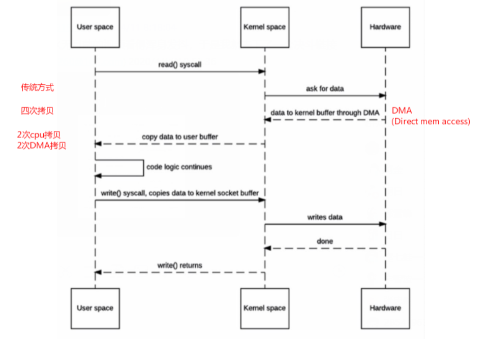
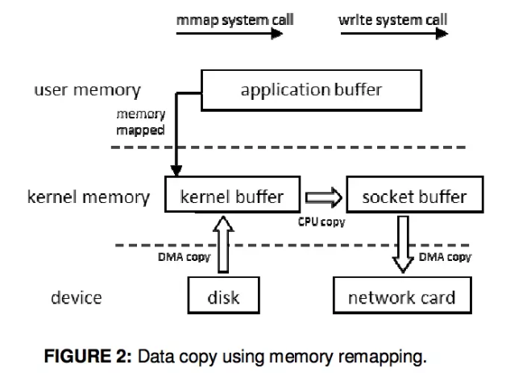

#### 零拷贝
* 参考网址
    * https://www.jianshu.com/p/2fd2f03b4cc3
* DMA（Direct mem access）
    * 在原先的io读取中，先由用户程序发起系统调用，然后系统陷入内核态，通过cpu+io中断来完后数据从磁盘到内存的
        载入，这个设计大量的中断操作，还有传输中cpu负责数据的总线控制等等。
    * 而在DMA是现代电脑的重要特色，它将cpu发起io操作之后，后续的动作都由DMA控制器来接管，cpu就可以由更多的
        时间去完成其他的事情，比如从磁盘到内存（内核缓冲区）的数据传输，这段时间将由DMA控制器来代替CPU接管总线的控制。
* Linux支持的(常见)零拷贝
    * 传统拷贝
    
        
        
    1. mmap内存映射
        * DMA加载磁盘数据到kernel buffer后，应用程序缓冲区(application buffers)和内核缓冲区(kernel buffer)进行映射，
            数据再应用缓冲区和内核缓存区的改变就能省略。
        * 原始的操作是：1. 磁盘通过DMA->内核buffer, 2. 内核buffer->用户空间app buffer,
            3. 用户空间app buffer->socket buffer, 4. socket buffer通过DMA->网卡。而有了mmap后，将
            用户app buffer与内核buffer映射起来，然后就可以省去用户空间到内核空间的拷贝。
            
        
        
        * mmap内存映射将会经历：3次拷贝: 1次cpu copy，2次DMA copy；
          以及**4次上下文切换**
    2. sendfile
        * linux 2.1支持的sendfile
        
        
        
        * 当调用sendfile()时，DMA将磁盘数据复制到kernel buffer，然后将内核中的kernel buffer直接拷贝到socket buffer；
          一旦数据全都拷贝到socket buffer，sendfile()系统调用将会return、代表数据转化的完成。
          socket buffer里的数据就能在网络传输了。
          
        
        
        * sendfile会经历：3次拷贝，1次CPU copy 2次DMA copy；以及**2次上下文切换**
    3. Sendfile With DMA Scatter/Gather Copy
    
        
        
        * Scatter/Gather可以看作是sendfile的增强版，批量sendfile
        * Scatter/Gather会经历2次拷贝: 0次cpu copy，2次DMA copy
        * IO请求批量化
            * DMA scatter/gather：需要DMA控制器支持的。
                DMA工作流程：cpu发送IO请求给DMA，DMA然后读取数据。
                IO请求：相当于可以看作包含一个物理地址。
                从一系列物理地址(10)读数据:普通的DMA (10请求)
                dma scatter/gather:一次给10个物理地址， 一个请求就可以（批量处理）。
    4. splice
        * Linux 2.6.17 支持splice
        
        
        
        * 数据从磁盘读取到OS内核缓冲区后，在内核缓冲区直接可将其转成内核空间其他数据buffer，而不需要拷贝到用户空间。
          如下图所示，从磁盘读取到内核buffer后，在内核空间直接与socket buffer建立pipe管道。
          和sendfile()不同的是，splice()不需要硬件支持。
 
        * 注意splice和sendfile的不同，sendfile是将磁盘数据加载到kernel buffer后，需要一次CPU copy,拷贝到socket buffer。
          而splice是更进一步，连这个CPU copy也不需要了，直接将两个内核空间的buffer进行set up pipe。
          
        * splice会经历 2次拷贝: 0次cpu copy 2次DMA copy；
          以及2次上下文切换
    * Linux零拷贝机制对比
        * 无论是传统IO方式，还是引入零拷贝之后，2次DMA copy 是都少不了的。
            因为两次DMA都是依赖硬件完成的。
    * linux零拷贝机制对比
    
          
* java.nio中的零拷贝
    1. FileChannel::map
    2. FileChannel::transferTo/From
        * 基于OS的sendfile技术
        1. FileChannel::transferTo(long pos, long len, WritableByteChannel tgt)
            * 将字节从这个通道对应的文件中传输到指定的可写通道中
            * 这个操作不会修改本channel的pos值