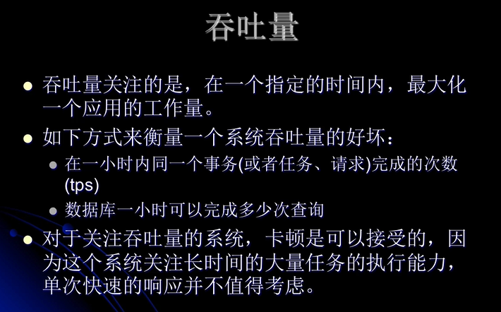
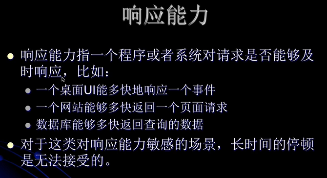
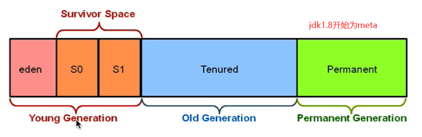
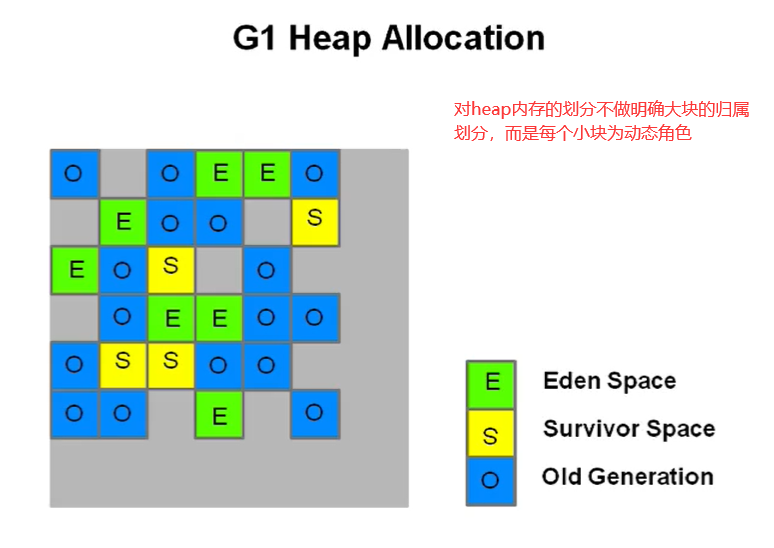
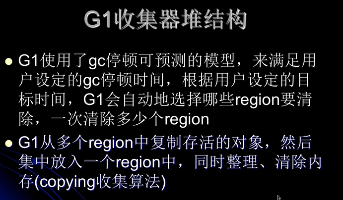
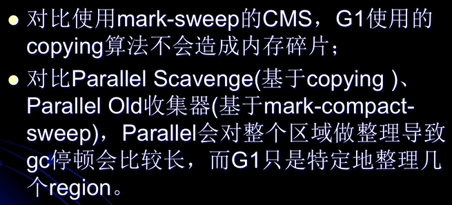
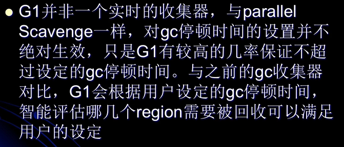
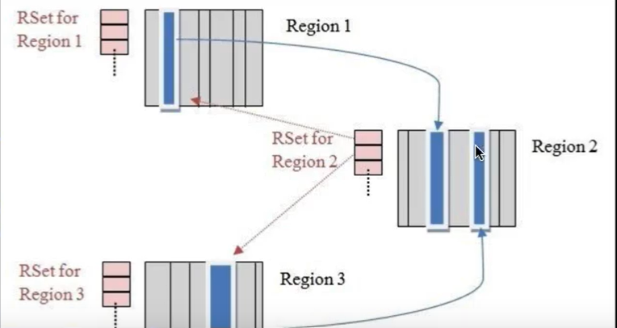
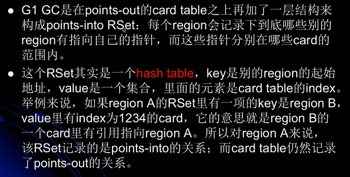

#### 评价系统的两个评价指标
1. 吞吐量

    
2. 响应能力
    
   
#### G1（garbage first collector）
* 基本情况
    * g1是一个面向服务端的gc，适用于多核cpu，大内存的服务端系统
    * 它满足短时间gc停顿的同事又能同时达到一个较高的吞吐量。（这种吞吐量与响应能力）
    * 与应用线程同时工作，几乎不需要STW（与cms类似）
    * 整理剩余空间，不产生内存碎片（cms只能在full gc的时候通过STW进行内存碎片整理）
    * gc停顿更加可控
        * **采用的堆内存的划分跟cms不一样**
    * 不牺牲系统的吞吐量
    * gc不要求额外的内存看哦麻黄碱（cms需要预留空间存储浮动垃圾）
    * g1在某些方面弥补了cms的不足，比如cms使用的是mark sweep算法，自然产生内存碎片，而g1基于coping算法
        高效的整理剩余内存，而不需要管理内存碎片。
    * 另外，g1提供了更多手段，以达到对gc停顿的可控。比如g1支持对老年代的部分回收以减少一次gc的过长时间，而cms
        则是要一次回收完成。
* g1与传统堆内存的结构对比
    1. 传统的内存划分
    
        
    2. g1的内存划分
        
        
        * heap被划分为一个个相等不连续的内存区域，每个region都有一个分代的角色分为eden，survivor，old
        * 对每个角色的数量并没有强制限定，也就是说对每种分代内存的大小，可以动态变化。
        * g1最大的特点就是高效的执行回收，优先去执行那些大量对象可回收的区域，也就是说优先回收那些存活较少的区块。
* g1的堆结构

* g1 vs cms

* g1重要概念
    1. 分区
        * g1采取不同的策略来解决并行，串行和cms收集器的碎片，暂停时间等时间不可控等问题
    2. 分代所属
        * 每个region在每个时候是能属于老年代/年轻代/幸存区，代别成为逻辑上的概念。
    3. garbage first
        * 分区带来的好处就是，有些区域牢记特多，有些较少，则g1**优先收集那些垃圾较多的分区**
    4. 新生代垃圾收集策略
        * 依然是当新生代满了的时候，对**整个新生代**进行回收。整个新生代中的对象，要么被回收要么晋升，其采取分区机制
            目的是为了与老年代策略一致，方便调整代的大小。
    5. 收集集合（CSet）
        * 组可被回收的分区集合，CSet中存活的对象会在gc的过程中被移动到另一个可用的分区，CSet中的分区可以来自
          eden，survivor，old区域。
    6. 已记忆集合（RSet）
        * 记录了其他region中的对象引用本region中的对象的关系(point-into)，RSet的价值就在于使得gc不需要扫描整个堆找到谁引用
            了当前分区中的对象，只需要扫描RSet中即可。
           
        
    7. SATB(snapshot at the beginning),是g1 gc在并发标记阶段使用的增量式标记算法，并发标记是并发多线程的，
        但同一时刻值扫描一个分区。
#### g1官方文档解读
* 网址 https://www.oracle.com/technetwork/tutorials/tutorials-1876574.html

                         