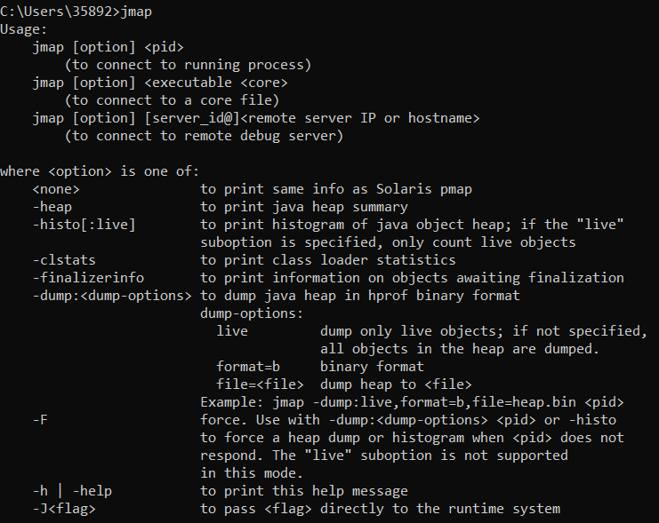
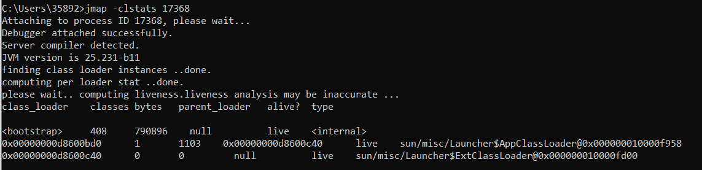
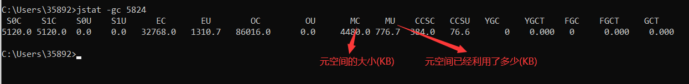
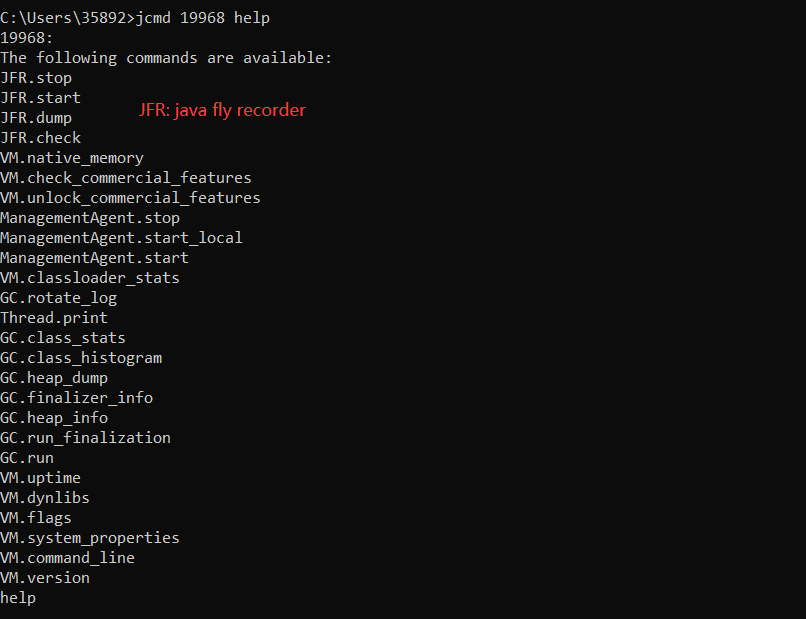
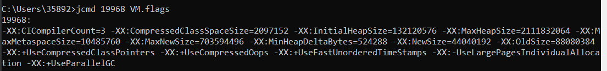
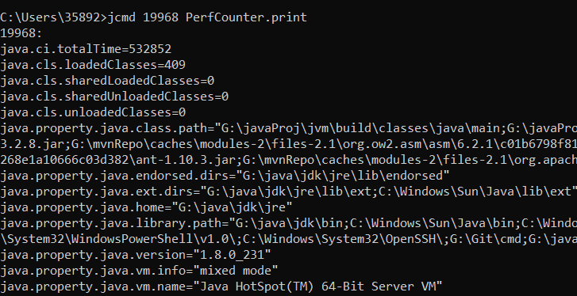

#### UI工具
1. jvisualvm
    * 基本涵盖所有功能
    * 使用
        1. 通过在命令行模式下键入jvisualvm打开该应用
        2. 通过本应用查看进程运行情况，查看线程等等
        3. 检测死锁
2. jconsole检测死锁
#### CMD工具 一般一个工具包含一种功能
1. jmap
    * 查看jmap的help
    
    * -clstats PID 打印类加载器的数据（在jdk1.8之前是使用-permstat选项）
    
    * -heap PID 查看heap
2. jstat
    * -gc PID 查看元空间的相关信息
    
3. jcmd
    * PID help 查看对于当前java进程可以执行那些操作
    
    * PID VM.flags 查看该jvm启动参数
    
    * PID help OPS 查看OPS的相关选项以及信息
    * PID PerfCounter.print 查看jvm性能相关的参数
    
    * PID GC.class_histogram 查看类中的类实例的统计信息
    * PID Thread.print 查看java进程中所有线程的堆栈信息（jconsole，jvisualvm均包含这个功能）
        * 通过这个可以查看是否存在死锁问题
    * PID VM.version 查看运行这个java进程的jvm版本（与jdk版本是不同的概念）
    * PID VM.command_line 获取运行这个java进程的命令行参数
* jmc (java mission control)
    1. jmx控制台 (java manage extension)
    2. jfr (java flight recorder) java飞行记录器
        * 记录java进程，线程实时的统计信息
    3. 安装
* jhat
    * jhat hprof文件路径（查看堆快照）
        * 会启动一个http服务器，用浏览器的模式去浏览
        * 同时可以用oql(object query language)去查询相关对象
    

    
    
    
       

    