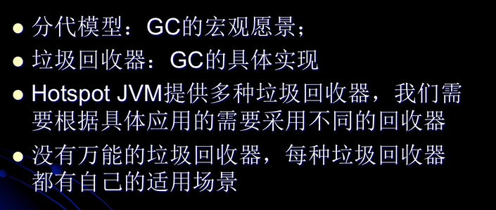
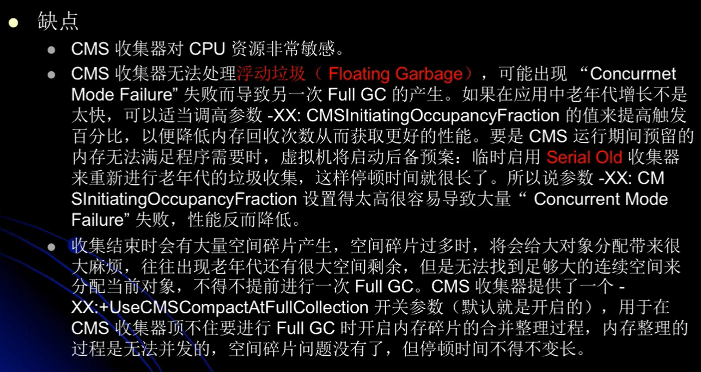

#### 内存分配
1. 堆上分配
    * 大多数情况在eden上分配，偶尔会直接在old上分配，细节取决于gc的实现
2. 栈上分配
    * 原子类型的局部变量
#### 内存回收
* gc要做的就是将那些dead的对象所占用的内存给释放掉
    * hotspot认为没有引用的对象就是dead的
    * hotspot将引用分为4种
        1. Strong 强引用
            * 即默认通过Object o = new T()这种方式赋值的引用
        2. Soft 软引用
        3. Weak 弱引用
        4. Phantom 虚引用  // phantom n.幻觉，幻象
        * 以上三种都是继承引用
* full gc时候会对ref类型的引用进行特殊的处理
    1. soft：内存不够时一定会被gc么长时间不用也会gc
    2. weak：一定会被gc，当被mark为dead时，会在ref queue中通知
    3. phantom：本来就没引用，当从jvm heap中释放是被通知
#### gc的时机
* 在分代模型的基础上，gc从时机上分为2种
    * 不同的时机触发不同的gc
    1. scavenge gc(minor gc) // scavenge v.拾荒
        * 触发时机：新对象生成时，eden空间满了
        * 理论上eden区的大多数对象会在scavenge gc回收，复制算法的执行效率会很高，scavenge gc的执行时间很短
    2. full gc
        * 对整个jvm进行整理，包括young，old与perm
        * 主要触发时机：
            1. old满了
            2. perm满了
            3. system.gc()
        * 效率很低，尽量减少full gc
#### gc的选择

#### gc的并行与并发
* **在gc中并行与并发只是在鉴别gc线程与用户线程之间的关系**
* 并行（parallel）
    * 指多个收集器的线程同时工作，但用户线程处于等待状态
* 并发（concurrent）
    * 收集器线程与用户线程同时工作
    * 并发不代表解决了gc的停顿问题，在关键的步骤还是要停顿的。比如在收集器标识垃圾的时候。
        但在清除垃圾的时候，用户线程可以与gc线程并发执行
#### gc收集器
1. serial收集器
    * 单线程收集器，收集时会暂停所有工作的线程（stop the world, STW），使用复制收集算法，jvm
        运行在cli模式下的默认新生代收集器
    * 是最早的收集器，单线程运行gc
    * new和old代都可以使用该收集器
    * 在新生代，采用复制算法，在老年代采用的是mark-compact算法
    * 由于是单线程gc，没有多线程切换的额外开销，简单实用
    * hotspot cli模式默认的收集器
    
2. parallel new收集器 (Par: parallel)

3. parallel scavenge收集器

4. serial old收集器

5. parallel old收集器

6. CMS(concurrent mark sweep)收集器
    * 是一种以最短停顿为目标的收集算法，使用cms并不能达到gc效率最高（即吞吐量最高，总体gc时间最短），
        但它尽可能降低gc时服务的停顿时间，cms收集器使用的是标记-清除算法
    * 与之对应的parallel scavenge收集器就是一总体gc时间最短为目标的，可能会出现单次gc时间较长的现象。
        以及parallel old算法
    * 追求最短停段时间，非常适合web应用
    * 只针对老年区，一般结合parallel new收集器使用
    * gc线程与用户线程并发工作
    * 多cpu/单cpu多核心才有意义
    * 使用-XX:+UseConcMarkSweepGC打开
    * 缺点(意味着)
    
#### gc的jvm参数

* 当在新生代分配的对象放不下时，会试图放置在老年代中
* 每一次在新生代回收，from space存活的会复制到to space，新的一轮to->from, 在来回多轮中
    当存在一些对象一直在from-to来回复制。则会将这些对象晋升老年代
    * 在gc算法中，会计算每个对象的年龄。若发现survivor空间被大年龄的对象占据（50%），则会调整潜在的
        年龄晋升阈值。
