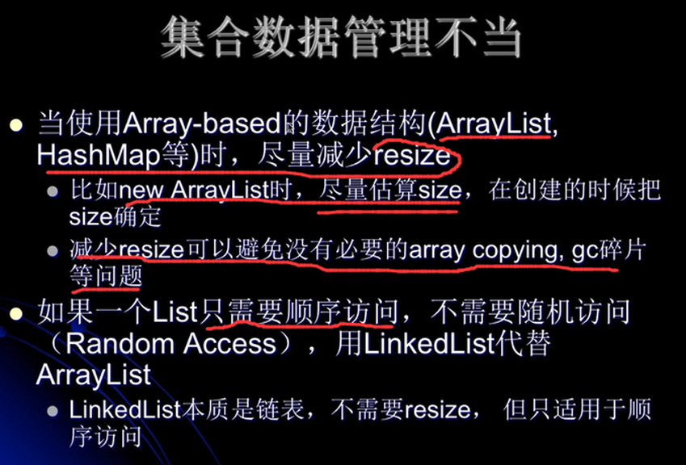

#### java内存泄漏的经典原因
1. 对象定义在错误的范围（wrong scope）
    * java例子 
    ```
    // (1)
    class Foo {
        private String[] names;
        void doIt(int len) {
            if (names == null || names.length < len) {
                names = new String[len];
            }
            populate(names);
            print(names);
        }
    }
    // 改进
    // (2)
    class Foo {
        void doIt(int len) {
            String[] names = new String[len];
            populate(names);
            print(names);
        }
    }    
    ```
    * 分析
        1. 上面的(1)可以看出若当Foo的实例对象生命周期很长的时候，其names字段会一直存在，可能会造成内存泄漏
            而这个字段其实没有必要作为类字段。 
        2. 改进就是将其放到方法体重，作为局部变量
        3. jvm喜欢生命周期短的对象
2. 异常（exception）处理不当
    * java例子
        * 常见的就是try-catch块的捕获不当
    * 处理资源回收放到finally语句中
3. 集合（collection）数据管理不当
    
    