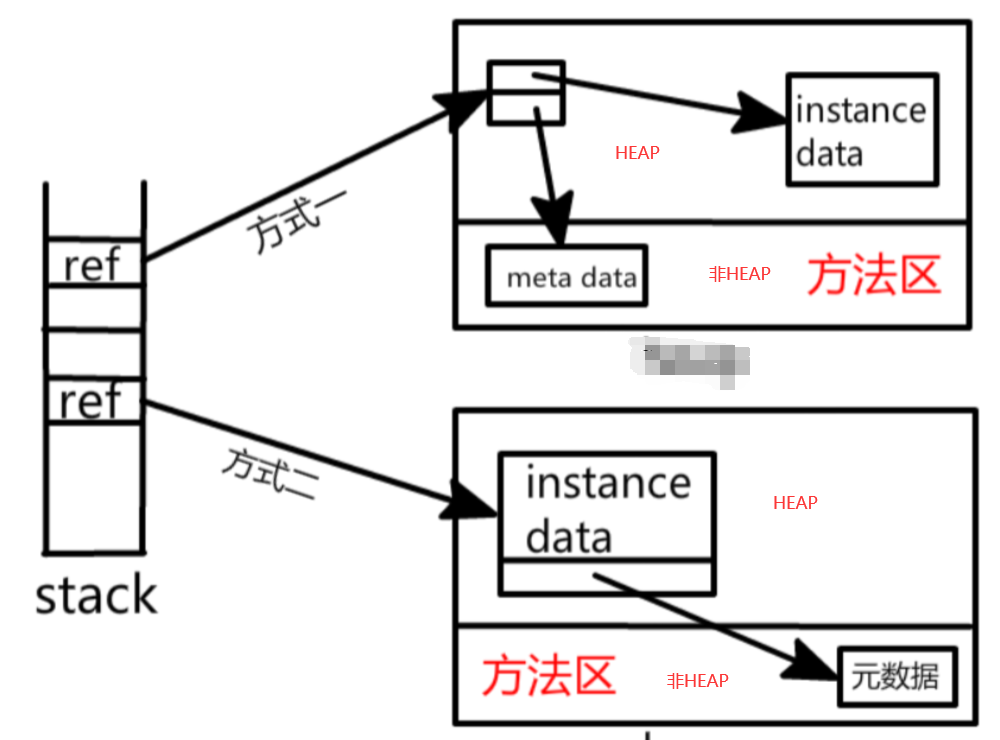

#### jvm内存基本组成
* jvm stack: stack frame, stores atomic types and obj refs
* program counter
* local methods stack: mainly handles local methods like native methods
* heap: objs are stored in heap, and refs are stored in stack. 与堆相关的一个重要概念就是GC(garbage collector)
    现代几乎所有的GC都采用分代收集算法。所以，堆空间也基于这一点进行了相应地划分: 新生代，老年代。
    有: 1. Eden空间 2. From Survivor空间 3. To Survivor空间。
    当放置到新生代的obj经过多轮gc收集未被收集，将会放置到老年代中，在老年代中gc的收集频率将会减少很多。
* method area(非堆区域)
    * 方法区是被所有线程共享。所有字段和方法字节码，以及一些特殊方法如构造函数，接口代码也在此定义。
      简单说，所有定义的方法的信息都保存在该区域，此区属于共享区间。
      静态变量 + 常量 + 类信息(构造方法/接口定义) + 运行时常量池存 在方法区中 。
      但是， 实例变量 存在 堆内存 中，和方法区无关。
      以上，只是逻辑上的定义。在HotSpot中，方法区仅仅只是逻辑上的独立，实际上还是包含在Java堆中（jdk1.8之前），
      也是就说，方式区在物理上属于Java堆区中的一部分，而永久区（Permanent Generation）就是方法区的实现。
    * 在jdk1.8之前方法区又叫permanent generation(永久代)内存区域，jdk1.8已结废弃了
        在jdk1.8换成了meta space（元空间）
    * 即jdk1.8之前方法区位于永久代中，而永久代在物理上是在堆空间中的，而在jdk1.8中，永久代更新为元空间，而
        元空间被挪到了堆空间之外的本地内存空间中。
* const pool in runtime: 方法区的一部分内容
* direct mem: 不是由jvm来管理的，由os来管理的（堆外内存）,与java NIO密切相关，jvm通过在堆上的DirectByteBuffer
    来直接操作内存的。
#### obj在jvm中存储方式
* obj在内存中的布局
    1. 对象头
        * 存储对象的运行时信息（比如哈希码，分代的信息）等
    2. 实例信息
        * 包括成员变量信息等
    3. 对齐填充（可选）
        * 占位（比如保证字节为8的倍数）
* 对于在heap中存放的obj实例，其由两部分组成，一部分是实例数据，**另一部分是meta data，包括常量,静态变量以及这个类的class对象**
    * obj在堆中的存储方式有两种如下
    * oracle的hotspot采用的是第二种方式 

* new关键字创建对象的过程
    1. 在堆内存中创建出对象实例
    2. 为对象实例赋予初值
    3. 将对象引用返回
* 管理内存空间的方式
    1. 指针碰撞
        * 将整个空间分为两部分：比如一边都是占用了的，一部分是没有占用的
        * 内存在压缩的，在gc进行垃圾收集的时候，结束后将不连续的内存结构再通过移动使得其保持内存连续。
    2. 空闲列表方式
        * 由于这种gc算法只是做到了垃圾回收，并没有做为保证内存连续而做内存移动，所以导致内存中的空闲与非空闲相互交织在一起
        * 使用一个列表记录哪里内存空间是被占用的，哪些是空闲的，每次分配内存以及gc回收的时候就要修改空闲列表的内容
    
        
