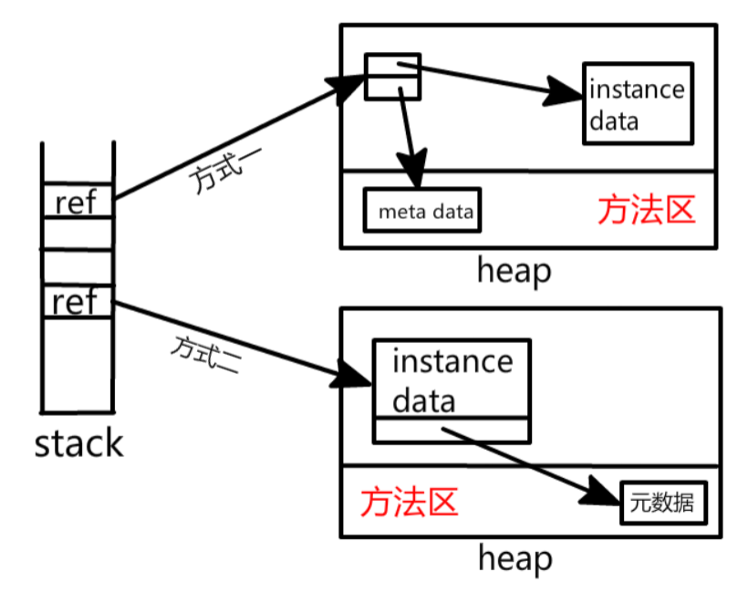

#### jvm内存基本组成
* jvm stack: stack frame, stores atomic types and obj refs
* program counter
* local methods stack: mainly handles local methods like native methods
* heap: objs are stored in heap, and refs are stored in stack. 与堆相关的一个重要概念就是GC(garbage collector)
    现代几乎所有的GC都采用分代收集算法。所以，堆空间也基于这一点进行了相应地划分: 新生代，老年代。
    有: 1. Eden空间 2. From Survivor空间 3. To Survivor空间。
    当放置到新生代的obj经过多轮gc收集未被收集，将会放置到老年代中，在老年代中gc的收集频率将会减少很多。
* method area: stores meta data like const val, static var, class obj and so on
    * 在jdk1.8之前存在permanent generation(永久代)内存区域，jdk1.8已结废弃了
        在jdk1.8换成了meta space（元空间）
* const pool in runtime: 方法区的一部分内容
* direct mem: 不是由jvm来管理的，由os来管理的（堆外内存）,与java NIO密切相关，jvm通过在堆上的DirectByteBuffer
    来直接操作内存的。
#### obj在jvm中存储方式
* 对于在heap中存放的obj实例，其由两部分组成，一部分是实例数据，**另一部分是meta data，包括常量,静态变量以及这个类的class对象**
    * obj在堆中的存储方式有两种如下
    * oracle的hotspot采用的是第二种方式 

