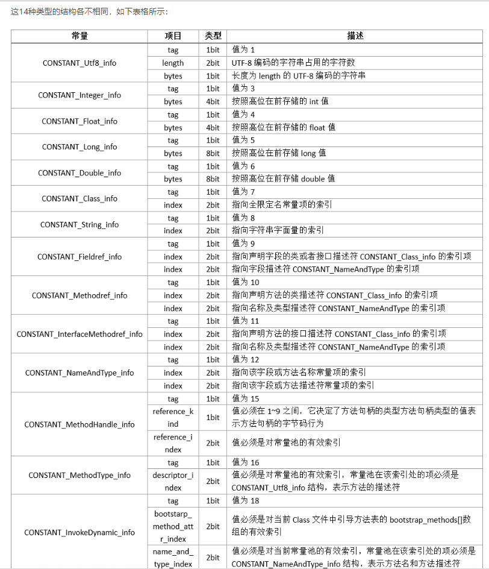

#### class文件查看的插件
* jclasslib
    * 在idea的settings的plugins中下载
#### javap xxx.class 简单反编译class文件
#### javap -c xxx.class 较详细反编译class文件
#### javap -verbose/v xxx.class 
* 详细反编译class文件（魔数，版本号，常量池，类信息，类中的构造方法，类中的方法信息，类变量，成员变量等信息）
#### 字节码前若干字节
```
CA FE BA BE 00 00 00 34
\_________/ \___/ \___/
   魔数    次版本号 主版本号
```
#### 字节码中的一些细节
* 对于实例方法，在字节码中，this是作为隐性参数被第一个传进来
#### 结构
* 魔数(Magic Number)4B
    * 前面4个字节
    * 0xCAFEBABE
* 版本Version（minor version, major version）4B
    * 00 00 00 34 对应就是主版本号52，次版本号0
    * 52就对应的是jdk8
    * 即jdk1.8.0
* 常量池(constant pool) (2+n)B

    * 紧接着主版本号后面的就是常量池的入口，一个java类中定义的很多信息
        都是由常量池来维护和描述的。可以将常量池看做class文件的资源仓库。比如说java类中定义的
        方法与变量信息，都是存储在常量池中的，常量池主要存储两类常量：字面量与符号引用。
    1. 字面量：文本字符串，java常量
    2. 符号引用：类和接口的全限定名，字段的名称和描述符，方法的名称和描述符
    * 常量池的总体结构
        1. 常量池数量 2B
            * 紧跟在主版本后面，占两个字节
            ```
            CA FE BA BE 00 00 00 34 00 18
                                    \___/
                                    常量池数量
            ```
        2. 常量池数组（常量表）nB
            * 常量池数组的元素个数 = 常量池数量 - 1 （索引从1开始）
                * 索引0（是一个保留常量），它不位于常量表中，表示不引用常量，对应的就是null。
                
            * 紧跟在常量池数量之后
            * 数组中的不同元素的类型，结构都是不同的。每一种元素的第一个字节都是u1类型，该字节是一个标志位
                ，jvm在解析常量池的时候，会根据这个标志位来获取元素的具体类型。
    * 在jvm规范中，每个变量与字段都有描述信息，用来描述字段的数据类型，方法的参数列表（包括数量，类型与顺序）与返回值。
        根据描述符规则，基本数据类型和void都用大写字母来表示，对象类型则使用字符L加对象全限定名来表示。
        1. B - byte
        2. C - char
        3. D - double
        4. F - float
        5. I - int
        6. J - long
        7. S - short
        8. Z - boolean
        9. V - void
        10. L - 对象类型 e.g. Ljava/lang/String
    * 对于数组来说，每一个维度用一个前置的[来表示，如int[]表示为[I，String[][]表示为[[Ljava/lang/String
    * 用描述符来描述方法时，**按照先参数列表，后返回值的顺序来描述**，参数列表按照参数的严格顺序放在一组()中，如
    ```
    // String func(int arg1, Demo d, String arg2, Void v)的描述符为：
    func(ILcom/zq/jvm/Demo;Ljava/lang/String;Ljava/lang/Void;)Ljava/lang/String;
    I -> int
    Lcom/zq/jvm/Demo -> Demo
    Ljava/lang/String -> String
    Ljava/lang/Void -> Void
    ```             
* 访问标志（Access Flags）2B
    ```
    标志名           标志值	标志含义	                针对的对像
    --------------------------------------------------------
    ACC_PUBLIC	    0x0001	public类型	            所有类型
    ACC_FINAL	    0x0010	final类型	            类
    ACC_SUPER	    0x0020	使用新的invokespecial语义	类和接口
    ACC_INTERFACE	0x0200	接口类型	                接口
    ACC_ABSTRACT	0x0400	抽象类型	                类和接口
    ACC_SYNTHETIC	0x1000	该类不由用户代码生成	    所有类型
    ACC_ANNOTATION 	0x2000	注解类型	                注解
    ACC_ENUM  	    0x4000	枚举类型	                枚举
    ```
* 本类类名 (this class name) 2B
    * 是一个index，用于指向constant pool中特定索引的值
* 本类类名 (this class name) 2B
    * 是一个index，用于指向constant pool中特定索引的值
* 父类类名 (super class name) 2B
    * 是一个index，用于指向constant pool中特定索引的值
* 接口 (interfaces) 2+nB
    1. 接口数量 2B
    2. 接口 nB
        * 接口索引
* 字段/域（fields）2+nB
    1. 字段的数量 2B
    2. 字段/域 nB
        * 字段部分由以下几部分组成
            1. 访问标志（access flags）
                * 比如值0x0002 表示ACC_PRIVATE
            2. 字段名称索引（name index）
                * e.g. name
            3. 字段描述符索引 descriptor index
                * e.g. I 表示int
            4. 属性数目 （attr count）
            5. 属性表 attr_info[attr_count]]
        * 字段表用于描述类和接口中声明的变量，包含类级别的变量与实例变量,不包括方法内部声明的局部变量
        ```
        class Foo {
            static int a; // 类级别的变量
            int b;  // 实例变量
        }
        ```
* 方法（methods） 2+nB
    1. 方法的数目 2B
    2. 方法 nB
        * 几种类型
            1. \<init\> 构造函数
            2. 自定义函数
            3. \<clinit\> 静态属性的初始化方法                      
        * 方法部分由以下几部分组成
            1. 访问标志（access flags）2B
                * 比如值0x0002 表示ACC_PRIVATE
            2. 方法名称索引（name index）2B
                * e.g. func
            3. 字段描述符索引 descriptor index 2B
                * e.g. (ILcom/zq/jvm/Demo;Ljava/lang/String;Ljava/lang/Void;)Ljava/lang/String; 表示参数以及返回类型
            4. 属性数目 （attrs count）2B
            5. 属性表 attr[attrs_count] xB
                * 对于每个attr
                    1. 属性名索引 attr name index 2B
                    2. 属性长度 attr length 4B
                    3. 属性信息 attr_info[attr_len] 指attr_len byte
                * 不同的attr由attr_name_index来区分 
                1. Code attr(即其attr_name_index在const pool中所指的内容为'Code')
                    ```
                    Code_attr {
                        u2 attr_name_index;
                        u4 attr_length; // 指的是attr_length这个单元之后的长度
                        u2 max_stack; // 表示运行时操作数栈的最大深度
                        u2 max_locals;  // 局部变量的数目（包含传入参数的数目）
                        u4 code_length;
                        u1 code[code_length]; // 指的是一个code占1byte
                        u2 expection_table_length;
                        // exp_table 存放的是异常处理的信息
                        {
                            u2 start_pc;
                            u2 end_pc;
                            // 指的是在code数组中的[start_pc, end_pc)中的指令抛出的异常都会由这个exp_table表项来处理
                            // 即由handler_pc开始的代码处理
                            u2 handler_pc; // 在code数组中处理异常的代码开始处
                            u2 catch_type;  // 一个指向const pool的index，表明catch的异常类型，当为0时(就是finally)指的是处理所有异常
                        } exception_tanble[exception_table_length]; // 是指exception_table由{...}组成,即一个占8byte
                        // 对于java代码中的finally语句块，其在字节码阶段，其finally块的字节码会在每个catch块的字节码后面都有追加
                        // 即采用的是重复的方式，而不是goto跳转的方式
                        u2 attrs_count;
                        attr attr[attrs_count]; //由于一个attr不是定长的
                            // 在Code中的附加属性 1.LineNumberTable
                            // 用来表示code数组中的字节码与java行数中间的映射关系，用来定位调试时候的代码执行的行数
                            LineNumberTable_attr {
                                u2 attr_name_index;
                                u4 attr_length; // 指的是attr_length这个单元之后的长度
                                u2 line_num_table_length;
                                {
                                    u2 start_pc;    // 在code数组中的代码开始索引
                                    u2 line_num;    // 对应于在代码中行号
                                } line_num_table[line_num_table_length]; // 即 4*line_num_table_length Byte
                            }
                            // 在Code中的附加属性 2.LocalVariableTable
                            LocalVariableTable_attr {
                                u2 attr_name_index;
                                u4 attr_length; // 指的是attr_length这个单元之后的长度
                                u2 local_var_table_length;
                                {
                                    u2 start_pc;    // 在code数组中的代码开始索引
                                    u2 length;    // code数组中的长度
                                    u2 name_index; // 局部变量的名称在cp中的索引
                                    u2 desriptor_index; // 对这个变量的描述在cp中的索引
                                    u2 index; // 
                                } local_var_table[local_var_table_length]; 
                            }
                    }
                    ```  
                2. Exceptions attr  
                    * 与Code属性同级，Code是函数的内容，Exceptions是方法的结构部分
                    * 就是函数的异常抛出部分void func() throws NullPointerException, Exception {...}
                    ```
                    Exceptions_attr {
                        u2 attr_name_index;
                        u4 attr_length; // 指的是attr_length这个单元之后的长度
                        u2 num_of_exceptions;
                        u2 exception_index_table[num_of_exceptions]; // 异常类型索引的表
                    }
                    ```
* 属性（attributes）2+nB
    * 添加一些附加的属性
    1. 属性的数目 2B
    2. 属性 nB
    * 常见的attr
        
        
    

