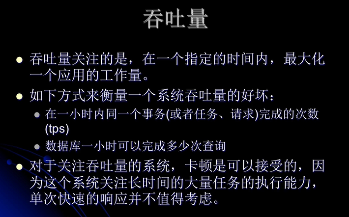
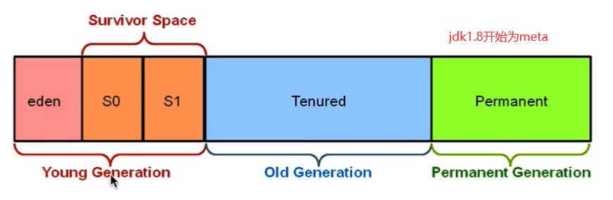
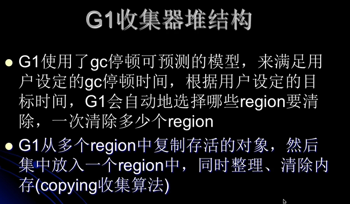
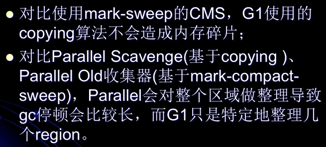
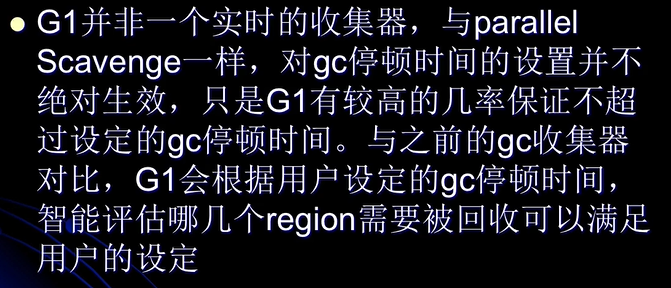

#### 评价系统的两个评价指标
1. 吞吐量

    
2. 响应能力
    
   
#### G1（garbage first collector）
* g1收集概览
    * 新生代与老年代的gc
        * g1虽然将heap分为regions，但是仍然属于分代收集器。不过这些区域的一部分包含新生代，**新生代的gc仍然采用的是STW的方式，
            将存活的对象拷贝到老年代/survivor空间**，老年代也分为很多区域，g1收集器通过从一个区域复制存活的对象到另一个区域来完成清理工作。
            这也就是g1堆压缩/整理的表现所在，不会出现像cms在old区产生内存碎片的问题。
            
* 基本情况
    * g1是一个面向服务端的gc，适用于多核cpu，大内存的服务端系统
    * 它满足短时间gc停顿的同事又能同时达到一个较高的吞吐量。（这种吞吐量与响应能力）
    * 与应用线程同时工作，几乎不需要STW（与cms类似）
    * 整理剩余空间，不产生内存碎片（cms只能在full gc的时候通过STW进行内存碎片整理）
    * gc停顿更加可控
        * **采用的堆内存的划分跟cms不一样**
    * 不牺牲系统的吞吐量
    * gc不要求额外的内存看哦麻黄碱（cms需要预留空间存储浮动垃圾）
    * g1在某些方面弥补了cms的不足，比如cms使用的是mark sweep算法，自然产生内存碎片，而g1基于coping算法
        高效的整理剩余内存，而不需要管理内存碎片。
    * 另外，g1提供了更多手段，以达到对gc停顿的可控。比如g1支持对老年代的部分回收以减少一次gc的过长时间，而cms
        则是要一次回收完成。
* g1与传统堆内存的结构对比
    1. 传统的内存划分
    
        
    2. g1的内存划分
        
        
        * heap被划分为一个个相等不连续的内存区域，每个region都有一个分代的角色分为eden，survivor，old
        * 对每个角色的数量并没有强制限定，也就是说对每种分代内存的大小，可以动态变化。
        * g1最大的特点就是高效的执行回收，优先去执行那些大量对象可回收的区域，也就是说优先回收那些存活较少的区块。
        * 而新生代也分区的目的就是便于调整代的大小
        * humongous区域
            * 在g1中存在一些特殊的区域，叫humongous区域。引入原因：若一个对象占一个region的比例超过50%，则g1 gc就认为
                这个对象是一个巨型对象。默认将巨型对象分配给老年代，但是若其是一个短期存在的巨型对象就会对gc造成负面影响。
                而这个humongous区就是来存放这些巨型对象的，若一个H区放不下这个大对象，则gc会用多个连续的H区来存放这个
                大对象。**有时候为了找到连续的H区，不得不进行full gc**
* g1的堆结构

* g1 vs cms

* g1重要概念
    1. 分区
        * g1采取不同的策略来解决并行，串行和cms收集器的碎片，暂停时间等时间不可控等问题
    2. 分代所属
        * 每个region在每个时候是能属于老年代/年轻代/幸存区，代别成为逻辑上的概念。
    3. garbage first
        * 分区带来的好处就是，有些区域牢记特多，有些较少，则g1**优先收集那些垃圾较多的分区**
    4. 新生代垃圾收集策略
        * 依然是当新生代满了的时候，对**整个新生代**进行回收。整个新生代中的对象，要么被回收要么晋升，其采取分区机制
            目的是为了与老年代策略一致，方便调整代的大小。
    5. 收集集合（CSet）（辅助young, old的gc）
        * 两种CSet(young gc), CSet(mixed gc)
        * 一组可被回收的old分区集合，CSet中存活的对象会在gc的过程中被移动到另一个可用的分区，CSet中的分区可以来自
          eden，survivor，old区域。
    6. 已记忆集合（RSet）（辅助old的gc）
        * 记录了其他region中的对象引用本region中的对象的关系(point-into)，RSet的价值就在于使得gc不需要扫描整个堆找到谁引用
            了当前分区（old regions）中的对象，只需要扫描RSet中即可。
           
        
    7. SATB(snapshot at the beginning),是g1 gc在并发标记阶段使用的增量式标记算法，并发标记是并发多线程的，
        但同一时刻值扫描一个分区。
#### g1官方文档解读
* 网址 https://www.oracle.com/technetwork/tutorials/tutorials-1876574.html
* 面向目标
    1. 收集线程可以与用户线程并发执行
    2. 压缩空间时，没有导致多次停顿的的冗长的gc
    3. 需要更加可预测的暂停时间，更加让gc暂停发生在用户想让其发生的地方
    4. 不想牺牲更大的吞吐性能
    5. 不需要更大的堆空间 
* 从ParOld/CMS迁移到g1
    1. full gc时间过长，或者频繁full gc
    2. 对象分配/晋升的频率较大
    3. 不期待的长时间gc或者压缩整理（超过0.5/1秒的）
    * 若对当前收集器比较满意就没太有必要更换到g1
* region的大小是可以在jvm启动参数中调节的，jvm通常将heap划分为2000个左右的region，
    每个region从1~32Mb大小不等
* 此外，g1中的region除了eden，survivor，old三种角色外，还有一种内在角色（存在于三种角色中的）就是humongous region（大区域），
    它被设计来装那些大于50%region的对象，被存储在连续的region中。   
* g1收集器在新生代中的gc是STW的（所有用户线程挂起），而在young gc时，是采用并行多线程收集的。
    而对于老年代中的收集，是跟cms类似的，是一种少中断的收集器。
* g1既可以针对新生代也可以针对老年代进行回收，这是跟cms不同的
* g1新生代的收集流程
    1. GC roots
        * 静态和本地对象被扫描
    2. 更新RSet
        * 处理dirty card队列更新RSet
        * 更新年轻代到老年代的引用，对于老年代来说就是point-in的关系（被指）
    3. 处理RSet
        * 检测从年轻代指向老年代的年轻代对象
    4. 对象拷贝
        * copying存活的对象到survivor/old，清空eden空间
    5. 处理引用队列
        1 软引用
        2 弱引用
        3 虚引用
        * 见内存分配与gc.md
* g1在老年代中的收集流程
    1. 初始标记（Initial Marking）
        * STW
        * 标记那些可能引用了老年代中对象的survivor regions
    2. 根区域扫描（Root Region Scanning）
        * 扫描那些那些已经标记了survivor regions，以找到到老年代的引用。这个过程是
            扫描线程与用户线程并发执行的，但是这个扫描阶段必须在年轻代gc发生之前完成。         
    3. 并发标记（Concurrent Marking）
        * 在程序运行时，并发查找整个heap中存活的对象，这个阶段能被young gc打断
    4. 重新标记（Remark）
        * 在heap中使用SATB（snapshot at the beginning）算法完成对存活兑现过的标记，较之cms在这个阶段更快速。
    5. 清理（Cleanup）
        1. 标记存活对象，释放regions （STW）
        2. 更新RSet （STW）
        3. 重置释放后的regions，并将其放回空闲列表中（与用户线程并发的）
        * 在这个阶段，回收那些存活最少对象的region，这个阶段是新老年代同时回收的。
    6. 复制（Copying）（与清理是同时）   
        * 将对象复制到新的region中（STW）
* 若产生full gc，不采用g1，二是serial old gc
* gc的模式
    1. young gc
        * 整个过程是STW的
        * 选定所有年轻代的region，通过控制年轻代region的个数，即年轻代内存的大小，
            来控制young gc的时间开销
        * 在eden区充满时触发，在这个情况，eden空间中的数据会被移动到survivor空间中，若
            survivor空间不够，则该数据对直接晋升到old区。即**survivor区的数据移动到新的survivor区，也
            可能有部分数据晋升到老年代中**，最终eden空间中的数据为空（其实garbage first是指在老年代中采取的
            标记优先收集垃圾较多的区域，而在新生代中采用的策略跟传统的gc是差不多的），young gc完成工作，应用线程恢复工作。
        * 而新生代也分区的目的就是便于调整代的大小    
    2. mixed gc
        * 选定所有年轻代中的regions，外根据global concurrent marking统计得出收益
            高的若干老年代的region，在用户指定的开销范围内尽可能选择收益高的老年代region。
            不是full gc，只能部分收集老年代region。若mixed gc无法跟上分配速度，导致老年代被填满了，
            就无法继续mixed gc。转而只能通过serial old gc来完成（full gc）
        * global concurrent marking
            * 在g1 gc中只是为mixed gc提供标记服务的
            1. 初始标记
            2. 并发标记
            3. 重新标记
            4. 清理
        * 由一些参数控制的，另外也控制着会放入CSet中的老年代regions
        * 相关参数
            * -XX:G1HeapWastePercent 在每次global concurrent mark之后，gc知道在old中有多少要被回收，
                该参数指定在每次young gc后，若垃圾占比（老年代region？）是否达到该参数的阈值，若达到，则下次执行mixed gc
            * -XX:G1HeapRegionSize=n 设置region的大小，非最终值
            * -XX:MaxGCPauseMillis 设置g1收集过程中的目标时间
            * -XX:G1NewSizePercent 新生代最小值，默认5%
            * -XX:G1MaxNewSizePercent 新生代最大值，默认60%
            * -XX:G1MixedGcLiveThresholdPercent 老年代regions中存活的对象的占比，只有其region存活对象比例小于此参数，才会被选入CSet
            * -XX:G1MixedGCCountTarget 一次global concurrent marking之后，最多执行mixed gc的次数
            * -XX:G1OldCSetRegionThresholdPercent 一次mixed gc能纳入CSet中的老年代region的数量（即所回收站老年代的比例）
            * -XX:ParallelGCThreads=n:设置并行收集器收集时使用的CPU数。并行收集线程数。（STW阶段的收集）
            * -XX:ConcGCThreads=n: 设置处在并发标记阶段，并行执行gc的线程数（每个线程单独处理各自的所属部分） 
            * -XX:InitialHeapOccupancyPercent 设置触发标记周期的java heap占用率阈值，默认是45%。这里的堆占比指的是old+humongous 
* 使用方法
    * -XX:+UseG1GC
    * 设置规定的最大停顿时间
        * -XX:MaxGCPauseMillis=n (ms)   
                