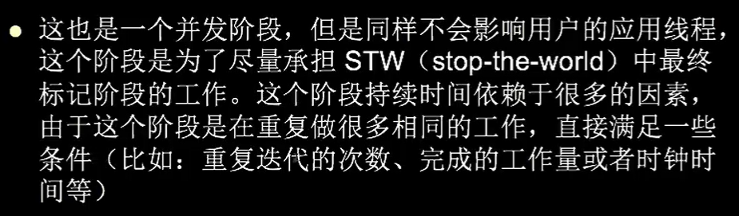

#### 安全点
* 程序在执行的时候，并非在所有地方都可以停顿下来执行gc，只有到达安全点才可以gc
* gc在最近的安全点上运行，两种机制
    1. 抢断式中断
        * 发生gc时，中断所有业务线程，若有线程不位于安全点上，则让其恢复运行，直到最近的安全点上。
    2. 主动式中断
        * 当gc需要中断线程时，不直接操作线程，仅仅做一个标志。每一个线程到安全点时就会轮训那个标志并挂起。
            当所有线程挂起后，就开始gc。
#### 安全区域
* 引入原因：安全点机制就保证了程序在执行的时候，可以在不太久的时间内就可以进入到可gc的安全点。当如果程序不执行的时候呢？
    即程序没有被分配cpu时间（比如处于sleep或者阻塞状态），这时候线程就无法响应jvm的中断挂起。
* 实现：当线程执行到safe region中（一般就是sleep或者阻塞）的代码时，首先标识自己已经进入了安全区域，这样，当在这段时间里，jvm要发起gc时，就不用
    管表示了safe region状态的线程。在线程要离开safe region时，它要检查系统是否已经完成了gc roots（或者整个gc），如果完成了
    那就留让线程继续执行，否则就要继续等待直到收到可以安全离开的safe region的信号。
#### CMS收集器（Concurrent Mark Sweep GC）
* 操作位置
    * 老年代
* 目标与实施
    * 获取最短回收停顿时间为目标，多数应用于web，b/s系统的服务器上
* 步骤
    1. 初始标记(initial mark)
        * 需要STW（stop the world）
        * 只是标记gc roots直接引用/年轻代存活对象引用的所有**位于老年代的**对象
        
        
    2. 并发标记(concurrent mark)
        * 就是进行gc roots tracing，寻找在上一轮找到的老年代对象接下来的所有关联对象，
            这个时间段是与业务程序执行并发的。在这个过程中，引用可能会由于用户执行而发生变化。
        
    3. 并发预清除（concurrent preclean）
        
        
    4. 并发可失败的预清理（concurrent abortable preclean）
        
        
    5. 最终重新标记(final remark)
        * 需要STW（stop the world）
        * 时间长于初始标记，远短于并发标记。
        
        
    6. 并发清除(concurrent sweep)
        * 清除回收过程是与用户线程并发执行的
    7. 重置线程(concurrent reset)
        * 这个阶段是并打执行的，它会重设cms内部的数据结构，为下次gc做准备
    * 整个过程
        
        
        
* 优点
    * 并发收集，低停顿。又称为并发低停顿收集器
* 缺点

    
    * 浮动垃圾: 原本被判定为非垃圾，但是由于用户执行导致其实质是垃圾，而无法在本轮cms gc中回收只能等到下一轮）
#### 空间分配担保
