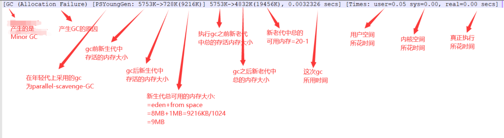

#### gc示例分析
* vm options如下:
    1. -verbose:gc  打印gc的冗余信息
    2. -Xms20m  设置heap最小20MB
    3. -Xmx20m  设置heap最大20MB
    4. -Xmn10m  设置新生代10MB
        * young generation = 10MB
        * old generation = 10MB
    5. -XX:+PrintGCDetails 打印gc细节
    6. -XX:SurvivorRatio=8  新生代中eden:单个survivor的比值
        * 也就是young generation = 10MB (eden = 8MB, to/from space = 1MB)
1. 例子1
    * 代码与GC打印
    ```                                                                     
    // 堆空间20MB, 新生代10MB(其中eden=8MB, from space=1MB, to space=1MB), 老年代10MB
    // java代码
    public class Demo {
        public static void main(String[] args) {
            int size = 1024 * 1024;
            byte[] bs1 = new byte[2 * size];
            byte[] bs2 = new byte[2 * size];
            byte[] bs3 = new byte[2 * size];
    
            System.out.println("hello world...");
        }
    }
    // gc打印
    hello world...
    Heap
     PSYoungGen      total 9216K, used 7966K [0x00000000ff600000, 0x0000000100000000, 0x0000000100000000)
      eden space 8192K, 97% used [0x00000000ff600000,0x00000000ffdc7860,0x00000000ffe00000)
      from space 1024K, 0% used [0x00000000fff00000,0x00000000fff00000,0x0000000100000000)
      to   space 1024K, 0% used [0x00000000ffe00000,0x00000000ffe00000,0x00000000fff00000)
     ParOldGen       total 10240K, used 0K [0x00000000fec00000, 0x00000000ff600000, 0x00000000ff600000)
      object space 10240K, 0% used [0x00000000fec00000,0x00000000fec00000,0x00000000ff600000)
     Metaspace       used 3220K, capacity 4496K, committed 4864K, reserved 1056768K
      class space    used 348K, capacity 388K, committed 512K, reserved 1048576K    
    ```        
    
2. 例子2
    * 代码与gc打印
    ```
    // 堆空间20MB, 新生代10MB(其中eden=8MB, from space=1MB, to space=1MB), 老年代10MB
    // java代码
    public class Demo {
        public static void main(String[] args) {
            int size = 1024 * 1024;
            byte[] bs1 = new byte[2 * size];
            byte[] bs2 = new byte[2 * size];
            byte[] bs3 = new byte[3 * size];
    
            System.out.println("hello world...");
        }
    }
    // gc打印
    [GC (Allocation Failure) [PSYoungGen: 5753K->728K(9216K)] 5753K->4832K(19456K), 0.0032326 secs] [Times: user=0.05 sys=0.00, real=0.00 secs] 
    hello world...
    Heap
     PSYoungGen      total 9216K, used 4123K [0x00000000ff600000, 0x0000000100000000, 0x0000000100000000)
      eden space 8192K, 41% used [0x00000000ff600000,0x00000000ff950d88,0x00000000ffe00000)
      from space 1024K, 71% used [0x00000000ffe00000,0x00000000ffeb6010,0x00000000fff00000)
      to   space 1024K, 0% used [0x00000000fff00000,0x00000000fff00000,0x0000000100000000)
     ParOldGen       total 10240K, used 4104K [0x00000000fec00000, 0x00000000ff600000, 0x00000000ff600000)
      object space 10240K, 40% used [0x00000000fec00000,0x00000000ff002020,0x00000000ff600000)
     Metaspace       used 3188K, capacity 4496K, committed 4864K, reserved 1056768K
      class space    used 342K, capacity 388K, committed 512K, reserved 1048576K
    ```
    * 分析
    
        
        * minor gc：将新生代的存活进行gc，这个过程可能会将部分存活复制到老年代中（当新生代的内存有限时）
        * PSYoungGen      total 9216K, used 4123K
            * 表明，在完成minor gc后，eden+from space的存活为728K，然后在GC后新的数据又注入了新生代，新增了4123K-728K
3. 例子3
    * 代码与gc打印
    ```
    // 堆空间20MB, 新生代10MB(其中eden=8MB, from space=1MB, to space=1MB), 老年代10MB
    // java代码
    public class Demo {
        public static void main(String[] args) {
            int size = 1024 * 1024;
            byte[] bs1 = new byte[3 * size];
            byte[] bs2 = new byte[3 * size];
            byte[] bs3 = new byte[3 * size];
    
            System.out.println("hello world...");
        }
    }
    // gc打印
    [GC (Allocation Failure) [PSYoungGen: 7801K->696K(9216K)] 7801K->6848K(19456K), 0.0040685 secs] [Times: user=0.00 sys=0.00, real=0.01 secs] 
    [Full GC (Ergonomics) [PSYoungGen: 696K->0K(9216K)] [ParOldGen: 6152K->6735K(10240K)] 6848K->6735K(19456K), [Metaspace: 3128K->3128K(1056768K)], 0.0051963 secs] [Times: user=0.02 sys=0.00, real=0.01 secs] 
    hello world...
    Heap
     PSYoungGen      total 9216K, used 3396K [0x00000000ff600000, 0x0000000100000000, 0x0000000100000000)
      eden space 8192K, 41% used [0x00000000ff600000,0x00000000ff951270,0x00000000ffe00000)
      from space 1024K, 0% used [0x00000000ffe00000,0x00000000ffe00000,0x00000000fff00000)
      to   space 1024K, 0% used [0x00000000fff00000,0x00000000fff00000,0x0000000100000000)
     ParOldGen       total 10240K, used 6735K [0x00000000fec00000, 0x00000000ff600000, 0x00000000ff600000)
      object space 10240K, 65% used [0x00000000fec00000,0x00000000ff293c98,0x00000000ff600000)
     Metaspace       used 3189K, capacity 4496K, committed 4864K, reserved 1056768K
      class space    used 342K, capacity 388K, committed 512K, reserved 1048576K
    ```
    * 分析
        
        
    