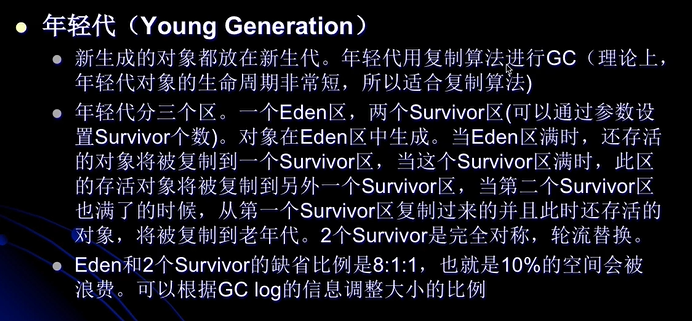

#### jvm运行时内存数据区域


* pc 程序计数器
* 本地方法栈
* jvm栈
    1. jvm栈描述的是java方法的执行模型：每个方法执行的时候都会产生一个栈帧（见字节码/stack_frame.md）.
        栈用于存放局部变量表，操作栈，动态链接，方法出口等信息。一个方法的执行过程，就是这个方法对于栈帧的入栈出战过程。
    2. 线程隔离（独享）
    * 等同于逻辑内存模型中的的工作内存
* 堆（heap）
    1. 堆存放对象的实例
    2. 是java虚拟机管理的最大一块内存区域
    3. gc的主要工作区域，为了高效gc，会把堆细分成更多子区域。
    4. 线程共享
    * 等同于逻辑内存模型中的的主内存
* 方法区
    * 方法区是逻辑概念，在jdk1.8之前，永久代是方法区的物理实现位于堆空间中。而在jdk1.8开始，永久代被
      拆分成元空间与一部分堆内存数据。
    1. 存放了每个class的结构信息，包括常量池，字段描述，方法描述
    2. gc的非主要工作区域
* 例子
    ```
    public void mtd() { Object o = new Object(); }
    ```
    1. 生成了两部分内存区域：（1）o这个存储在jvm stack中的对象ref （2）真真过的Object实例对象实例存放在heap中。
    2. 方法结束后，对应的stack中的ref变量立刻回收，而heap中的对象则需要等待gc来回收。   
#### 在方法区中国的GC
* jvm规范不要求在方法区中实现gc，在这个区域中gc的“性价比”一般较低
* 在堆中，尤其是新生代中，常规应用进行一次gc一般就可以回收70%~95%的空间，而方法区中国的gc效率远远小于此。
    * 因为只要是类加载器还存活，与之相关的类均不会被回收
* 当前商业的jvm都有实现方法区的gc，主要回收两部分内容：（1）废弃常量（2）无用class
* class回收要满足：
    1. 该类的所有实例已被gc
    2. 加载该类的class loader已被gc
    3. class对象没有在任何地方呗引用（比如不能在任何地方存在反射访问这个class的方法）
* 在大量使用反射，动态代理，cglib等字节码框架，动态生成jsp以及OSGi这类频繁自定义class loader的
    场景都需要jvm具备类卸载的支持以保证方法区不会溢出。    
#### gc中垃圾判断算法
1. 引用计数算法（reference counting）
    * 给对象添加一个引用计数器，当有一个地方引用他的时候，计数器就+1，当引用失效，计数器就-1.任何时刻计数器值为0的对象
        就代表着这个对象不再使用。
    * 缺点：引用计数算法无法解决对象循环引用的问题
    
    
2. 根搜索算法（root tracing）
    * 在实际的生产语言中（java, c sharp等），都是使用根搜索算法来判定对象是否存活的。
    * 算法思路：通过一系列称为“GC Roots”的点作为起始进行向下搜索，当一个对象到GC Roots
        没用任何引用链（reference chain）相连，则证明此对象是不可用的。
        * GC Roots包括
            1. 在VM栈（帧中的本地变量）中的引用
            2. 方法区中的静态引用
            3. JNI(java native interface)中的引用
            * 即指的是以上三种情况对对象的引用（比如对于引用计数的那种图来说，因为AB对象都是在heap中的互相引用
                ，并没有gc roots对其存在引用，故可被回收）
                
     
#### jvm常见的在判活的基础上的gc算法
1. 标记-清除算法（mark-sweep）
    * 两个阶段
        1. 标记
        2. 清除
    缺点
        1. 效率问题，标记和清除两个过程效率都不高,堆越大，gc越慢
        2. 空间问题，标记清理之后会产生大量不连续的内存碎片，空间碎片太多会导致后续使用中无法找到足够的
           连续内存而提前触发另一次垃圾搜集动作。gc次数越多，碎片会越严重。 
2. 标记-整理/压缩算法（mark-compact）
    * 过程是，先标记，然后将所有存活的对象移动到内存的一端，然后将另一端全部清空。
    * 没有碎片，比mark-sweep花费更多的时间进行compact
    
    
3. 复制算法（copying）
    * 将内存划分为两块，每次只使用其中一块。当半区内存使用完了，仅将其中还存活的对象复制到另一半内存中个，
        然后将原来的那块内存整个一次性清掉。
    * 这样的使得每次内存回收都是半个内存区域，也不考虑内存碎片的问题
    * 该算法非常适合生命周期短的对象，根据ibm研究，98%的java对象只会存活一个生命周期。故也不需要1:1划分工作与复制区域
    * 缺点：内存使用率只有一半，代价高昂
    * 改进实现
        * 现在的商业虚拟机都是使用对于复制算法的改进策略来回收**新生代**的
            1. 将内存分为：（1）一块内存较大的eden空间 （2）2块较小的survivor空间。
                内存使用eden和其中的一块survivor空间。当回收的时候，将eden与survivor中还存活的对象
                一次性复制到另一块survivor中，然后清理掉原来的eden与survivor空间。
            2. oracle hotspot vm默认使用过的eden与survivor之比是8:1,即只有10%的内存空间是浪费的
        * 可以看到，当对象存活率高的时候，效率有所下降。由于老年代中，存活率较高，故不采用复制算法。
        
            
4. 分代算法（generational collecting）
    * 当前商业虚拟机的垃圾收集都是采用“分代收集”算法，根据对象的不同存活周期将内存划分成几块
    * 一般将java heap分为新生代和老年代，这样就可以根据各个代别的特定采用最适当的收集算法，譬如新生代
        每次gc都只会有少量的对象存活，那么就在新生代采用改进的复制算法。而在老年代区域则采用标记-清除或者
        标记-压缩算法。
        
    
    * 在hotspot jvm 6中分为：年轻代（young generation），老年代（old generation），
        永久代（permanent generation）（在jdk1.8开始没有了老年代，换之为元空间）
    * 各个代别之间的转换
    
        
        1. 在eden space与from space中的经过一轮gc后存活的对象放置到to space，清空原来的eden与from space
        2. 此时在新的一轮中原来的to space变成来from space，原来的额from space变成了to space，这就是为什么要有两个
            survivor space的原因
        3. 在多轮均存活的对象将会放置到老年代
        4. 而永久代只是方法区的物理实现（jdk1.8之前）
        
        
        
        
        
        
                    