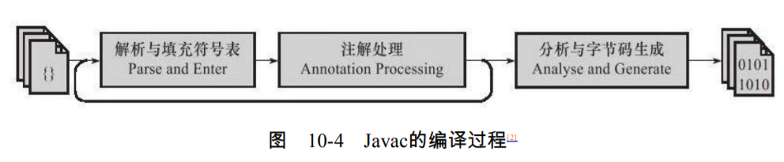
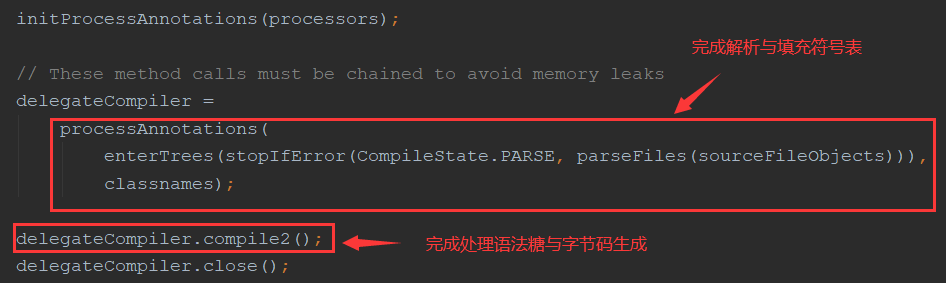
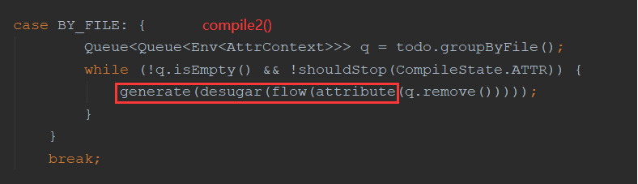

#### 前期编译
* Javac编译器不像HotSpot虚拟机那
  样使用C++语言（包含少量C语言）实现，它本身就是一个由Java语言编写的程序，这为纯
  Java的程序员了解它的编译过程带来了很大的便利。
* 之所以把Javac这类将**Java代码转变为字节码的编译器称做“前端编译器”**，是因为它只完成了从程序到抽象语法树
  或中间字节码的生成，而在此之后，还有一组内置于虚拟机内部的“后端编译器”完成了从字
  节码生成本地机器码的过程，即前面多次提到的即时编译器或JIT编译器，这个编译器的编
  译速度及编译结果的优劣，是衡量虚拟机性能一个很重要的指标。


1. 词法/语法分析
    1. 词法分析
        * 词法分析是将源代码的字符流转变为标记（Token）集合
        * 在Javac的源码中，词法分析过程由com.sun.tools.javac.parser.Scanner类来实现
    2. 语法分析
        * 语法分析是根据Token序列构造抽象语法树的过程，抽象语法树（Abstract Syntax
          Tree,AST）是一种用来描述程序代码语法结构的树形表示方式，语法树的每一个节点都代表
          着程序代码中的一个语法结构（Construct），例如包、类型、修饰符、运算符、接口、返回
          值甚至代码注释等都可以是一个语法结构。
        * 在Javac的源码中，语法分析过程由com.sun.tools.javac.parser.Parser类实现，这个阶段产出的抽象语法树由
          com.sun.tools.javac.tree.JCTree类表示，**经过这个步骤之后，编译器就基本不会再对源码文件
          进行操作了，后续的操作都建立在抽象语法树之上**。
2. 填充符号表
    * 符号表（Symbol Table）是由一组符
        号地址和符号信息构成的表格，读者可以把它想象成哈希表中K-V值对的形式（实际上符号
        表不一定是哈希表实现，可以是有序符号表、树状符号表、栈结构符号表等）。符号表中所
        登记的信息在编译的不同阶段都要用到。
3. 注解处理
    * 注解与普通的Java代码一样，是在运行期间发挥作用的。注解处理器就是用来处理注解的，比如将java代码中的注解所实现的功能要求
        更新到抽象语法树上。
    * 在JDK 1.6中实现了JSR-269规范，提供了一组插入式注解处理器的标准API在编译期间对注解进行处理，
        我们可以把它看做是一组编译器的插件，在这些插件里面，可以读取、修改、添加抽象语法树中的任意元素。
        **如果这些插件在处理注解期间对语法树进行了修改，编译器将回到解析及填充符号表的过程重新处理，直到所
        有插入式注解处理器都没有再对语法树进行修改为止，每一次循环称为一个Round（所有注解处理器都处理了一遍）**。
    * 作用：
        * 有了编译器注解处理的标准API后，我们的代码才有可能**干涉编译器的行为，由于语法树中的任意元素，甚至包括代码注释都可以在插件之中访问到，所以通过插入式注解处理器
           实现的插件在功能上有很大的发挥空间**。
        1. 通过为自己定义的新注解定义新的注解处理器，从而达到提供新的功能。
        2. 通过自定义注解处理器达到对语法树中元素的处理目的（此时跟注解无关）
    * 注解处理的方式
        1. 通过反射机制在jvm运行时对java注解进行操作。（缺点：反射机制消耗性能资源，速度慢）
        2. 通过APT（annotation process tool）来自定义新的注解处理器来完成在编译器就对语法树进行调整操作（不仅限于注解）。

4. 语义分析与字节码生成
    
    * 语法分析之后，编译器获得了程序代码的抽象语法树表示，语法树能表示一个**结构正确**
      的源程序的抽象，但无法保证源程序是**符合逻辑**的。
    1. attribute（标注检查）
        * 标注检查步骤检查的内容包括诸如**变量使用前是否已被声明、变量与赋值之间的数据类
          型是否能够匹配等**。在标注检查步骤中，还有一个重要的动作称为**常量折叠**
        ```
        // 常量折叠
        int a = 1 + 2; ==> int a = 3;
        ```
    2. flow（数据以及控制流分析）
        * 数据及控制流分析是对程序上下文逻辑更进一步的验证，它可以检查出诸如程序局部变
          量在使用前是否有赋值、方法的每条路径是否都有返回值、是否所有的受查异常都被正确处
          理了等问题。
        * 有个常见的就是：当局部变量声明为final，**变量的不变性仅仅由编译器在编译期间保障**（即当编译时期检查出重复赋值等就编译不通过）。
            当编译成字节码后，该局部变量在字节码中是不带ACC FLAGS的（区别于对象实例字段与类静态字段，它们是有访问控制符的）
            ，这些局部变量在字节码中甚至可以名字，故**局部变量的访问修饰符没有对运行期是没有影响的**。
    3. desugar（解语法糖）    
        * 指在计算机语言中添加的某种语法，这种语法对语言的
          功能并没有影响，但是更方便程序员使用。通常来说，使用语法糖能够增加程序的可读性，
          从而减少程序代码出错的机会。
        * java在现代编程序语言中是一种于“低糖语言”，Java中最常用的语法糖主要是前面提到过的**泛型、变长参数、自动装箱/拆箱等**，
            虚拟机运行时不支持这些语法，它们**在编译阶段还原回简单的基础语法结构，这个过程称为解语法糖**。
    4. generate（字节码生成） 
        * 字节码生成阶段不仅仅是把前面各个步骤所生成的信息（语法树、符号表）转化成字节码写到磁盘中，编译器还进行了少量的代码添加和转换工作。
            * 当语句块的代码，字段的初始化收敛到构造器中
   

            
    
    
