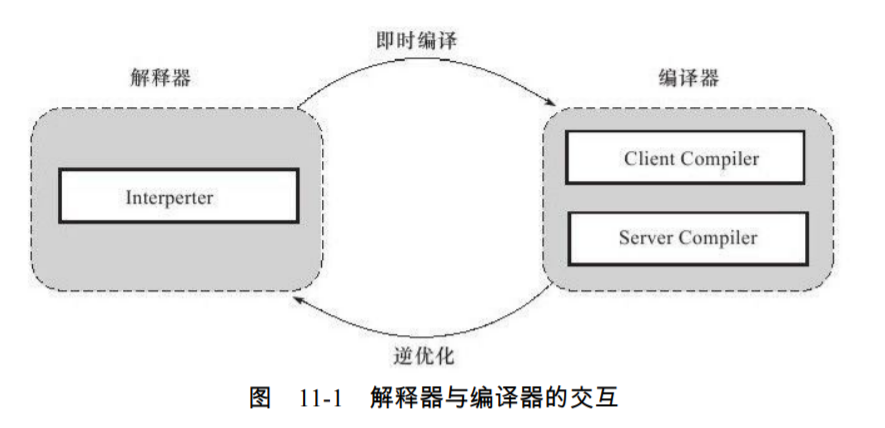
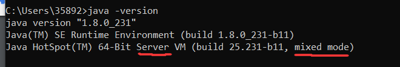
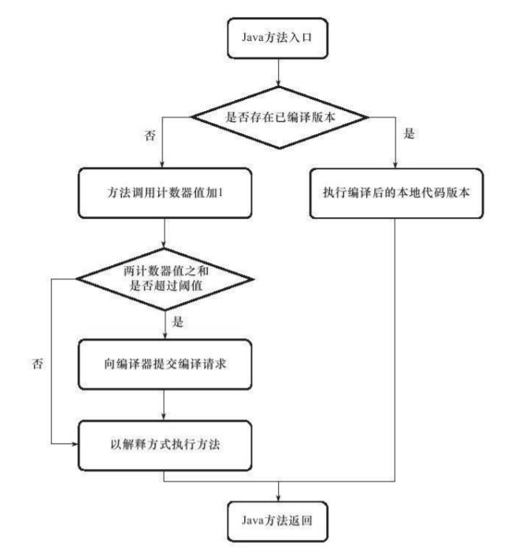
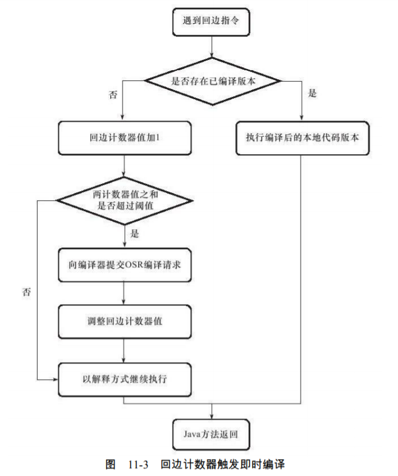

### 后期编译/运行期优化
* 在部分的商用虚拟机（Sun HotSpot、IBM J9）中，Java程序最初是通过解释器（Interpreter）进行解释执行的.
#### JIT编译器(just in time)
* 当虚拟机发现某个方法或代码块的运行特别频繁时，就会把这些代码认定为“热点代码”（Hot Spot Code）。
    为了提高热点代码的执行效率，在运行时，虚拟机将会把这些代码编译成与本地平台相关的机器码，
    并进行各种层次的优化，完成这个任务的编译器称为即时编译器（Just In Time Compiler，下文中简称JIT编译器）。
* **即时编译器并不是虚拟机必需的部分**，Java虚拟机规范并没有规定Java虚拟机内必须要
  有即时编译器存在，更没有限定或指导即时编译器应该如何去实现。但是，即时编译器编译
  性能的好坏、代码优化程度的高低却是衡量一款商用虚拟机优秀与否的最关键的指标之一，
  它也是虚拟机中最核心且最能体现虚拟机技术水平的部分。
* 即：非热点代码采用解释执行，热点代码则有JIT编译器做编译执行。
#### hotspot虚拟机中的JIT编译器
* 编译器与解释器
    * 现代jvm通常是将解释执行与编译执行共存的。
        1. 解释执行
            * 表现为平台无关性
            * 解释执行解释一句后就提交计算机执行一句，并不形成目标程序。（走走停停模式）
        2. 编译执行
            * 将整段代码编译为平台依赖的本地机器码
            * 执行速度快
    * 解释器适用的场景
        1. 当程序需要迅速启动和执行的时候，解释器可以首先发挥作用，省去编译的时间，立即执行。
        2. 当程序运行环境中内存资源限制较大（如部分嵌入式系统中），可以使用解释执行节约内存
        3. 当编译器激进优化（优化效果不好）时，可以转为解释执行
    * 编译器适用的场景
        1. 在程序运行后，随着时间的推移，编译器逐渐发挥作用，把越来越多的代码编译成本地代码之后，可以获取更高的执行效率。
        2. 当程序运行环境中内存资源限制较小，可以使用编译执行提高效率
    
* HotSpot虚拟机中的即时编译器
    * 分为两个
        1. client compiler（c1编译器）
        2. server compiler（c2编译器或opto编译器）
    * hotspot运行采用一个解释器搭配其中一个jit编译器运行，搭配哪个看jvm运行的模式（client模式与server模式）而定。
        通过在jvm启动的时候指定-server/-client来表明启动哪种模式，在64位系统默认启动server模式
    * 默认jvm启动的是混合模式（mixed mode）即解释器与编译器搭配工作
        1. 通过jvm启动设置-Xint强制指定jvm只运行解释模式
        2. 通过jvm启动设置-Xcomp强制指定jvm尽力运行编译模式，**当在编译无法进行的情况下仍由解释器处理这些代码**
        
    * HotSpot虚拟机的编译分层策略
        * 出现原因
            * 编译器编译代码为本地机器码时码需要占用程序运行时间，要编译出优化程度更高的代码，
                所花费的时间可能更长；而且想要编译出优化程度更高的代码，解释器可能还要替编译器收
                集性能监控信息，这对解释执行的速度也有影响。
            * 为了程序启动响应速度与运行效率之间达到最佳平衡 
        * 在JDK 1.7的**Server模式**虚拟机中作为默认编译策略被开启
        * 分层编译根据编译器编译、优化的规模与耗时，划分出不同的编译层次
        * 分层
            1. 第0层，**程序解释执行，解释器不开启性能监控功能**（Profiling），可触发第1层编译。
            2. 第1层，也称为C1编译，将字节码编译为本地代码，进行简单、可靠的优化，**如有必要**
               将加入性能监控的逻辑。
            3. 第2层（或2层以上），也称为C2编译，也是将字节码编译为本地代码，但是会启用一些
               编译耗时较长的优化，甚至会根据性能监控信息进行一些不可靠的激进优化。（出现激进优化可能会转为解释执行）
        * 实施分层编译后，Client Compiler和Server Compiler将会同时工作，许多代码都可能会被
          多次编译，用Client Compiler获取更高的编译速度，用Server Compiler来获取更好的编译质
          量，在解释执行的时候也无须再承担收集性能监控信息的任务。
* 热点代码
    * 触发编译执行的条件
        1. 多次执行的方法
            * 将整个方法镜像编译
        2. 多次执行的循环体
            * **将包含这个循环体的方法进行编译**
    * **热点探测（Hot Spot Detection）** 的判定方式（判定热点代码（方法/循环体多少的界分））      
        1. **基于采样的热点探测（Sample Based Hot Spot Detection）**：采用这种方法的虚拟机会周
           期性地检查各个线程的栈顶，如果发现某个（或某些）方法经常出现在栈顶，那这个方法就
           是“热点方法”。
            * 优点：基于采样的热点探测的好处是**实现简单、高效，还可以很容易地获取方法调用关系（将调用堆栈展开即可）**
            * 缺点：缺点是**很难精确地确认一个方法的热度，容易因为受到线程阻塞或别的外界因素的影响而扰乱热点探测**。
        2. **基于计数器的热点探测（Counter Based Hot Spot Detection）**：采用这种方法的虚拟机会
           为每个方法（甚至是代码块）建立计数器，统计方法的执行次数，如果执行次数超过一定的
           阈值就认为它是“热点方法”。
            * 优点：它的统计结果相对来说**更加精确和严谨**。
            * 缺点：这种统计方法**实现起来麻烦一些，需要为每个方法建立并维护计数器，而且不能直接获取到方法的调用关系**。
        3. 基于“踪迹”（Trace）的热点探测
            * 暂略
    * 在HotSpot虚拟机中使用的是**基于计数器的热点探测方法**，因此它为每个方法准备了两类计数器：
        1. 方法调用计数器（Invocation Counter）
            * 调用方法后判定方法计数器+1与回边计数器之和超过阈值产生的编译请求为**即时编译请求**
        2. 回边计数器（Back Edge Counter）
            * 在字节码中遇到控制流向后跳转的指令称为“回边”（Back Edge）,不是简单指循环，比如空循环是不会产生回边的。
            * 碰到回边指令后判定回边计数器+1与方法计数器之和超过阈值产生的编译请求为**OSR编译请求**
            * OSR编译
                * 这种编译方式因为编译发生在方法执行过程之中，因此形象地称之为栈上替换（OnStack Replacement，简称为OSR编译，
                    即**方法栈帧**还在栈上，方法就被替换了，因为包含这个回边的整个方法都需要尝试编译为本地代码）。
        * 在确定虚拟机运行参数的前提下，这两个计数器都有一个共用确定的阈值，当两个计数器之和超过阈值溢出了，就会触发JIT编译。
        * 方法调用计数器的默认阈值在Client模式下是1500次，在Server模式下是10000次，这个阈值可以通过
            虚拟机参数-XX:CompileThreshold来人为设定
        * 当一个方法被调用时，会先检查该方法是否存在被JIT编译过的版本，如果存在，则优先使用编译后的本地代码来执行。
            如果不存在已被编译过的版本，则将此方法的调用计数器值加1，然后判断方法调用**计数器与回边计数器
            值之和**是否超过方法调用计数器的阈值。如果已超过阈值，那么将会向即时编译器提交一个该方法的代码编译请求。
        * cli vm模式下的对method的处理过程
        
            
        * **方法计数器的热度衰减**：如果不做任何设置，方法调用计数器统计的**并不是方法被调用的绝对次数，而是一个相
            对的执行频率**，即一段时间之内方法被调用的次数。当**超过一定的时间限度，如果方法的调
            用次数仍然不足以让它提交给即时编译器编译，那这个方法的调用计数器就会被减少一半**，
            这个过程称为**方法调用计数器热度的衰减（Counter Decay）**，而这段时间就称为此方法统计
            的半衰周期（Counter Half Life Time）。进行热度衰减的动作是在虚拟机进行垃圾收集时顺
            便进行的，可以使用虚拟机参数-XX:-UseCounterDecay来关闭方法计数器的热度衰减，让方法计数器统计
            方法调用的绝对次数，这样，只要系统运行时间足够长，绝大部分方法都会被编译成本地代
            码。另外，可以使用-XX:CounterHalfLifeTime参数设置方法计数器的半衰周期的时间，单位是秒。
            * 注意：**回边计数器没有热度衰减**
        * cli vm模式下的对回边的处理过程（在字节码中遇到控制流向后跳转的指令称为“回边”（Back Edge）,不是简单指循环，比如空循环是不会产生回边的）    
        
* 编译过程
    * 默认情况下当触发方法编译的时候（即此时没有该方法的本地代码且计数器之和超过阈值），发送该方法的即时编译请求
        给JIT编译器由另一个线程来进行**后台编译**为本地机器码。然后这个方法仍然采用解释执行，下次再调用这个方法的时候，若
        有了这个方法的本地机器码的时候就不在通过解释执行了而是通过执行本地机器码。
    * 通过参数-XX：-BackgroundCompilation来禁止后台编译，在禁止后台编译
        后，一旦达到JIT的编译条件，执行线程向虚拟机提交编译请求后将会一直等待，直到编译
        过程完成后再开始执行编译器输出的本地代码。     
    * cli jit与server jit编译器的具体编译过程是不同的
        * 主要表现为cli jit编译器是一个简单快速的三段式编译器，主要的关注点在于局部性的优化，而放弃了许多耗时较长的全局优化手段。
        * 书中有，暂略
* 即时编译器与静态编译器
    * 典型代表就是java的jit编译器与c/c++的静态编译器
#### 编译优化
* 书中有这里略      
        
#### 一些问题
1. 为何HotSpot虚拟机要使用解释器与编译器并存的架构？
    * 首先解释器的优点是无平台依赖性，对资源内存要求低，边解释边执行。而编译器则是将字节码编译为平台依赖的字节码从而追求高效的执行。
        hotspot虚拟机通过在热点代码上进行编译执行，在非热点代码上通过解释器来解释执行，通过这种手段达到**通过编译器增加代码的执行效率，
        通过解释器增加对环境的兼容和灵活性**。
2. 为何HotSpot虚拟机要实现两个不同的即时编译器？
    * 因为两个即时编译器的侧重点不同，client编译器也就是c1编译器侧重的是局部优化，快速高效。而server编译器则侧重于一种全局优化，追求高质量的机器码，
        往往需要较大的资源支持，较长的时间编译处理。通过提供两种jit编译器，以供具体业务来灵活选择，也是正好配对jvm的client与server启动模式。
3. 程序何时使用解释器执行？何时使用编译器执行？
    * 在默认的mixed mode下，在热点代码上进行编译执行，在非热点代码上进行解释执行。
4. 哪些程序代码会被编译为本地代码？如何编译为本地代码？
    * hotspot vm会为每个方法分配一个方法计数器与一个回边计数器，当执行一个方法或者一条回边指令的时候，
        判断二者计数器之和大于阈值的时候则会将本方法视为热点代码，并发出即时/OSR（on stack replacement）编译请求编译为本地字节码。
5. 如何从外部观察即时编译器的编译过程和编译结果？
    * 可以通过一些jvm参数来实现（-XX：+PrintCompilation在即时编译时将被编译成本地代码的方法名称打印出来，-XX：+PrintInlining
        要求虚拟机输出方法内联信息），但是这些参数一般在产品版本的虚拟机是不支持的，一般要用到测试或者debug版本的虚拟机。还有就是
       一些辅插件来实现。