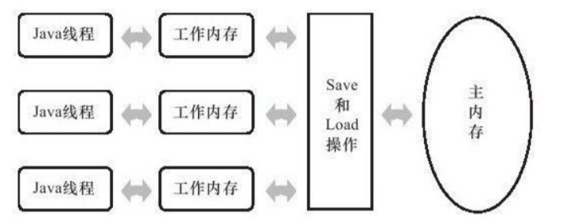

#### 指令重排序
* 原因
    * 为了使得处理器内部的运算单元能尽量被充分利用，处理器可能会对输入代码进行乱序执行（Out-Of-Order Execution）优化
* 处理过程
    * 处理器会在计算之后将乱序执行的结果重组，保证该结果与顺序执行的结果是一致的，但并不保证程序中各个语句计算
      的先后顺序与输入代码中的顺序一致，因此，如果存在一个计算任务依赖另外一个计算任务
      的中间结果，那么其顺序性并不能靠代码的先后顺序来保证。与处理器的乱序执行优化类
      似，Java虚拟机的即时编译器中也有类似的指令重排序（Instruction Reorder）优化。
      也就有线程内**表现为串行**的语义”（Within-Thread As-If-Serial Semantics）
      （即指令重排序后并不会导致这段代码最终的执行结果的改变，在不改变程序执行结果的前提下,尽可能地提高程序执行的并行度）
    ```
    // e.g. 这个方法的执行结果就是配置好了并变量设置为真
    void func() {
        confSomethings(); // 做一些配置
        isConf = true; // 标识配置成功
    }
    
    // 优化可能的重排序伪代码
    void func() {
        isConf = true; // 重排序导致的位置调换
        confSomethings();
    } // 方法执行完，最终结果都是配置好了并设置为真
    ```
#### java内存模型
* 这里可以理解为逻辑的内存模型，分为主内存与工作内存
* java内存模型中的变量定义与Java编程中所说的变量有所区别，它包括了实例字段、静态字段和构成数组对象的元素，
    但**不包括局部变量与方法参数**，因为后者是线程私有的，不会被共享，自然就不会存在竞争问题。（即内存模型中的
    变量就是临界区资源）
* 主内存
    * Java内存模型规定了所有的变量都存储在主内存（Main Memory）中（此处的主内存与介绍物理硬件时的主内存名字一样，
        两者也可以互相类比，但此处仅是虚拟机内存的一部分）。
    * 逻辑主内存的物理实现在jvm堆上实现
* 工作内存
    * 逻辑工作内存的物理实现在jvm栈上实现，例如包括局部变量表
    * 特征
        1. 每条线程还有自己的工作内存（Working Memory，可与前面讲的处理器高速缓存类比）
        2. 线程的工作内存中保存了被该线程使用到的变量的主内存副本拷贝，线程对变量的所有操作（读取、赋值等）都必须在工作内存中进行，
           而不能直接读写主内存中的变量。
            * 副本拷贝的理解问题
                * 假设线程中访问一个10MB的对象，也会把这10MB的内存复制一份拷贝出来吗？，
                    事实上并不会如此，这个对象的引用、对象中某个在线程访问到的字段是有可能存在拷贝的，
                    但不会有虚拟机实现成把整个对象拷贝一次。
        3. 不同的线程之间也无法直接访问对方工作内存中的变量，线程间变量值的传递均需要通过主内存来完成
        
* 内存间交互操作
    * 8种原子操作（用来维持主工作内存之间的同步）
        1. lock（锁定）：作用于主内存的变量，它把一个变量标识为一条线程独占的状态。
        2. unlock（解锁）：作用于主内存的变量，它把一个处于锁定状态的变量释放出来，释放
           后的变量才可以被其他线程锁定。
        3. read（读取）：作用于主内存的变量，它把一个变量的值从主内存传输到线程的工作内
           存中，以便随后的load动作使用。
        4. load（载入）：作用于工作内存的变量，它**把read操作从主内存中得到的变量值放入工
           作内存的变量副本中**。（对于主内存中的对象不一定完整复制到工作内存中【见上副本拷贝的理解问题】）
        5. use（使用）：作用于工作内存的变量，它把工作内存中一个变量的值传递给执行引
           擎，**每当虚拟机遇到一个需要使用到变量的值的字节码指令时将会执行这个(use)操作**。
        6. assign（赋值）：作用于工作内存的变量，它把一个从执行引擎接收到的值赋给工作内
           存的变量，**每当虚拟机遇到一个给变量赋值的字节码指令时执行这个（assign）操作**。
        7. store（存储）：作用于工作内存的变量，它把工作内存中一个变量的值传送到主内存
           中，以便随后的write操作使用。
        8. write（写入）：作用于主内存的变量，它把store操作从工作内存中得到的变量的值放入
           主内存的变量中。
    * 基本操作必须满足如下规则
        1. read与load，store与write成对出现且顺序执行，但成对执行的中间允许插入其他指令
        2. 一个线程当执行了assign操作（就是工作内存更新了最新的变量数据），必须要执行store-write去同步到主内存中。（即不能丢弃assign操作）
        3. 不允许一个线程无故的同步工作内存中的一个变量数据到主内存中（比如变量数据未发生变化而重复无意义的变量数据同步）
        4. 一个新的变量只能在主内存中“诞生”
        5. 一个变量在同一个时刻只允许一条线程对其进行lock操作，但lock操作可以被同一条线
           程重复执行多次，多次执行lock后，只有执行相同次数的unlock操作，变量才会被解锁。（可重入锁）
        6. 如果对一个变量执行lock操作，那将会清空工作内存中此变量的值，在执行引擎使用这
           个变量前，需要重新执行load或assign操作初始化变量的值。
        7. 如果一个变量事先没有被lock操作锁定，那就不允许对它执行unlock操作，也不允许去
           unlock一个被其他线程锁定住的变量。
        8. 对一个变量执行unlock操作之前，必须先把此变量同步回主内存中（执行store、write操
           作）。
    * volatile型变量的特殊规则
        * 关键字volatile可以说是Java虚拟机提供的最轻量级的同步机制
        * 两个特征
            1. 保证此变量对**所有线程的可见性**，这里的“可见性”是指当一条线程修改了这个变量的值，新值对于其他线程来说是可以立即得知的。
                * 只是保证每个线程在使用volatile关键字的变量时候，都会刷新，因此可以认为不存在一致性问题。
            2. 是禁止指令重排序优化（见本md最上面的重排序优化）
                * 用处举例
                ```
                // ******线程A中的代码（配置）********
                // 重排序前的代码                          // 重排序优化后可能的重排序伪代码                    
                void func() {                           void func() {                                     
                    confSomethings(); // 做一些配置           synchronized (isConf) { // 同步      
                    synchronized (isConf) { // 同步               is_conf = true; // 重排序导致的位置调换     
                        isConf = true; // 标识配置成功         }                                 
                    }                                       conf_somethings();                      
                }                                       } // 方法执行完，最终结果都是配置好了并设置为真                
                
                // ******线程B中的代码（读取配置）********
                void readConf() {
                    boolean status;
                    do {
                        synchronized (isConf) {
                            status = isConf;
                        }
                    } while (!status);
                    // do sth about the conf              
                }
                // 不难看出表面上程序没有同步的问题，但是可能由于指令重排序的原因造成问题：还尚未执行配置就设置了true，而此时若b线程工作必定出错
                // 解决办法1：就是将涉及同步问题的逻辑代码一并框入同步代码块中，不管怎么重排序都不影响
                void func() {   
                    synchronized (isConf) { // 同步 
                        confSomethings(); // 做一些配置 
                        isConf = true; // 标识配置成功  
                    }                             
                }  
                // 解决办法二
                // 无需使用同步代码块，只需将isConf变量定义为validate变量即可
                // 其保证线程可见且相关指令码不重排序                                             
                ```
        * 使用场景
            * 只读或者仅对其做赋值操作（保证线程安全）
            * 特定逻辑代码块中，见上代码域中举的例子
            
    * 对于long和double型变量的特殊规则
        * **允许**虚拟机实现选择可以不保证64位数据类型的load、store、read和write这4个操作的原子性，这点就是所谓的long和double的
            非原子性协定（Nonatomic Treatment of double and long Variables）。
        * 比如：某虚拟机的实现可能将对64bit的L/D的load操作分为两步完成，分别load其高32bit与低32bit，这样就出现了非原子性。
            * 但若64bit数据类型声明为validate类型则会保证其的原子操作
        * 注意：目前各种平台下的商用虚拟机几乎都选择把64位数据的读写操作作为原子操作来对待，
          因此我们在编写代码时一般不需要把用到的long和double变量专门声明为volatile。
