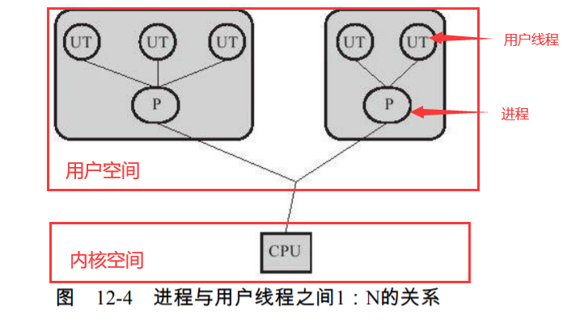

#### 线程的实现
1. 使用内核线程实现

    
    * 使用内核线程的益处：
        1. 种线程由内核来完成线程切换，内核通过操纵调度器（Scheduler）对线程进行
           调度，并负责将线程的任务映射到各个处理器上。（由内核来完成调度）
    * 轻量级进程的局限性：
        1. 由于是基于内核线程实现的，所以各种线程操作，如创建、析构及同步，都需要进行系统调用。
        2. 而系统调用的代价相对较高，需要在用户态（User Mode）和内核态（KernelMode）中来回切换。其次，每个轻量级进程都需要有一个内核线程的支持，因此轻量级进
            程要消耗一定的内核资源（如内核线程的栈空间），因此一个系统支持轻量级进程的数量是有限的。
2. 使用用户线程实现
    
    
    * 从**广义**上来讲，一个线程只要不是内核线程，就可以认为是用户线程（User
      Thread,UT），因此，从这个定义上来讲，轻量级进程也属于用户线程，但轻量级进程的实
      现始终是建立在内核之上的，许多操作都要进行系统调用，效率会受到限制。
    * **狭义**上的用户线程指的是完全建立在用户空间的线程库上，**系统内核不能感知线程存
      在的实现**。用户线程的建立、同步、销毁和调度**完全在用户态中**完成，不需要内核的帮助。
    * 优势：
        1. 如果程序实现得当，这种线程不需要切换到内核态，因此操作可以是非常快速且低消耗的
        2. 也可以支持规模更大的线程数量，部分高性能数据库中的多线程就是由用户线程实现的
    * 劣势
        1. 所有的线程操作都需要用户程序自己处理。线程的创建、切换和调度都是需要考虑的问题，而且
           由于操作系统只把处理器资源分配到进程，那诸如“阻塞如何处理”、“多处理器系统中如何
           将线程映射到其他处理器上”这类问题解决起来将会异常困难，甚至不可能完成。因而使用
           用户线程实现的程序一般都比较复杂。
    * 现状
        * 现在使用用户线程的程序越来越少了，Java、Ruby等语言都曾经使用过用户线程，最终又都放弃使用它。
3. 使用用户线程加轻量级进程混合实现
    
    
#### java线程的实现
* 现阶段java的线程实现是跟平台相关的
    * 其实现是跟平台的线程模型有一定相关性，比如windows就是基于内核级线程的模型
    1. win与linux是基于内核线程的1:1的实现
    2. Solaris是基于混合模型的M:N的实现
#### java线程调度
1. 协同式线程调度（Cooperative Threads-Scheduling）
    * 使用协同式调度的多线程系统，**线程的执行时间由线程本身来控制**，线程把自己的
      工作执行完了之后，要主动通知系统切换到另外一个线程上。
    * 优点
        * 协同式多线程的最大好处是实现简单，而且由于线程要把自己的事情干完后才会进行线程切换，
            切换操作对线程自己是可知的，所以没有什么线程同步的问题。
    * 缺点
        * 线程执行时间不可控制，甚至如果一个线程编写有问题，一直不告知系统进行线程
          切换，那么程序就会一直阻塞在那里。
2. 抢占式线程调度（Preemptive Threads-Scheduling）
    * 么每个线程将由系统来分配执行时间，线程的切
      换不由线程本身来决定（在Java中，Thread.yield（）可以让出执行时间，但是要获取执行时
      间的话，线程本身是没有什么办法的）。在这种实现线程调度的方式下，线程的执行时间是
      系统可控的，也不会有一个线程导致整个进程阻塞的问题，Java使用的线程调度方式就是抢
      占式调度。
    * java的线程分为1-10，数字越大优先级越高，优先级越高支持表明其有更大概率在cpu执行。
#### java的线程状态切换
* java的线程5状态
    1. new
    2. runnable
        1. 就绪态
        2. 运行态
    3. blocked
    4. waiting
    5. terminated
    * 等待态与阻塞态的区别：
        * 等待就是等在一个等待在一个对象的等待队列上，需要其他线程显性唤醒，或者超时自动唤醒
            * 常见：obj.wait(), Thread.sleep(n), t.join()
        * 阻塞就是一个线程阻塞等待去获得另一线程释放的获得排他锁(lock)的过程
    
#### 线程安全
* Java语言中各种操作共享的数据分为以下5类
    1. 不可变
        * 不可变（Immutable）的对象一定是线程安全的，无论是对象的方法实现还是方法的调用者，都不需
          要再采取任何的线程安全保障措施，在第12章我们谈到final关键字带来的可见性时曾经提到
          过这一点，只要一个不可变的对象被正确地构建出来（没有发生this引用逃逸的情况），那
          其外部的可见状态永远也不会改变，永远也不会看到它在多个线程之中处于不一致的状态。
          “不可变”带来的安全性是最简单和最纯粹的。
        * 常见不可变的类实例：String，Integer等
    2. 绝对线程安全
        * 绝对的线程安全完全满足“不管运行时环境如何，调用者都不需要任何额外的同步措施。这通常需要付
         出很大的，甚至有时候是不切实际的代价。在Java API中标注自己是线程安全的类，大多数都不是绝对的线程安全。
            （比如虽然一些类的实例方法都是线程安全的，但是在业务逻辑上，仍还需额外的同步措施）
            ```
            private static List<Integer> list = new ArrayList();
            
            void static run1() {
                while (true) {
                    list.add()
                }
            }
            
            void static run2() {
                int i = 0;
                for (i = 0; i < list.size(); i++)
                    System.out.println(list.get(i));
            }
            ```   
    3. 相对线程安全
        * 相对的线程安全就是我们通常意义上所讲的线程安全，它需要保证对这个对象单独的操
          作是线程安全的，我们在调用的时候不需要做额外的保障措施，但是对于一些特定顺序的连
          续调用，就可能需要在调用端使用额外的同步手段来保证调用的正确性。
    4. 线程兼容
        * 线程兼容是指对象本身并不是线程安全的，但是可以通过在调用端正确地使用同步手段
          来保证对象在并发环境中可以安全地使用.
    5. 线程对立
        * 线程对立是指无论调用端是否采取了同步措施，都无法在多线程环境中并发使用的代
            码。由于Java语言天生就具备多线程特性，线程对立这种排斥多线程的代码是很少出现的，
            而且通常都是有害的，应当尽量避免。
* 单例的线程安全
    1. 第一种：饿汉模式（线程安全）
        ```
        public class Single2 {
            
            private static Single2 instance = new Single2();
            
            private Single2() {}
            
            public static Single2 getInstance() {
                return instance;
            }
        }
        ```
    2. 第二种：懒汉模式 （如果方法没有synchronized，则线程不安全）
        ```
        public class Single3 {
            
            private static Single3 instance = null;
            
            private Single3() {}
            
            public static synchronized Single3 getInstance() {
                if(instance == null){
                    instance = new Single3();
                }
                return instance;
            }
        }
        ```
    3. 第三种：懒汉模式改良版（线程安全，使用了double-check，即check-加锁-check，目的是为了减少同步的开销）
        ```
        public class Single4 {
        
            private volatile static Single4 instance = null;
            
            private Single4() {}
            
            public static Single4 getInstance() {
                if(instance == null){ // instance的线程可见性由validate关键字保证
                    synchronized (Single4.class) {
                        if(instance == null){
                            instance = new Single4();
                        }
                    }
                }
                return instance;
            }
        }
        ```
    4. 第四种：利用私有的内部工厂类（线程安全，内部类也可以换成内部接口，不过工厂类变量的作用于要改为public了。）
        ```
        public class Singleton {
            
            private Singleton() {}
            
            public static Singleton getInstance() {
                return SingletonFactory.singletonInstance;
            }
            
            private static class SingletonFactory {
                private static Singleton singletonInstance = new Singleton();
            }
        }
        ```
    5. 枚举
    * 注：这些非枚举单例模式均能在反射机制下失效，由于反射可以破坏类的封装（修改字段方法等的访问权限）
        ```
        class Singleton {
            private Singleton() {}
        }
        main(String[] args) {
            Constructor<Singleton> constructor = Singleton.class.getDeclaredConstructor();
            constructor.setAccessible(true);
            Singleton singleton = constructor.newInstance();
        }
        ```
        * 改进
            ```
            public class Single2 {
                        
                private static Single2 instance = new Single2();
                
                private Single2() {
                    if (instance != null) // 这样就阻断了反射
                        throw new IllegalAccessException();
                }
                
                public static Single2 getInstance() {
                    return instance;
                }
            }                
            ```
    
#### 实现线程安全
* 互斥同步
    * 当使用synchronized语句块的时候对应字节码中的相应指令块用monitorenter与monitorexit指令包住
    * 如果要阻塞或唤醒一个线程，都需要操作系统来帮忙完成，这就需要从用户态转换到核心态中，
        因此状态转换需要耗费很多的处理器时间。
    * 锁绑定多个条件是指一个ReentrantLock对象**可以同时绑定多个Condition对象**（cond中为await与signal），而在
      synchronized中，锁对象的wait（）和notify（）或notifyAll（）方法可以实现一个隐含的条
      件，如果要和多于一个的条件关联的时候，就不得不额外地添加一个锁，而ReentrantLock则
      无须这样做，只需要多次调用newCondition（）方法即可。
    * 在新版本的jdk中对于使用ReentrantLock还是synchronized关键字来维持同步关系，建议使用synchronized
* 非阻塞同步
    * 互斥同步最主要的问题就是进行线程阻塞和唤醒所带来的性能问题，因此这种同步也称
        为**阻塞同步（Blocking Synchronization）**。
        * 互斥同步属于一种悲观的并发策略，总是认为只要不去做正确的同步措施（例如加锁），
          那就肯定会出现问题，无论共享数据是否真的会出现竞争，它都要进行加锁
    * 基于冲突检测的乐观并发策略，通俗地说
        1. 就是先进行操作，如果没有其他线程争用共享数据，那操作就成功了
        2. 如果共享数据有争用，产生了冲突，那就再采取其他的补偿措施（最常见的补偿措施
            就是不断地重试，直到成功为止）
        3. 这种乐观的并发策略的许多实现都不需要把线程挂起
        * 因此这种同步操作称为**非阻塞同步（Non-Blocking Synchronization）**
        * 使用乐观并发策略需要“硬件指令集的发展”才能进行呢？因为我们需要操
          作和冲突检测这两个步骤具备原子性
* 无同步方案
    * 当一段代码无论在多线程还是单线程都能正常运行时，其就是不用同步支持的。