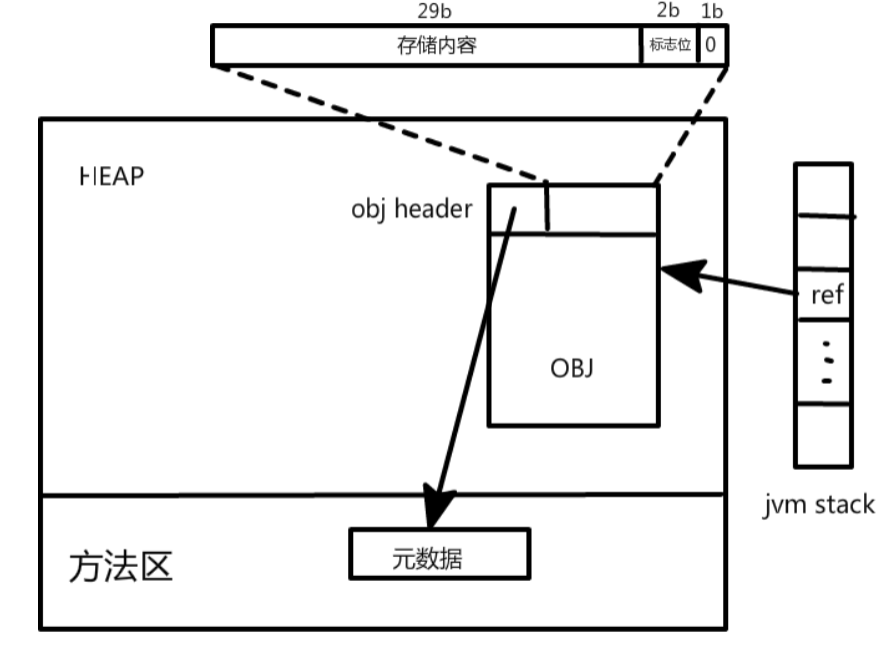
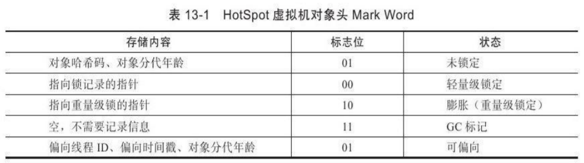
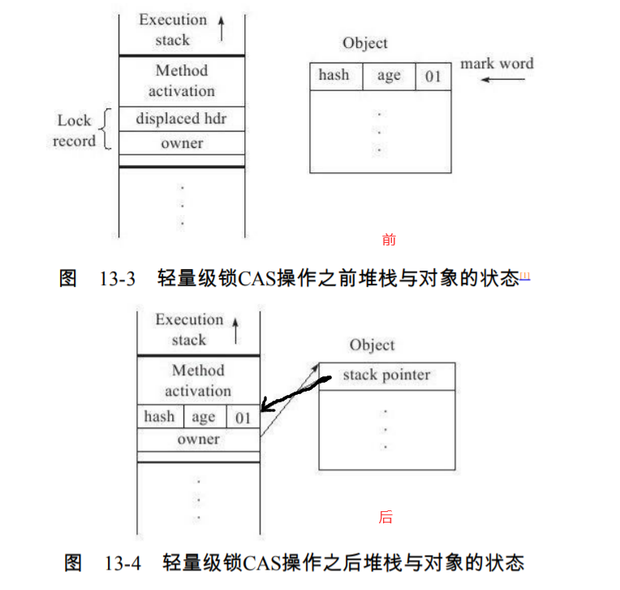
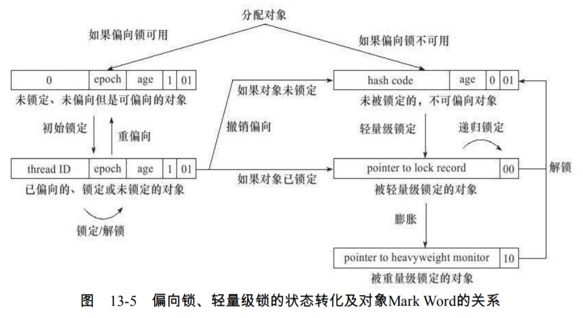

* 公平锁与非公平锁
    * 公平锁是指多个线程在等待同一个锁时，必须按照申请锁的时间顺序来依次获得锁；而
      非公平锁则不保证这一点，在锁被释放时，任何一个等待锁的线程都有机会获得锁。
    * synchronized中的锁是非公平的，ReentrantLock默认情况下也是非公平的，但可以通过带布尔
      值的构造函数要求使用公平锁。
#### 锁优化
1. 自旋锁与自适应自旋（spinning lock and adaptive spinning）
    * 引入优化原因
        * 互斥同步对性能最大的影响是阻塞的实现，挂起线程和恢复线程的操作都需要转入内核态中完成，
            这些操作给系统的并发性能带来了很大的压力。通常共享数据的锁定状态只会持续很短
            的一段时间，为了这段时间去挂起和恢复线程并不值得。
    * 自旋锁
        * 如果物理机器有一个以上的处理器，能让两个或以上的线程同时并行执行，我们就可以让后面
            请求锁的那个线程“稍等一下”，但不放弃处理器的执行时间，看看持有锁的线程是否
            很快就会释放锁。为了让线程等，我们只需让线程执行一个忙循环（自旋），
            这项技术就是所谓的**自旋锁**。（其实就是忙等待）
        * 注意点：
            * 如果锁被占用的时间很短，自旋等待的效果就会非常好，反之，如果锁被占用的时间
              很长，那么自旋的线程只会白白消耗处理器资源，而不会做任何有用的工作，反而会带来性
              能上的浪费。
            * 因此，自旋等待的时间必须要有一定的限度，如果自旋超过了限定的次数仍然
              没有成功获得锁，就应当使用传统的方式去挂起线程了。**自旋次数的默认值是10次**，用户可
              以使用参数-XX：PreBlockSpin来更改。
    * 自适应的自旋锁
        * 自适应意味着自旋的时间不再固定了，而是由前
          一次在同一个锁上的自旋时间及锁的拥有者的状态来决定。如果**在同一个锁对象上，自旋等
          待刚刚成功获得过锁，并且持有锁的线程正在运行中，那么虚拟机就会认为这次自旋也很有
          可能再次成功，进而它将允许自旋等待持续相对更长的时间，比如100个循环**。另外，**如果
          对于某个锁，自旋很少成功获得过，那在以后要获取这个锁时将可能省略掉自旋过程，以避
          免浪费处理器资源**。
2. 锁消除
    * 锁消除是指虚拟机即时编译器在运行时，对一些代码上要求同步，但是被检测到不可能
      存在共享数据竞争的锁进行消除。锁消除的主要判定依据来源于逃逸分析的数据支持。（
      如果判断在一段代码中，堆上的所有数据都不会逃逸出去从
      而被其他线程访问到，那就可以把它们当做栈上数据对待，认为它们是线程私有的，同步加
      锁自然就无须进行。）
    * 有许多同步措施并不是程序员自己加入的，同步的代码在Java程序中的普遍程度也许超过了
        大部分读者的想象
        ```
        public static void main(String[] args) {
            String a = "a";
            String b = "b";
            // 不做优化前是new StringBuffer().append(a).append(b).toString();
            String s = a + b;
        }
        
        public static void main(String[] args) {
            String a = "a";
            String b = "b";
            // 新jdk编译器阶段就做了优化
            // (new StringBuilder()).append(a).append(b).toString();
            // 老版本jdk编译后， StringBuffer的append操作等是加锁线程安全的，但是在这里没必要加锁
            (new StringBuffer()).append(a).append(b).toString();
        }
        // 虽然这里有锁，但是可以被安全地消除掉（经过逃逸分析），在即时编译之后，
        // 这段代码就会忽略掉所有的同步而直接执行了。
        ```
3. 锁粗化
    * 原则上，我们在编写代码的时候，总是推荐将同步块的作用范围限制得尽量小，但是如果一系列的连续操作
        都对同一个对象反复加锁和解锁，甚至加锁操作是出现在循环体中的，那即使没有线程竞争，
        频繁地进行互斥同步操作也会导致不必要的性能损耗。
    ```
    new StringBuffer()).append(a).append(b).toString();
    // 例如以上代码每个append均会加锁
    // 如果虚拟机探测到有这样一串零碎的操作都对同一个对象加锁，
    // 将会把加锁同步的范围扩展（粗化）到整个操作序列的外部
    ```
4. 轻量级锁
    * 对象（对象头部分）的内存布局
    
        
        * HotSpot虚拟机的对象头（Object Header）分为两部分信息(对于数组对象就是三部分)
            1. 一部分用于存储对象自身的运行时数据
                * 如哈希码（HashCode）、GC分代
                  年龄（Generational GC Age）等，这部分数据的长度在32位和64位的虚拟机中分别为32bit和
                  64bit，官方称它为“Mark Word”，它是实现轻量级锁和偏向锁的关键。
                
            2. 一部分用于存储指向方法区对象类型数据的指针
            3. 如果是数组对象的话，还会有一个额外的部分用于存储数组长度。
    * 到轻量级锁的执行过程
    
        
        1. 在代码进入同步块的时候，如果此同步对象没有被锁定（锁标志位为“01”状态），虚拟机首先将在当
           前线程的栈帧中建立一个名为锁记录（Lock Record）的空间，用于存储锁对象目前的Mark
           Word的拷贝（官方把这份拷贝加了一个Displaced前缀，即Displaced Mark Word）
           
        2. 虚拟机将使用CAS操作(CAS:Compare and Swap泛指加强后的原子操作)尝试将对象的Mark Word
            更新为指向Lock Record的指针。如果这个更新动作成功了，那么这个线程就拥有了该对象的锁，
            并且对象Mark Word的锁标志位（Mark Word的最后2bit）将转变为“00”，即表示此对象处于轻量级锁定状态
        3. 如果这个更新操作失败了，虚拟机首先会检查对象的Mark Word是否指向当前线程的栈
           帧，如果只说明当前线程已经拥有了这个对象的锁，那就可以直接进入同步块继续执行，否
           则说明这个锁对象已经被其他线程抢占了。如果有两条以上的线程争用同一个锁，那轻量级
           锁就不再有效，要膨胀为重量级锁，锁标志的状态值变为“10”，Mark Word中存储的就是指
           向重量级锁（互斥量）的指针，后面等待锁的线程也要进入阻塞状态。
        4. 它的解锁过程也是通过CAS操作来进行的，如果对
           象的Mark Word仍然指向着线程的锁记录，那就用CAS操作把对象当前的Mark Word和线程中
           复制的Displaced Mark Word替换回来，如果替换成功，整个同步过程就完成了。如果替换失
           败，说明有其他线程尝试过获取该锁，那就要在释放锁的同时，唤醒被挂起的线程。
        * 轻量级锁能提升程序同步性能的依据是“对于绝大部分的锁，在整个同步周期内都是不
           存在竞争的”，这是一个经验数据。如果没有竞争，轻量级锁使用CAS操作避免了使用互斥
           量的开销，但如果存在锁竞争，除了互斥量的开销外，还额外发生了CAS操作，因此在有竞
           争的情况下，轻量级锁会比传统的重量级锁更慢。
5. 偏向锁
    * 它的目的是消除数据在无竞争情况下的同步
      原语，进一步提高程序的运行性能。如果说轻量级锁是在无竞争的情况下使用CAS操作去消
      除同步使用的互斥量，那偏向锁就是在无竞争的情况下把整个同步都消除掉，连CAS操作都
      不做了。
    * 这个锁会偏向于第一个获得
      它的线程，如果在接下来的执行过程中，该锁没有被其他的线程获取，则持有偏向锁的线程
      将永远不需要再进行同步。  
    
    * 如果**程序中大多数的锁总是被多个不同的线程访问，那偏向模式就是多余的**。在具体问题具体分析的前提下，有时候
      使用参数-XX：-UseBiasedLocking来禁止偏向锁优化反而可以提升性能。      
        