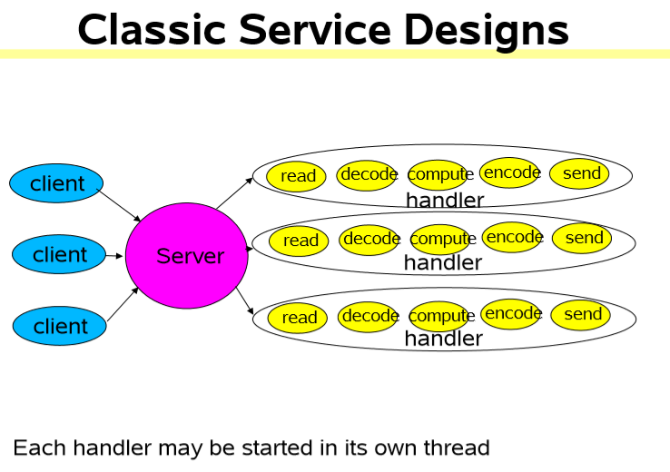
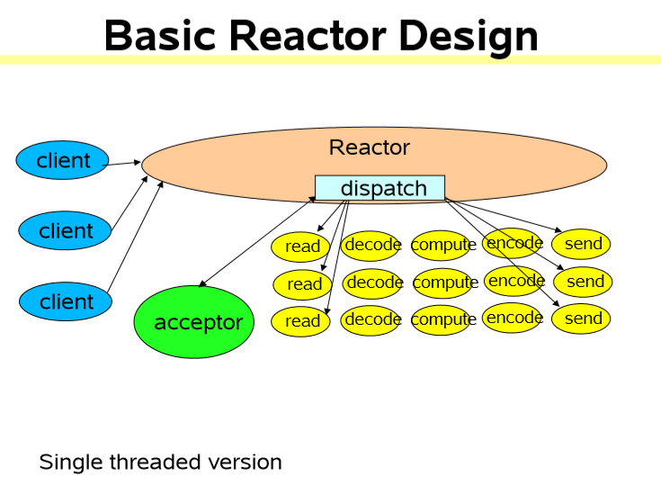
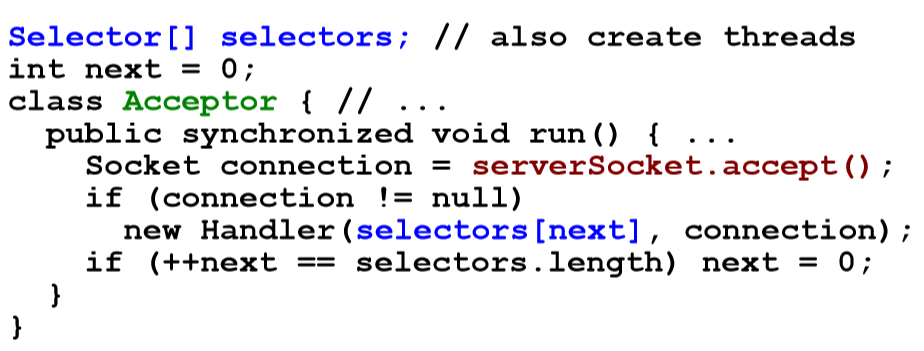
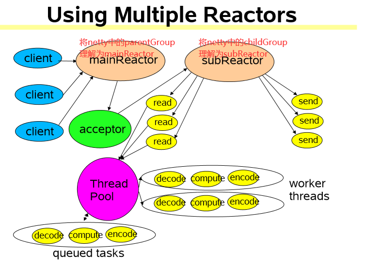
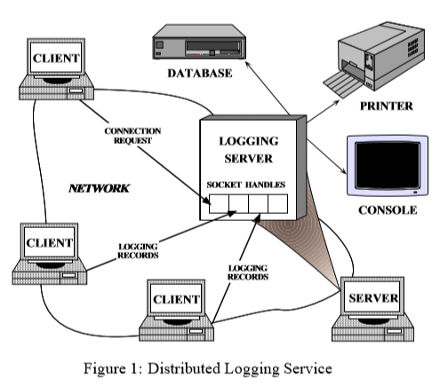
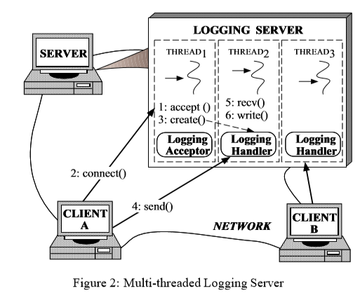
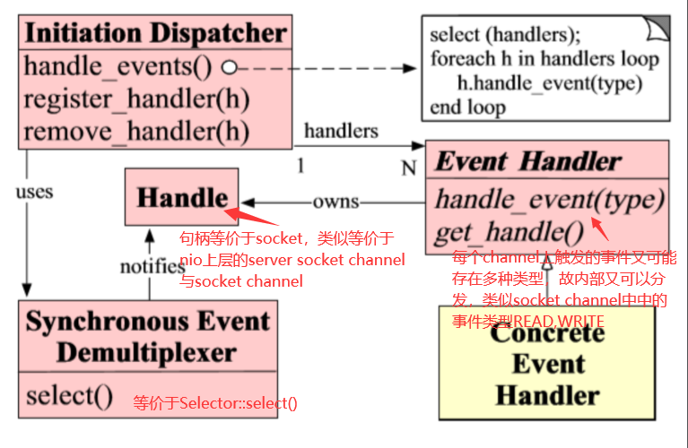
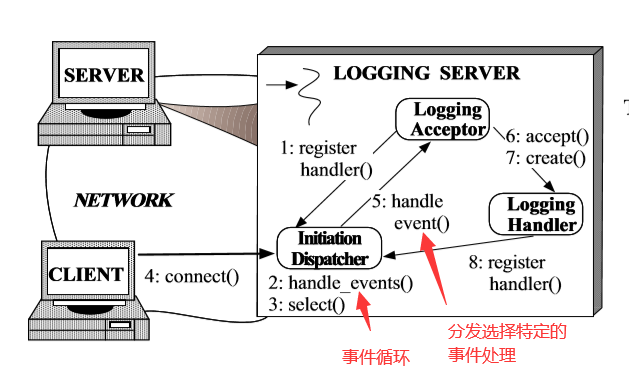
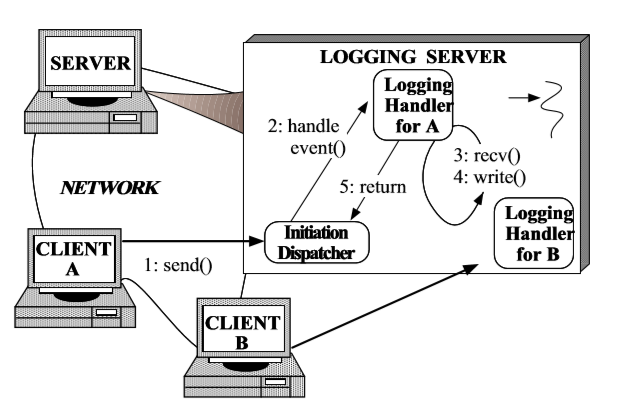

### Reactor模式（响应者模式）
#### scalable io in java学习
1. 可伸缩的网络服务
    * 网络服务的基本结构
        1. 读请求
        2. 请求解码
        3. 处理服务
        4. 编码回应
        5. 发送回应
    * 经典的服务设计
    
              
        ```java
        class Server implements Runnable {
            public void run() {
                try {
                    ServerSocket ss = new ServerSocket(PORT);
                    while (!Thread.interrupted())
                        new Thread(new Handler(ss.accept())).start();      // or, single-threaded, or a thread pool  
                } catch (IOException ex) { /* ... */ }
            }
        
            static class Handler implements Runnable {
                final Socket socket;
        
                Handler(Socket s) {
                    socket = s;
                }
        
                public void run() {
                    try {
                        byte[] input = new byte[MAX_INPUT];
                        socket.getInputStream().read(input);
                        byte[] output = process(input);
                        socket.getOutputStream().write(output);
                    } catch (IOException ex) { /* ... */ }
                }
        
                private byte[] process(byte[] cmd) { /* ... */ }
            }
        }
        ```
    * 可伸缩目标（由于以上模型当会容易受到多用户连接后，线程数量过多）
        1. 当越来越多的cli连接时做到优雅降级
        2. 当拥有的资源（CPU，内存，硬盘，带宽）越来多的时候，能够做到不断提升
        3. 低延迟，满足高峰期的需求，可调节的服务质量
        4. divide-and-conquer通常是完成可伸缩目标的最好方法
        * Divide and Conquer
            * 将处理分成更小的任务
                * 每个任务都在不阻塞的情况下去完成一个动作
            * 当任务能够执行的时候，去执行这个任务
                * IO事件通常作为一个触发器是使用
            * 在java.nio中支持的基本机制有
                1. 非阻塞的读写
                2. 分发与IO事件绑定的任务
            * 无穷的变化可能
                * 基于事件驱动设计的大家庭
2. 事件驱动设计
        1. 通常它会比其他的方案效率更高，它会有：
            1. 更低的资源消耗（通常不需要为每个cli绑定一个线程）
            2. 开销少（less overhead）：更少的上下文切换，更少的阻塞
            3. **但是**分发可能变得更慢
                * 必须手动地将动作绑定到事件上
        2. 通常编程更困难些
            1. 必须手动地去分解为简单的非阻塞的动作
                * 类似于GUI的事件驱动动作
                * 不能够消除所有的阻塞：GC，页错误等
            2. 必须追踪所有的服务的逻辑状态
        * 在AWT中的事件
            * 事件驱动的IO使用了与AWT类似的观点，但是设计有所不同
            
            
3. reactor pattern
    * **Reactor**通过分发恰当的处理器来响应IO事件
        * 类似AWT线程
    * **Handler**会执行非阻塞的动作
        * 类似于AWT中的ActionListeners
    * 通过将将处理器绑定到事件上来进行管理
        * 类似于AWT的addActionListener
    1. 基础版本
        
        
        * java.nio的支持
            1. Channels
                * 用来连接支持非阻塞读操作的文件，套接字等等
            2. Buffers
                * 能够通过通道用于直接的读写的类似数组的对象
            3. Selectors
                * 告知一组通道上哪些产生的IO事件
            4. SelectionKeys
                * 用于维持IO事件的状态以及绑定信息
        ```java
        // 代码示例
       
        // Reactor 1: Setup   
        class Reactor implements Runnable {
            final Selector selector;
            final ServerSocketChannel serverSocket;
        
            Reactor(int port) throws IOException {
                selector = Selector.open();
                serverSocket = ServerSocketChannel.open();
                serverSocket.socket().bind(new InetSocketAddress(port));
                serverSocket.configureBlocking(false);
                SelectionKey sk = serverSocket.register(selector, SelectionKey.OP_ACCEPT);
                // 将一个对象绑定到选择键上，通过sk.attachment()方法来获取这个已绑定的对象
                // 通过这种方式，将一个对channel的处理绑定到选择键上，当需要处理这个channel时
                // 就取出这个处理器
                sk.attach(new Acceptor());
            }
            
            /*  Alternatively, use explicit SPI provider:
            SelectorProvider p = SelectorProvider.provider();
            selector = p.openSelector();
            serverSocket = p.openServerSocketChannel();
            */
            
       
            // Reactor 2: Dispatch Loop
            // class Reactor continued    
            public void run() {  // normally in a new Thread    
                try {
                    while (!Thread.interrupted()) {
                        selector.select();
                        Set selected = selector.selectedKeys();
                        Iterator it = selected.iterator();
                        while (it.hasNext()) 
                           dispatch((SelectionKey) (it.next())); 
                        selected.clear();
                    }
                } catch (IOException ex) { /* ... */ }
            }
            
            void dispatch(SelectionKey k) {
                // 取出处理器
                // 可能为Acceptor，Handler
                Runnable r = (Runnable) (k.attachment());
                if (r != null) r.run();
            }
            
            // Reactor 3: Acceptor
            // class Reactor continued
            // 用于处理server socket channel的接收连接请求，产生出新的socket channel用与处理连接
            class Acceptor implements Runnable { // inner    
                public void run() {
                    try {
                        SocketChannel c = serverSocket.accept();
                        if (c != null) new Handler(selector, c);
                    } catch (IOException ex) { /* ... */ }
                }
            }
        }
               
        // Reactor 4: Handler setup
        // Handler用于绑定socket channel与selector，同时自身也处理这个channel
        final class Handler implements Runnable {
            final SocketChannel socket;
            final SelectionKey sk;
            ByteBuffer input = ByteBuffer.allocate(MAXIN);
            ByteBuffer output = ByteBuffer.allocate(MAXOUT);
            static final int READING = 0, SENDING = 1;
            int state = READING;
        
            Handler(Selector sel, SocketChannel c) throws IOException {
                socket = c;
                c.configureBlocking(false);    // Optionally try first read now 
                sk = socket.register(sel, 0);
                sk.attach(this);
                sk.interestOps(SelectionKey.OP_READ);
                sel.wakeup();
            }
        
            boolean inputIsComplete() { /* ... */ }
        
            boolean outputIsComplete() { /* ... */ }
        
            void process() { /* ... */ }
        
            // Reactor 5: Request handling
            // class Handler continued  
            public void run() {
                try {
                    if (state == READING) read();
                    else if (state == SENDING) send();
                } catch (IOException ex) { /* ... */ }
            }
        
            void read() throws IOException {
                socket.read(input);
                if (inputIsComplete()) {
                    process();
                    state = SENDING;        // Normally also do first write now       
                    sk.interestOps(SelectionKey.OP_WRITE);
                }
            }
        
            void send() throws IOException {
                socket.write(output);
                if (outputIsComplete()) sk.cancel();
            }
        }
        ```
        ```java
        // Per-State Handlers
        // 一个状态对象模式的简单使用
        // 重新绑定一个恰当的处理器
        class Handler { // ...
            public void run() {
                // initial state is reader
                socket.read(input);
                if (inputIsComplete()) {
                    process();
                    sk.attach(new Sender());
                    sk.interestOps(SelectionKey.OP_WRITE);
                    sk.selector().wakeup();
                }
            }
        
            class Sender implements Runnable {
                public void run() { // ...
                    socket.write(output);
                    if (outputIsComplete()) sk.cancel();
                }
            }
        }
        ```
            
    2. 多线程版本
        * 为了可伸缩性，策略上增加一些线程：主要适用于多处理器。
        * 工作者线程
            * reactors应该快速地触发处理器（用于处理连接）
                * 而处理器的处理会使得reactor运行变慢
            * 让non-io的处理放到其他线程处理来加快reactor线程
            * 会比重新使得基于事件驱动的重新绑定计算处理（也就是每个选择键绑定一个处理器）更加简单
                * 应该依旧保持纯粹的非阻塞计算,足够的处理胜过开销
            * 但是比交叠处理IO更加困难
                * 最好的时候就是能够在第一次读就读完
            * 使用线程池来调节控制
                * 正常情况下，仅需要远少于cli数量的线程数来处理。
            
            ```java
            // Handler with Thread Pool
            class Handler implements Runnable {  // uses util.concurrent thread pool
                // 也可以使用Executors.xxxx来获取线程池
                static PooledExecutor pool = new PooledExecutor(...);
                static final int PROCESSING = 3;  // ...
            
                synchronized void read() { // ...
                    socket.read(input);
                    if (inputIsComplete()) {
                        state = PROCESSING;
                        pool.execute(new Processer());
                    }
                }
            
                synchronized void processAndHandOff() {
                    process();
                    state = SENDING; // or rebind attachment
                    sk.interest(SelectionKey.OP_WRITE);
                }
            
                class Processer implements Runnable {
                    public void run() {
                        processAndHandOff();
                    }
                }
            }
            ```
            * 任务协调
                1. Handoffs（指这个任务完成后立即交出控制的资源让下一个任务继续处理）
                    * 每一个任务都能够触发或者调用下一个任务，通常这样是最快的，但是这样的做法是脆弱的
                2. Callbacks to per-handler dispatcher
                    * 设置状态，绑定等等，它是设计模式中调解者模式的一个变种
                3. Queues
                    * 在不同阶段时间传递buffers
                3. Futures
                    * 当每个任务成生一个结果，通过join/wait/notify来进行协同
            * 使用PooledExecutor
                * 一个可调节worker的线程池
                * 主要方法execute(Runnable r)
                * 用来控制：
                    1. 用来控制队列的种类（对于任何channel）
                    2. 线程的最大最小数量
                    3. 自动根据需求来调节存活的数量
                    4. 每个线程的空闲存活时长（若需要的话，可能在后续又会新添线程）
                    5. 饱和政策
                        * block, drop, producer-runs, etc
        * 多reactor线程
            * reactor线程可以饱和处理IO
            * 将负载转移给其他reactor
                * 负载均衡cpu与io
            * 使用reactor pools
                * 用来匹配CPU与IO速率
                * 静态或动态构建
                    * pool中的每个reactor都有其自身的selector, thread, dispatch loop
                * 主接收器分发给其他reactor
            
            
            
            
3. 其他变种
    * 使用其他的java nio特性
        1. 每个reactor使用多个选择器
            * 对于不同的的IO事件用不同的处理器绑定，这可能需要小心的使用同步来协调
        2. 文件传输
            * 自动地文件到网络，网络到文件的拷贝
        3. 内存映射文件
            * 通过buffers来访问文件
        4. 直接buffers
            * 有时能够完成零拷贝传输，但是有setup与finalization的开销，对于
                应用最好使用长连接。
    * 基于连接的拓展
        1. 通过在以此连接的服务中使用一系列messages/requests
        2. 例子：
            1. 数据库与事务监视
            2. 多人游戏，聊天等等
        3. 拓展简单网络服务模式
            1. 处理许多相关的长时间存活的cli
            2. 追踪cli与session的状态（包括drop）
            3. 分发服务到多个主机上（负载均衡）
                
4. java.nio非阻塞io APIs概略

#### Reactor论文学习
* 一个对于同步事件进行多路分解（demultiplexing）与分发（dispatching）处理的对象行为模式
1. 意图
    * reactor设计模式用于处理服务请求，这些服务请求是由一个或多个cli对于一个应用
        并发发起的请求。一个应用中的每一个服务都可能由一些方法组成，而每个服务又由不同的
        事件处理器所代表，对于这些事件处理器，其职能就是分发特定服务的请求。事件处理器的分发由
        一个初始分发器来执行，这个分发器管理着那些已经注册了的事件处理器。而对于若干服务请求
        的多路分解则由一个同步事件多路分解器处理。
        * 即：服务请求先由同步的多路分解器来分解，然后的的服务再由初始分发器通过事件处理器来做分发给
            特定服务的执行方法来执行。
2. 别名
    * 分发者(dispatcher), 通知者（notifier）
3. 例子
    * 对于一个分布式的日志处理服务器，由一个中央日志server与若干其他log server，
        中央log svr可以吧日志写往多个设备
        
    * 对于这种情形直觉的解决方案就是一个线程负责接收连接，然后多线程分别处理不同的连接
        
        * 存在的问题
            1. 低效：多线程容易导致低性能--存在线程之间的上下切换，同步机制，数据移动
            2. 编程复杂：多线程可能需要复杂的并发控制
            3. 可移植性差：并不是所有的OS都支持多线程
            * 由于这些缺点，多线程通常不是开发并发日志服务器的最有效或最不复杂的解决方案。
4. 背景
    * 在一个分布式系统中，一个服务器应用收到来自一个或者多个cli的并发事件。
5. 问题
    * 在基于多cli访问的服务器应用中，在调用一个特定的服务之前，服务器应用应该先
        分解与分发每一个进入服务器的请求，让其落实到对应的service provider.
        对于开发一个高效的服务器机制来分解分发cli请求，这需要解决以下几点：
        1. 可用性
            * 服务器能够处理到来的请求，即时其正在等待其他的请求。尤其，一个服务器不能
                无限期的阻塞处理任何单个事件源从而导致其他的事件源得到处理，因为这样可能会
                严重地延迟对其他cli的响应处理。
        2. 高效性
            * 一个服务器必须最小化延迟， 最大化吞吐量以及避免使用不必要的cpu时间。
        3. 易于编程
            * 服务器的设计应该简化适当并发策略的使用
        4. 适应性（即代码能较好的适应新的需求）
            * 对于添加新的服务或者提高服务质量（比如：改变消息格式，增加server端的缓存）应该做到
                最小化对已存在代码的修改以及开销。比如，实现一个新的应用服务，不应该去修改
                一般的事件分解分发机制。
        5. 可移植性
            * 将一个服务器移植到新的OS上不需要大费周章。
6. 解决方案
    * 将同步的事件分解与分发对应事件处理器相整合，此外，将特定应用的分发与通过一般用途的事件分解分发
        机制来实现的服务相解耦。  
    * 对于每一个应用提供的服务，引入不同的事件处理器来处理事件的同步类型，而所有事件处理器都实现
        相同的接口。所有的事件处理器都注册在一个初始分发器上，这个分发器使用一个同步的事件分解器来
        来等待事件的发生。这个同步事件分解器通知初始分发器来同步回调与这个事件相关联的事件处理器。
        然后事件处理器分发事件给那些实现请求服务的方法来处理。
        * 自我感觉：同步事件分解器就像Selector，等待事件发生就像selector.select()方法，
            事件分发器就像返回的selection key set, 事件处理器就像绑定在selectionKey上的对象
            (selectionKey.attachment())，而句柄就像是channel
7. 结构
    * reactor模式中的几个重要组成部分如下
    1. 句柄（handles，由OS管理）
        * 本质上就是一种资源，由OS来提供的，该资源表示一个个的时间，比如二五年间描述符，或者针对网络编程中的socket描述符。
            事件即可以来自于外部也可以来自于内部，外部事件比如说cli的连接请求，cli发过来的数据等。内部事件比如OS产生的
            定时器事件，其本质就是一个文件描述符。handle就是事件的发源地。
    2. 同步的事件分解器
        * 阻塞等待句柄上事件的发生，当能够在一个句柄上初始化一个操作时它将结束阻塞并返回。
            一个对于IO常见的分解器就是select，它是一个由unix以及win32 OS提供的
            事件分解系统调用。
        * 它本身是一个是系统调用，用于等待事件的发生（事件可能多个），调用方调用它会被阻塞直到其上有事件发生。对于linux来说，
            其指的就是IO的多路复用的机制，比如select,poll,epoll等。
    3. 初始分发器
        * 一个用于注册移除以及分发事件处理器的接口，最终，同步事件分解器一直等待直到新事件的发生，
            当其探测到一个新事件，它将会通知初始分发器来回调特定应用的事件处理器。一般的事件包括：
            连接接收事件，数据输入输出事件，超时事件。
    4. 事件处理器
        * 由一个钩子方法组成的接口，这个方法抽象地代表了这个特定服务事件的分发操作（也就是对应的执行操作）。
            这个方法必须由特定应用服务来实现。
        * 本身由多个回调方法构成，这些回调方法就构成了与应用相关的对于某个事件的反馈机制。Netty在java nio的基础上，对于事件
            处理器的角色上进行了一个升级，他为我们开发者提供了大量的回调方法，供我们在特定的事件发生时，回调相应的方法。
    5. 具体的事件处理器
        * 钩子方法的实现，也是对于处理这些事件的一种应用特定的方式。应用通过将事件处理器注册到初始分发器
            来处理特定类型的事件。当这些事件到达，初始事件分发器将会回调适当的具体事件处理器。
            * 比如，这里有两个具体的事件处理器：LoggingAcceptor, LoggingHandler. LoggingHandler用来
                接收处理log记录，而LoggingAcceptor则用来创建与连接LoggingHandler，使得LoggingHandler
                来处理来自客户端后续的日志记录。
        * reactor模式结构如下
            
            
            
8. 各角色之间的协同
    1. 当应用向Initiation Dispatcher注册具体的事件处理器时，应用会标识出该事件处理器希望Initiation Dispatcher
        在某个事件发生时向其通知的该事件，该事件与Handle关联。
    2. Initiation Dispatcher会要求每个事件处理器向其传递内部的Handle，
        该Handle向操作系统标识了事件处理器。
    3. 当所有的事件处理器注册完毕后，应用会调用handle_events方法来启动Initiation Dispatcher的事件循环。
        这时，Initiation Dispatcher会将每个注册的事件管理器的Handle合并起来，
        并使用同步事件分离器等待这些事件的发生。比如说，TCP协议层会使用select同步事件分离器
        操作来等待客户端发送的数据到达连接的socket handle上。
    4. 当与某个事件源对应的Hand1e变为ready状态时(比如说，TCP socket变为等待读状态时)，
        同步事件分离器就会通知Initiation Dispatcher.
    5. Initiation Dispatcher会触发事件处理器的回调方法，从而响应这个处于ready状态的Handle。
        当事件发生时，Initiation Dispatcher会将被事件源激活的Handle作为key来寻找并分发怡当的事件处理器回调方法。
    6. Initiation Dispatcher会回调事件处理器的handle_events回调方法来执行特定于
        应用的功能(开发者自己所编写的功能)，从而响应这个事件。
        所发生的事件类型可以作为该方法参数并被该方法内部使用来执行额外的特定于服务的分离与分发。
        * 这个传递的参数就类似在对一个SelectionKey判断其是OP_READ,OP_WRITE然后再做进一步分发。
  
* 示例图
    1. 连接建立
    
        
    2. 连接请求处理
        