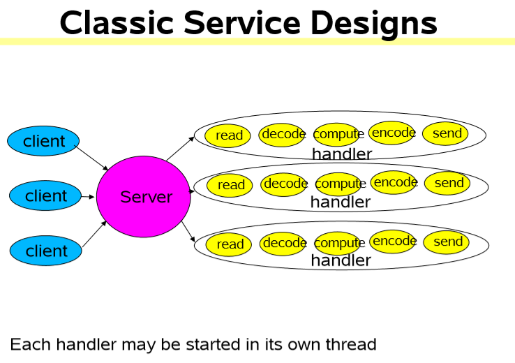
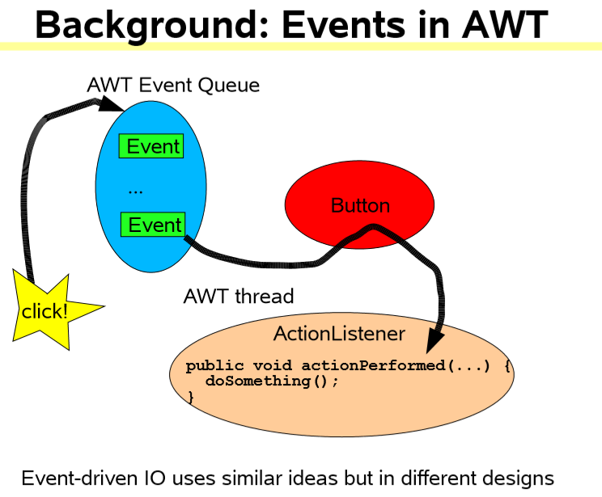
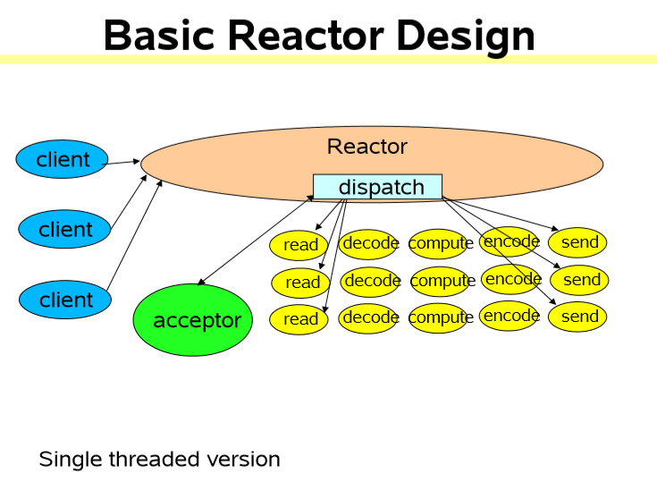

### Reactor模式（响应者模式）
#### scalable io in java学习
1. 可伸缩的网络服务
    * 网络服务的基本结构
        1. 读请求
        2. 请求解码
        3. 处理服务
        4. 编码回应
        5. 发送回应
    * 经典的服务设计
    
              
        ```java
        class Server implements Runnable {
            public void run() {
                try {
                    ServerSocket ss = new ServerSocket(PORT);
                    while (!Thread.interrupted())
                        new Thread(new Handler(ss.accept())).start();      // or, single-threaded, or a thread pool  
                } catch (IOException ex) { /* ... */ }
            }
        
            static class Handler implements Runnable {
                final Socket socket;
        
                Handler(Socket s) {
                    socket = s;
                }
        
                public void run() {
                    try {
                        byte[] input = new byte[MAX_INPUT];
                        socket.getInputStream().read(input);
                        byte[] output = process(input);
                        socket.getOutputStream().write(output);
                    } catch (IOException ex) { /* ... */ }
                }
        
                private byte[] process(byte[] cmd) { /* ... */ }
            }
        }
        ```
    * 可伸缩目标（由于以上模型当会容易受到多用户连接后，线程数量过多）
        1. 当越来越多的cli连接时做到优雅降级
        2. 当拥有的资源（CPU，内存，硬盘，带宽）越来多的时候，能够做到不断提升
        3. 低延迟，满足高峰期的需求，可调节的服务质量
        4. divide-and-conquer通常是完成可伸缩目标的最好方法
        * Divide and Conquer
            * 将处理分成更小的任务
                * 每个任务都在不阻塞的情况下去完成一个动作
            * 当任务能够执行的时候，去执行这个任务
                * IO事件通常作为一个触发器是使用
            * 在java.nio中支持的基本机制有
                1. 非阻塞的读写
                2. 分发与IO事件绑定的任务
            * 无穷的变化可能
                * 基于事件驱动设计的大家庭
2. 事件驱动设计
        1. 通常它会比其他的方案效率更高，它会有：
            1. 更低的资源消耗（通常不需要为每个cli绑定一个线程）
            2. 开销少（less overhead）：更少的上下文切换，更少的阻塞
            3. **但是**分发可能变得更慢
                * 必须手动地将动作绑定到事件上
        2. 通常编程更困难些
            1. 必须手动地去分解为简单的非阻塞的动作
                * 类似于GUI的事件驱动动作
                * 不能够消除所有的阻塞：GC，页错误等
            2. 必须追踪所有的服务的逻辑状态
        * 在AWT中的事件
            * 事件驱动的IO使用了与AWT类似的观点，但是设计有所不同
            
            
3. reactor pattern
    * **Reactor**通过分发恰当的处理器来响应IO事件
        * 类似AWT线程
    * **Handler**会执行非阻塞的动作
        * 类似于AWT中的ActionListeners
    * 通过将将处理器绑定到事件上来进行管理
        * 类似于AWT的addActionListener
    1. 基础版本
        
        
        * java.nio的支持
            1. Channels
                * 用来连接支持非阻塞读操作的文件，套接字等等
            2. Buffers
                * 能够通过通道用于直接的读写的类似数组的对象
            3. Selectors
                * 告知一组通道上哪些产生的IO事件
            4. SelectionKeys
                * 用于维持IO事件的状态以及绑定信息
        ```java
        // 代码示例
       
        // Reactor 1: Setup   
        class Reactor implements Runnable {
            final Selector selector;
            final ServerSocketChannel serverSocket;
        
            Reactor(int port) throws IOException {
                selector = Selector.open();
                serverSocket = ServerSocketChannel.open();
                serverSocket.socket().bind(new InetSocketAddress(port));
                serverSocket.configureBlocking(false);
                SelectionKey sk = serverSocket.register(selector, SelectionKey.OP_ACCEPT);
                // 将一个对象绑定到选择键上，通过sk.attachment()方法来获取这个已绑定的对象
                sk.attach(new Acceptor());
            }
            
            /*  Alternatively, use explicit SPI provider:
            SelectorProvider p = SelectorProvider.provider();
            selector = p.openSelector();
            serverSocket = p.openServerSocketChannel();
            */
            
       
            // Reactor 2: Dispatch Loop
            // class Reactor continued    
            public void run() {  // normally in a new Thread    
                try {
                    while (!Thread.interrupted()) {
                        selector.select();
                        Set selected = selector.selectedKeys();
                        Iterator it = selected.iterator();
                        while (it.hasNext()) 
                           dispatch((SelectionKey) (it.next())); 
                        selected.clear();
                    }
                } catch (IOException ex) { /* ... */ }
            }
            
            void dispatch(SelectionKey k) {
                Runnable r = (Runnable) (k.attachment());
                if (r != null) r.run();
            }
            
            // Reactor 3: Acceptor
            // class Reactor continued
            class Acceptor implements Runnable { // inner    
                public void run() {
                    try {
                        SocketChannel c = serverSocket.accept();
                        if (c != null) new Handler(selector, c);
                    } catch (IOException ex) { /* ... */ }
                }
            }
        }
               
        // Reactor 4: Handler setup
        final class Handler implements Runnable {
            final SocketChannel socket;
            final SelectionKey sk;
            ByteBuffer input = ByteBuffer.allocate(MAXIN);
            ByteBuffer output = ByteBuffer.allocate(MAXOUT);
            static final int READING = 0, SENDING = 1;
            int state = READING;
        
            Handler(Selector sel, SocketChannel c) throws IOException {
                socket = c;
                c.configureBlocking(false);    // Optionally try first read now 
                sk = socket.register(sel, 0);
                sk.attach(this);
                sk.interestOps(SelectionKey.OP_READ);
                sel.wakeup();
            }
        
            boolean inputIsComplete() { /* ... */ }
        
            boolean outputIsComplete() { /* ... */ }
        
            void process() { /* ... */ }
        
            // Reactor 5: Request handling
            // class Handler continued  
            public void run() {
                try {
                    if (state == READING) read();
                    else if (state == SENDING) send();
                } catch (IOException ex) { /* ... */ }
            }
        
            void read() throws IOException {
                socket.read(input);
                if (inputIsComplete()) {
                    process();
                    state = SENDING;        // Normally also do first write now       
                    sk.interestOps(SelectionKey.OP_WRITE);
                }
            }
        
            void send() throws IOException {
                socket.write(output);
                if (outputIsComplete()) sk.cancel();
            }
        }
        ```
        ```java
        // Per-State Handlers
        // 一个状态对象模式的简单使用
        // 重新绑定一个恰当的处理器
        class Handler { // ...
            public void run() {
                // initial state is reader
                socket.read(input);
                if (inputIsComplete()) {
                    process();
                    sk.attach(new Sender());
                    sk.interestOps(SelectionKey.OP_WRITE);
                    sk.selector().wakeup();
                }
            }
        
            class Sender implements Runnable {
                public void run() { // ...
                    socket.write(output);
                    if (outputIsComplete()) sk.cancel();
                }
            }
        }
        ```
            
    2. 多线程版本
    3. 其他变种
4. java.nio非阻塞io APIs概略
