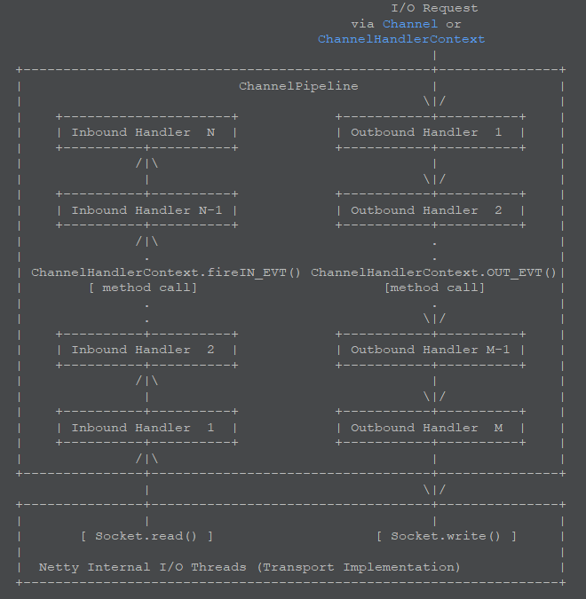

#### Channel
* interface Channel extends AttributeMap, 
    ChannelOutboundInvoker, Comparable<Channel>
    * 介绍
        * 代表一个网络套接字的连接，或者代表一个可以进行诸如读写连接绑定的IO操作的组件。
    * channel向用户提供的功能：
        1. 当前channel的状态（诸如打开状态，已经连接上的状态）
        2. 这个channel的一些配置参数（比如接收buf的大小）
        3. channel的支持的IO操作（比如read, write, connect, and bind）
        4. 用于处理所有IO事件以及与这个channel相关联请求的ChannelPipeline
    * 特性
        1. 所有IO操作都是异步的
            * 所有在netty中的IO操作都是异步的，这意味着任何IO操作调用都会立即返回，但是并不保证在这个调用结束后IO操作也完成了。
                代替的是，你会在这个调用后得到一个ChannelFuture的对象实例，这个实例会在请求的IO操作成功，失败或者取消时，
                它将会通知你。
        2. channel是具有层次结构的
            * 一个channel可以拥有一个父channel，这个父channel是取决于本channel是如何创建的，比如：
                对于一个SocketChannel,它是由ServerSocketChannel接收而产生的,故这个channel调用parent方法就会返回ServerSocketChannel.
                层次化的结构语义是依赖于这个channel所属的传输实现，比如说：你可以创建一个新的channel实现，
                这个实现它会创建与原channel共享套接字连接的子channel，比如像BEEP，SSH的做法。
        3. 向下转换以访问特定的传输操作
            * 有一些操作，对于特定传输来说，是会暴露额外操作的。通过将这个channel进行向下转换从而到达调用额外操作的目的
                （也就是子类/子接口Channel拥有更多特性），比如：对于老式放入数据报传输（UDP），DatagramChannel来提供多播的加入/退出操作。
        4. 释放资源
            * 一旦你完成了对channel的操作，通过close()与close(ChannelPromise)来释放所有资源是非常重要的，
                这确保所有的资源都以一种恰当的方式释放。
#### ChannelPipeLine
* interface ChannelPipeline
          extends ChannelInboundInvoker, ChannelOutboundInvoker, 
          Iterable<Entry<String, ChannelHandler>>
    * 介绍
        * 它是对进出channel进行处理或者拦截，每一个channel都有其自身的channel pipeline，
            且这个channel pipeline在一个channel新建时自动创建。
    * 处理流程
        
        
        * 上图典型地描述了IO事件时如何由位于ChannelPipeline中的ChannelHandlers处理的，一个IO事件要么
            由ChannelInboundHandler要么由ChannelOutboundHandler处理，并且处理完后就通过调用
            定义在ChannelHandlerContext中的事件传播方法来传递给最近的处理器，事件传播方法比如：
            ChannelHandlerContext.fireChannelRead(Object)（入站） and ChannelHandlerContext.write(Object)（出站）.
        * 这种拦截过滤模式是更加细粒度的，将入站与出站的拦截过滤相分离。
        * 正如上图所示，一个入站事件是由入站处理器由自底向上的方向来处理的。入站处理器通常处理由IO线程生成的入站数据。通常从远端对点
            通过实际的输入操作（比如SocketChannel::read(ByteBuffer)）来读取入站数据。若一个入站事件从底向上经过所有的入站处理器
            均得不到处理，则其将被无声丢弃（若你需要你可以通过log记录这种情况）。
        * 如上图所示，一个出站事件是由出站处理器由自顶向下的方向来处理的。一个出站处理器通常生成或者转变出站流量，比如写请求。若一个出站
            事件从顶向下经过所有的出站处理器均得不到处理，那么这个出站事件将由与这个channel所关联的一个线程来处理。这个相关的IO线程通常
            一个事件的输出操作比如SocketChannel::write(ByteBuffer).
        ```
        For example, let us assume that we created the following pipeline:
           ChannelPipeline p = ...;
           p.addLast("1", new InboundHandlerA());
           p.addLast("2", new InboundHandlerB());
           p.addLast("3", new OutboundHandlerA());
           p.addLast("4", new OutboundHandlerB());
           p.addLast("5", new InboundOutboundHandlerX());
        // 入站事件处理顺序: 1, 2, 5 
        // 出站事件处理顺序: 5, 4, 3
        ```
    * 传递一个事件给下一个事件处理器
        * 一个处理器通过调用位于ChannelHandlerContext中的时间传播方法来将事件传递给下一个处理器，这些方法包括：
            1. 入站的事件传播方法：
                * ChannelHandlerContext.fireChannelRegistered()
                * ChannelHandlerContext.fireChannelActive()
                * ChannelHandlerContext.fireChannelRead(Object)
                * ChannelHandlerContext.fireChannelReadComplete()
                * ChannelHandlerContext.fireExceptionCaught(Throwable)
                * ChannelHandlerContext.fireUserEventTriggered(Object)
                * ChannelHandlerContext.fireChannelWritabilityChanged()
                * ChannelHandlerContext.fireChannelInactive()
                * ChannelHandlerContext.fireChannelUnregistered()
            2. 出站的事件传播方法：
                * ChannelHandlerContext.bind(SocketAddress, ChannelPromise)
                * ChannelHandlerContext.connect(SocketAddress, SocketAddress, ChannelPromise)
                * ChannelHandlerContext.write(Object, ChannelPromise)
                * ChannelHandlerContext.flush()
                * ChannelHandlerContext.read()
                * ChannelHandlerContext.disconnect(ChannelPromise)
                * ChannelHandlerContext.close(ChannelPromise)
                * ChannelHandlerContext.deregister(ChannelPromise)
        * 事件传播使用的实例
            ```java
               public class MyInboundHandler extends ChannelInboundHandlerAdapter {
                    @Override
                   public void channelActive(ChannelHandlerContext ctx) {
                       System.out.println("Connected!");
                       ctx.fireChannelActive();
                   }
               }
              
               public class MyOutboundHandler extends ChannelOutboundHandlerAdapter {
                    @Override
                   public void close(ChannelHandlerContext ctx, ChannelPromise promise) {
                       System.out.println("Closing ..");
                       ctx.close(promise);
                   }
               }
            ```    
    * 建立一个管道
        * 用户应该有一个或一个以上ChannelHandler在管道s到接收I / O事件（如读取），并请求I / O操作（如写入和关闭）。 
            例如，一个典型的服务器将在每个通道的管道下面的处理程序，但您的里程可能取决于复杂性和协议和业务逻辑的特点有所不同：
            1. 协议解码器-转换的二进制数据（例如ByteBuf ）到Java对象。
            2. 协议编码器 - 转换的Java对象转换成二进制数据。
            3. 业务逻辑处理 - 执行实际的业务逻辑（例如数据库访问）。
        * 并且它可以表示为显示在下面的例子：
            ```
            static final EventExecutorGroup group = new DefaultEventExecutorGroup(16);
            ...
            
            ChannelPipeline pipeline = ch.pipeline();
            
            pipeline.addLast("decoder", new MyProtocolDecoder());
            pipeline.addLast("encoder", new MyProtocolEncoder());
            
            // Tell the pipeline to run MyBusinessLogicHandler's event handler methods
            // in a different thread than an I/O thread so that the I/O thread is not blocked by
            // a time-consuming task.
            // If your business logic is fully asynchronous or finished very quickly, you don't
            // need to specify a group.
            // 由于自己的业务逻辑处理可能很耗时，指定这个业务处理发生在另一个线程中。
            // 自己也可以在MyBusinessLogicHandler内部完成通过线程池来处理业务
            pipeline.addLast(group, "handler", new MyBusinessLogicHandler());  // ****** 重点 ******
            ```  
    * 线程安全
        * 一个ChannelHandler可以添加或删除在任何时候，因为ChannelPipeline是线程安全的。 
            例如，你可以当敏感信息即将被交换插入一个加密处理程序，并在交换之后将其删除。
        