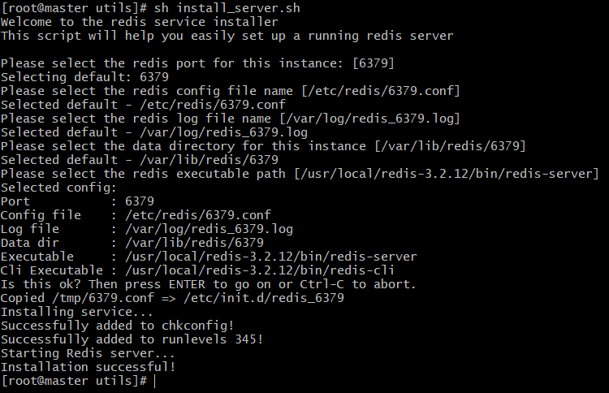
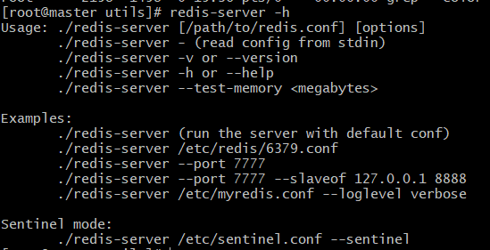
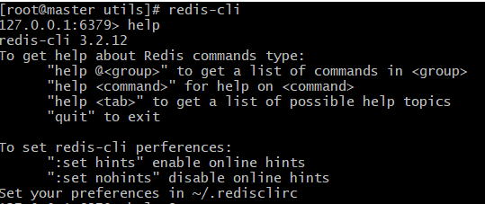

#### 3.x版本之前的redis是不支持cluster模式
1. 安装
    1. wget https://github.com/antirez/redis/archive/3.2.12.tar.gz
    2. 解压tar -zxf xxx
    3. 安装make && make PREFIX=安装目录 install
    4. 配置环境变量
        1. export REDIS_HOME=xxx
        2. export PATH=...:$REDIS_HOME/bin
2. 将redis添加到自启动
    * 通过运行redis的压缩包中的utils文件夹下的install_server.sh脚本文件**完成redis的自启动,并且已经在运行**。
        与此同时也**完成了redis的service注册**，可以通过service redis_REDIS_PORT start/restart/stop
        等，来完成相关操作。
        
    * 设置默认不自启
        * chkconfig redis_REDIS_PORT off
3. svr启动
    * 默认端口6379
    * 查看svr的帮助，shell键入redis-server -h
    
    * 若未为redis添加service，则通过手动shell输入nohup redis-server [CONF_FILE_PATH] [--port REDIS_PORT] [--slaveof ...] &等来完成运行
    * 若有service，则直接通过service redis_REDIS_PORT start/stop/.. 来控制
3. cli连接
    * 通过shell键入redis-cli进入cli的shell，或者通过redis-cli -h查看cli帮助
    * 查看cli的shell对数据等的操作的help，在cli shell中键入help
    
    * help @<group>
        * group包括string, list等
        
    
     
        