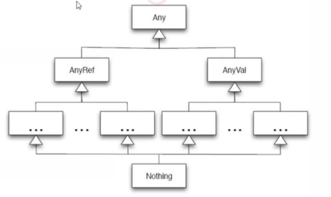
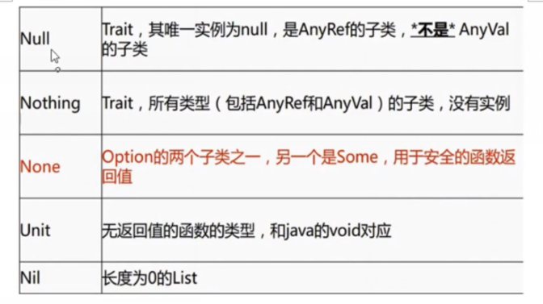

* 类型
    1. Byte
    2. Short
    3. Int
    4. Long
    5. Float
    6. Double
    7. Char
    8. String
    9. Boolean
    10. Unit 等同于void
    11. Null 等同于null
    12. Nothing 所有类型子类型（无值）
    13. Any 等同于Object
    14. AnyRef 所有ref类型的超类
    15. AnyVal 所有值类型的超类
    
    
* class与object关键字
    * object关键字定义的类就是单例的（包含静态方法），可以大概理解为java里面的工具类，main函数只能写在object关键字定义的类中
    * class关键字定义的类
* 定义值
    1. 定义变量 var a = 100
    2. 定义常量 val a = 100
    ```
    var a = 1; a = "123"; // 这是不可以的，不可以类型转换
    ```
* 使用驼峰命名法，传参指定类型，类定义的时候传参相等于构造函数，重写构造函数的时候需要先调用构造函数
```
class Demo {
  private var name: String = _ // null

  def this(name: String) {
    this() // 必须要
    println(this.name)
    this.name = name
  }
}

object Base {
  def main(args: Array[String]): Unit = {
    val demo = new Demo("david")
  }
}
```  
* scala的静态块不用static{}
* 同一个scala文件中，class与object名称一致时候，他们之间是伴生的
* object传参，必调用其中定义的apply方法

