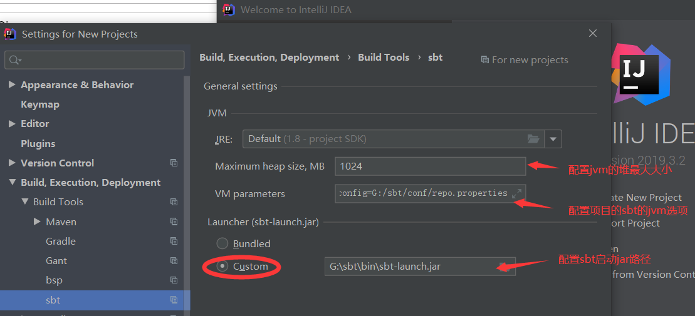
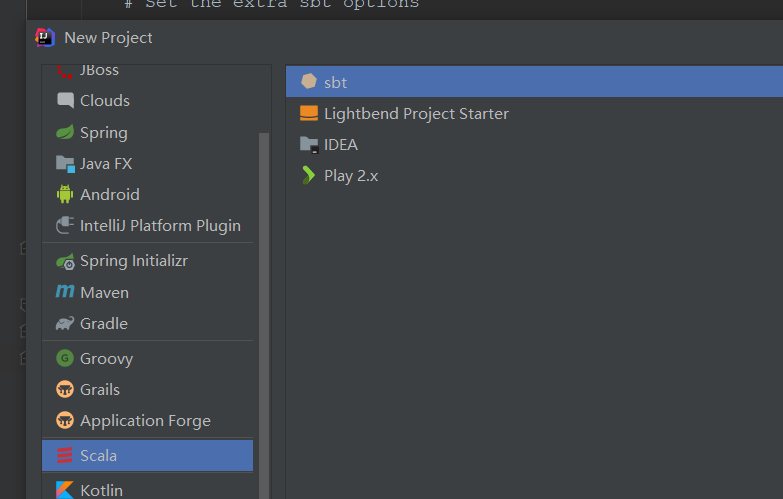
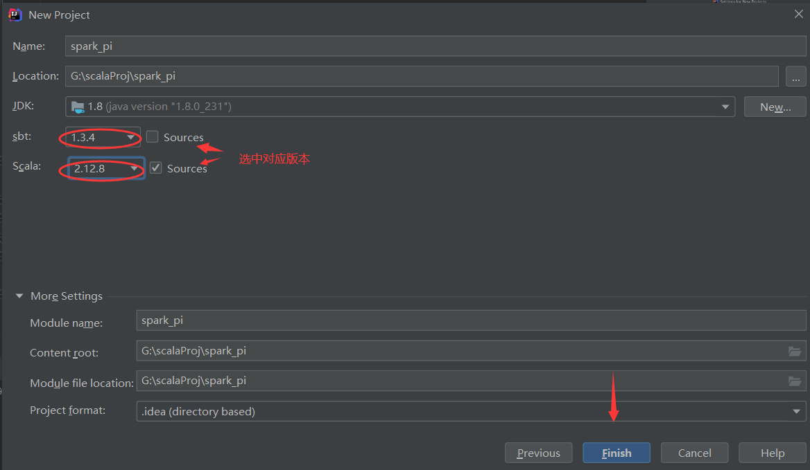
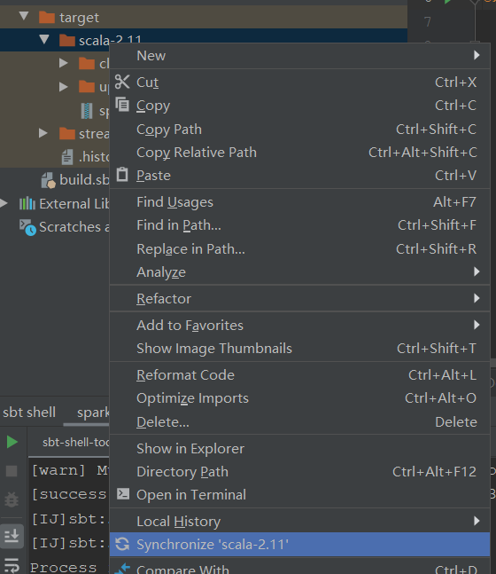

#### 在idea中通过sbt构建scala项目
1. 下载sbt
    * 通过百度云盘下载(win系统的sbt1.3.4)
        ```
        链接：https://pan.baidu.com/s/1uwTS5oKzrFSXm5F6eEqGkA 
        提取码：uw9i
    ```
2. 安装
3. 调整
    * 这里假设sbt的安装目录为G:/sbt
    1. 由于关于sbt的插件配置文件夹位于~/.sbt而不是位于sbt的安装目录，故将~/.sbt目录移动到G:/sbt/.sbt
    2. 创建repo配置文件，位于G:/sbt/conf/repo.properties
        ```
        # repo.properties
        [repositories]
          local
          maven-local: file:///G:/mvnRepo/
          huaweicloud-ivy: https://mirrors.huaweicloud.com/repository/ivy/, [organization]/[module]/(scala_[scalaVersion]/)(sbt_[sbtVersion]/)[revision]/[type]s/[artifact](-[classifier]).[ext]
          huaweicloud-maven: https://mirrors.huaweicloud.com/repository/maven/
          aliyun-maven: https://maven.aliyun.com/repository/public/
        ```
    3. 创建本地ivy仓库
        * G:/sbt/repo
    4. 修改G:/sbt/conf/sbtconfig.txt
        ```
        # sbt configuration file for Windows
        
        # Set the java args
        
        #-mem 1024 was added in sbt.bat as default
        
        -Xms128m
        -Xmx512m
        -Xss4M
        -XX:ReservedCodeCacheSize=64m
        -XX:MaxMetaspaceSize=128m
        
        # Set the extra sbt options
        
        # -Dsbt.log.format=true
        -Dsbt.override.build.repos=true
        -Dsbt.log.format=true
        -Dsbt.global.base=G:/sbt/.sbt
        -Dsbt.ivy.home=G:/sbt/repo
        -Dsbt.boot.directory=G:/sbt/.sbt/boot
        -Dsbt.repository.config=G:/sbt/conf/repo.properties
        ```
4. 在idea中配置启动scala项目
    1. 在idea的welcome to IDEA界面配置settings进行配置
        
        * 在vm opts中填入与sbtconfig.txt文件中下部分相同的内容
            ```
            -Dsbt.override.build.repos=true
            -Dsbt.log.format=true
            -Dsbt.global.base=G:/sbt/.sbt
            -Dsbt.ivy.home=G:/sbt/repo
            -Dsbt.boot.directory=G:/sbt/.sbt/boot
            -Dsbt.repository.config=G:/sbt/conf/repo.properties
            ```
    2. 创建基于sbt的scala项目
        
        
        
        
5. 配置项目中的build.sbt文件
6. 用idea中的sbt打jar包
    * 选中sbt对应项目下的tasks，点击packageBin，等运行完毕后，会在target/scala-x.x下生成jar文件（再同步一下）
        