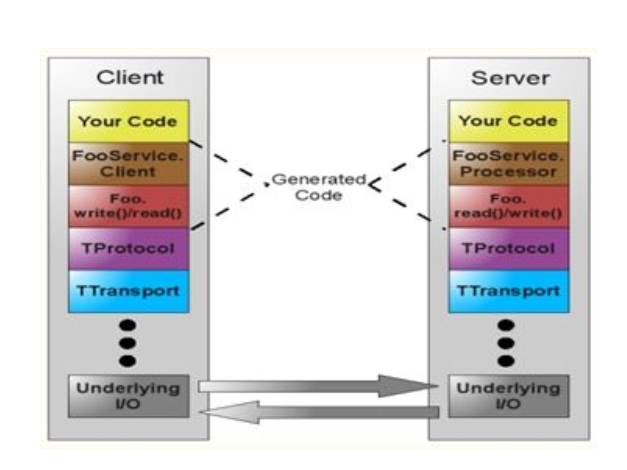

#### Apache Thrift
* 介绍
    * 可伸缩，跨语言
* 数据类型
    * byte，i16，i32，i64，double，string，bool
* 容器类型
    * list：一系列由T类型的数据构成的有序列表
    * set：一系列由T类型的数据构成的无序集合
    * map：字典结构
* 工作原理
    * 数据传输使用socket（多种语言支持），数据再以特殊的格式（string等）发送，接收方语言进行解析
    * 定义thrift文件，由thrift文件（IDL，interface describe/definition language）生成双方语言的接口，
        model，在生成的model以及接口中会由解析编码的代码。
* IDL
    0. 在头部定义文件包含include(类似java import),namespace(类似java的包名)，同时支持定义别名typedef
        * include ".thrift文件的路径"
        * namespace 语言名 路径：namespace java com.test.thrift.demo
        * typedef i32 int
    1. struct类似c语言中的结构体，等价于java中的class
        ```
        struct StructName {
            1: string name;
            2: i32 age;
            3: string gender;
        }
        ```
    2. 枚举enum
        ```
        enum Enum {
            APPLE,
            ORINGE,
            BANANA
        }
        ```
    3. 异常exception
        exception Exception {
            1: i32 exCode,
            2: string exMsg
        }
    4. 服务接口service，类似java中的service接口
        ```
        service Service {
            // 注意逗号结尾
            string doAction(1: string name, 2: i32 age) throws (1: Exception ex),
            i32 getAgeByID(1: string id)
        }
        ```
    5. 注释：支持#, //, /**/
    6. 可选与必选：optional与required
        ```
        struct People {
            1: required string name;
            2: optional i32 age;
        }
        ```
* thrift文件编译
    * thrift --gen java \[-out  dir\] \[-I include_dir\] data.thrift
* thrift架构

    
    * thrift传输格式 （TProtocol层次）
        1. TBinaryProtocol
            * 二进制格式
        2. TCompactProtocol（最常用）
            * 压缩格式
        3. TJSONProtocol
            * json格式（支持读写）
        4. TSimpleJSONProtocol（不太常用）
            * 仅仅支持写的协议，一般生成的都交由脚本语言读取
        5. TDebugProtocol
            * 使用易读的文本格式，便于debug
            * 可以看出数据在传输过程中的格式，一般可以通过抓包分析
    * thrift的数据传输方式（TTransport层次）
        1. TSocket（用的最少，效率最低的）
            * 阻塞式socket
        2. TFramedTransport（常用）
            * 以帧为单位进行传输（将数据报切分成多个数据帧），非阻塞式服务中使用
        3. TFileTransport
            * 以文件形式进行传输
        4. TMemoryTransport
            * 将内存用于IO，Java实现时内部使用的就是简单的ByteArrayOutputStream
        5. TZlibTransport
            * 使用zlib进行压缩，与其他传输方式联合使用，当前无java实现。
    * thrift支持的服务模型（TServer层次）
        1. TSimpleServer
            * 简单的单线程服务模型，常用于测试
        2. TThreadPoolServer
            * 多线程服务模型，使用标准的阻塞式IO，当线程不够用了就创建新的线程，当常有线程闲置，就对
                线程进行回收。
        3. TNonblockingServer
            * 多线程服务模型，使用户非阻塞式IO（需使用TFramedTransport数据传输方式）
        4. THsHaServer（是TNonblockingServer的一种拓展）（常用）
            * 半同步/半异步处理模式，在处理IO事件上（accept/read/write io）使用异步，在处理
                handler对rpc的同步处理的时候就是同步的方式（需使用TFramedTransport数据传输方式）