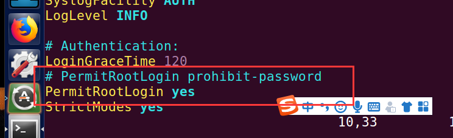
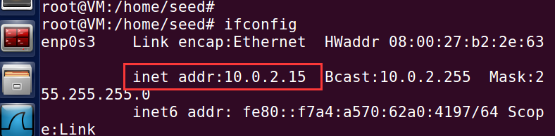
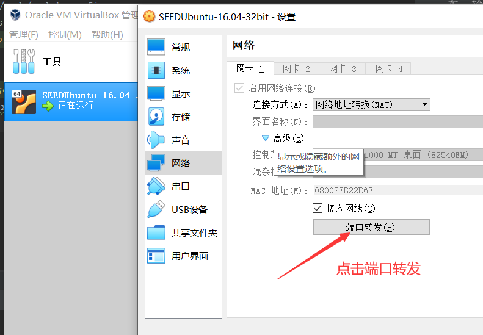
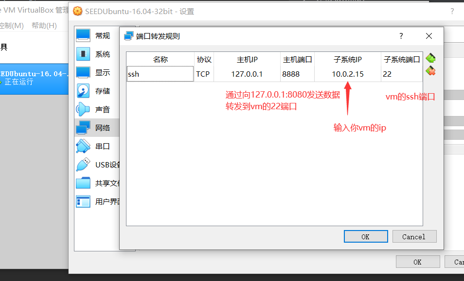
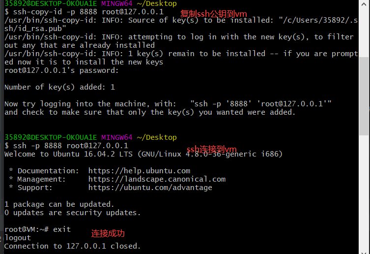

#### 主机通过ssh方式访问VM
* 为了方便起见，先进入root（键入su回车，输入root的密码回车）
1. 配置VM的sshd为root可以登录（）
    * 首先键入vi /etc/ssh/sshd_config
    * 修改为可以root ssh登录
    
    
2. 获取vm的ip
    * 键入ifconfig
    
    
3. 获得vm的ip后设置vbox的端口转发

    
    
    
4. 此时已经可以通过本地主机的ssh访问vm了（选择一下1,2中的一种即可）
    1. 若不想配置ssh公秘钥
        ```shell script
        # 在本地主机的shell窗口中键入
        ssh -p 8888 root@127.0.0.1
        # 然后输入你再vm中的root账户密码即可，连接成功
        ```
    2. 若为了方便，配置公钥（这里我使用win系统本地安装的git bash）
        * 若本地没有ssh公秘钥，键入
            * ssh-keygen -t rsa -P '' -f ~/.ssh/id_rsa
               * -t rsa 使用rsa算法
               * -P '' 秘钥口令为空
               * -f 将生成的秘钥放到指定文件中
               * 注：配套生成的公钥放在 ~/.ssh/id_rsa.pub中
        * 然后上传本地的ssh公钥到vm, 键入
            ```shell script
            ssh-copy-id -i ~/.ssh/id_rsa.pub -p 8888 root@127.0.0.1
            ```
5. 通过本地主机ssh访问vm

    
        
    